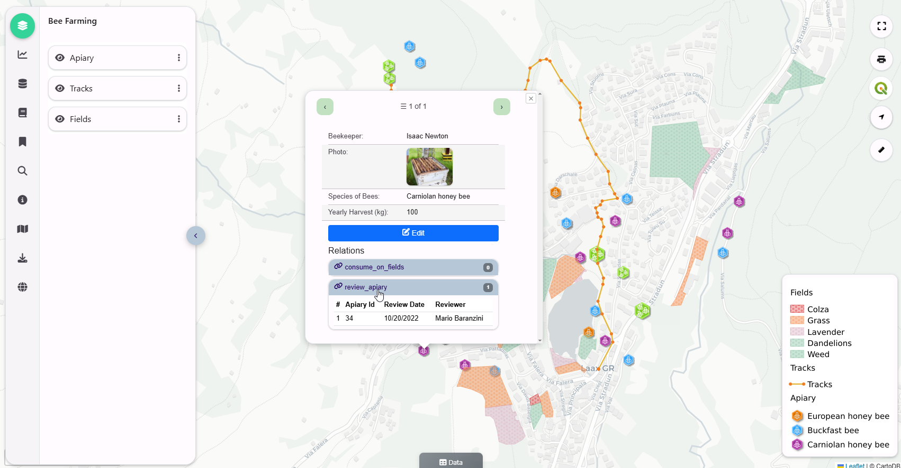
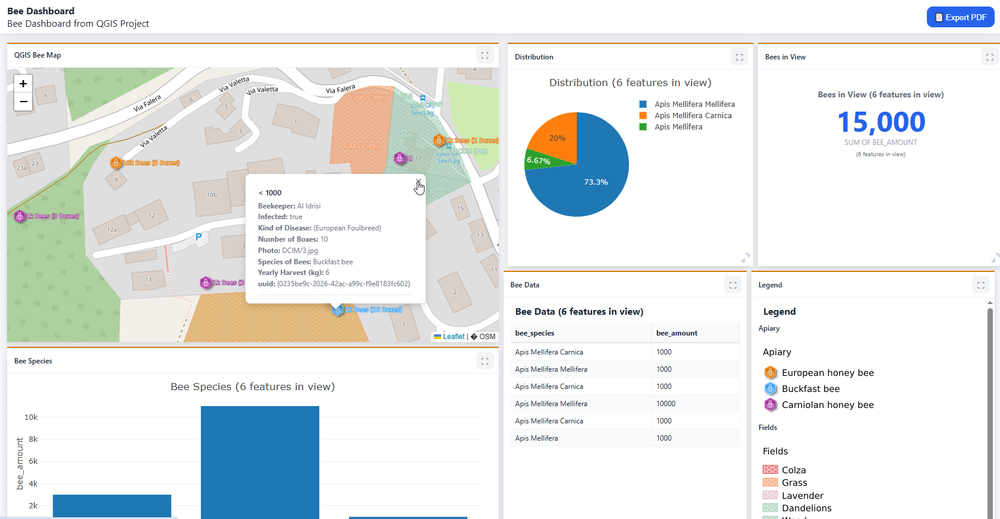
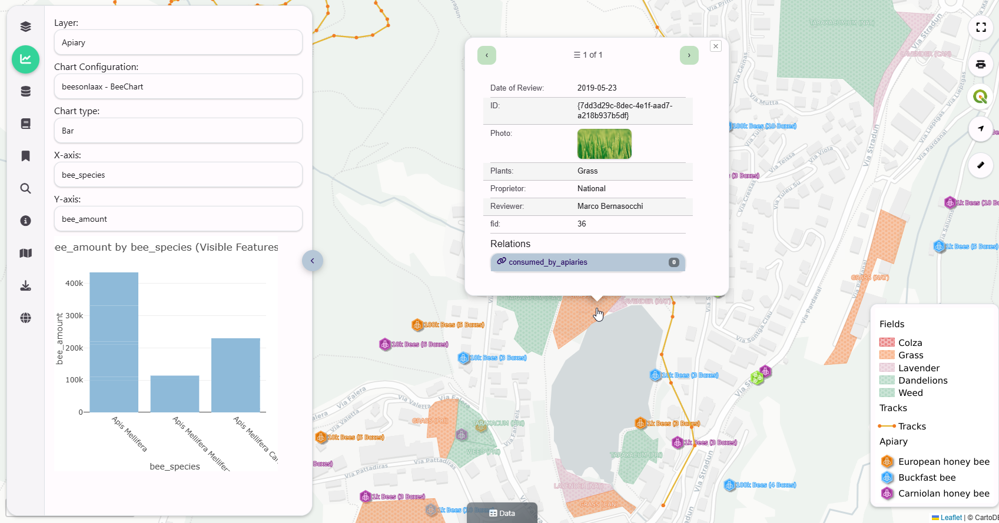
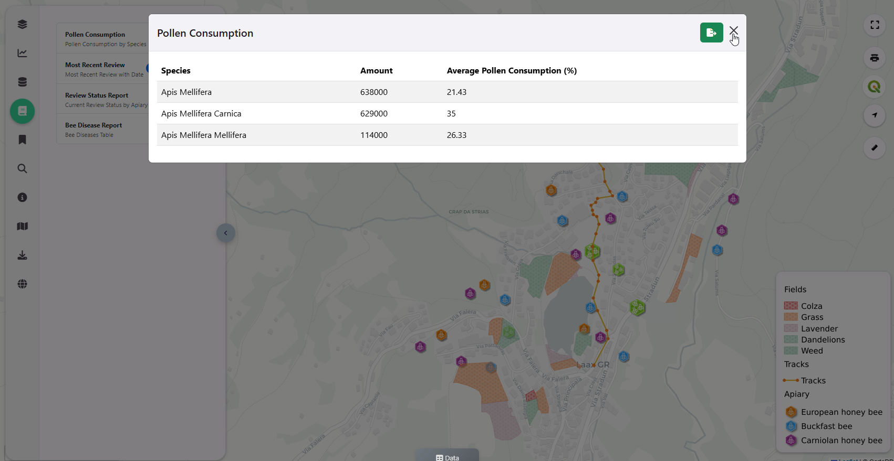
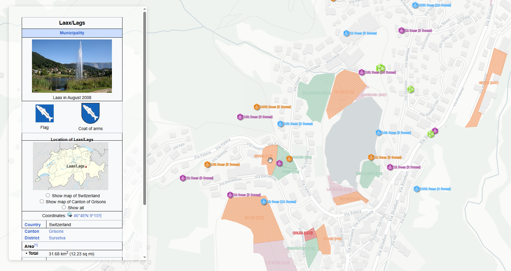

# QCarta

[](https://qcarta.docs.acugis.com/en/latest/?badge=latest)

## QGIS Map Portal 
### Version 5.1.0

QCarta - the simplest way to publish your QGIS Projects.  

QCarta is a complete GeoPortal for QGIS.


  
## Requirements

- Ubuntu 24
- 4 GB RAM
- 10 GB Disk

## Install

Be sure to set the hostname prior to installation if you plan to provision SSL using certbot.

```bash
hostnamectl set-hostname <yourhostname>
```

### Installer

```bash
   git clone https://github.com/AcuGIS/qcarta.git
   cd qcarta
   ./installer/postgres.sh
   ./installer/app-install.sh
```

Optionally, provision and SSL certificate using:

```bash
 apt-get -y install python3-certbot-apache
 certbot --apache --agree-tos --email hostmaster@${HNAME} --no-eff-email -d ${HNAME}
```

Default credentials

   - Email: admin@admin.com
   - Password: quail

### Docker (Not for Production Use)

```bash
git clone https://github.com/AcuGIS/qcarta.git
$ cd qcarta
$ ./installer/docker-install.sh
$ docker-compose pull

Before calling up set docker/public.env with values used on your machine!
$ docker-compose up

If you want to build from source, run next command.
$ docker-compose build
```

URL: http://yourdomain.com:8000

## Features and Demos

QCarta includes sample projects to get you started

### Features

- Maps
- Dashboards
- Filters
- GeoStories
- Plotly Support
- SQL Reports
- SQL Workshop
- QGIS Relations
- QGIS Plugin
- OGC Web Services (WMS, WFS, and WMTS)
- Topics and Keywords
- Metadata

<p>&nbsp;</p>

### Demo Projects



### Dashboards                                             



### Plotly Chart Support:



### SQL Reports




### GeoStories



## Documentation

Quail Docs [Documentation](https://quail.docs.acugis.com).


## License
Version: MPL 2.0
