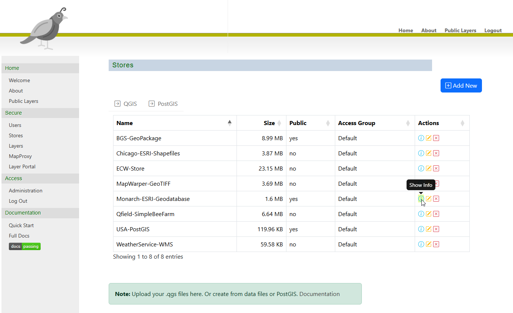

# Quail

[](https://quail.docs.acugis.com/en/latest/?badge=latest)

## QGIS Server Adminstration and Layer Server 

Publish your QGIS Projects as OGC Web Services.  

Group level permissions and integration MapProxy caching.


   
## Requirements

- Ubuntu 24
- 1 GB RAM
- 5 GB Disk

## Install

Be sure to set the hostname prior to installation if you plan to provision SSL using certbot.

```bash
hostnamectl set-hostname <yourhostname>
```

### Installer

```bash
$ git clone https://github.com/AcuGIS/quail.git
$ cd quail
$ ./installer/postgres.sh
$ ./installer/app-install.sh
```

Optionally, provision and SSL certificate using:

```bash
 certbot --apache --agree-tos --email hostmaster@${HNAME} --no-eff-email -d ${HNAME}
```

Default credentials

   - Email: admin@admin.com
   - Password: quail

### Docker (Not for Production Use)

```bash
git clone https://github.com/AcuGIS/quail.git
cd quail
./installer/docker-install.sh

docker-compose build --build-arg DOCKER_IP=192.168.0.25 --build-arg DOCKER_PORT=8000
docker-compose up
```

URL: http://yourdomain.com:8000

## Documentation

Quail Docs [Documentation](https://quail.docs.acugis.com).


## License
Version: MPL 2.0
