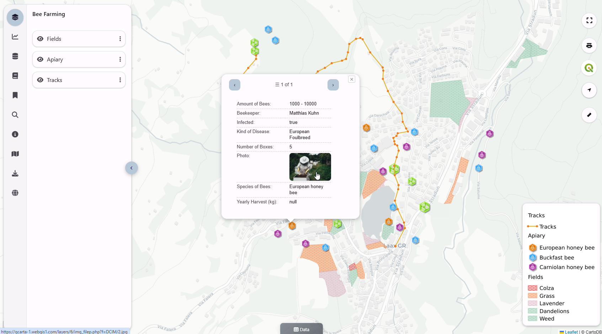
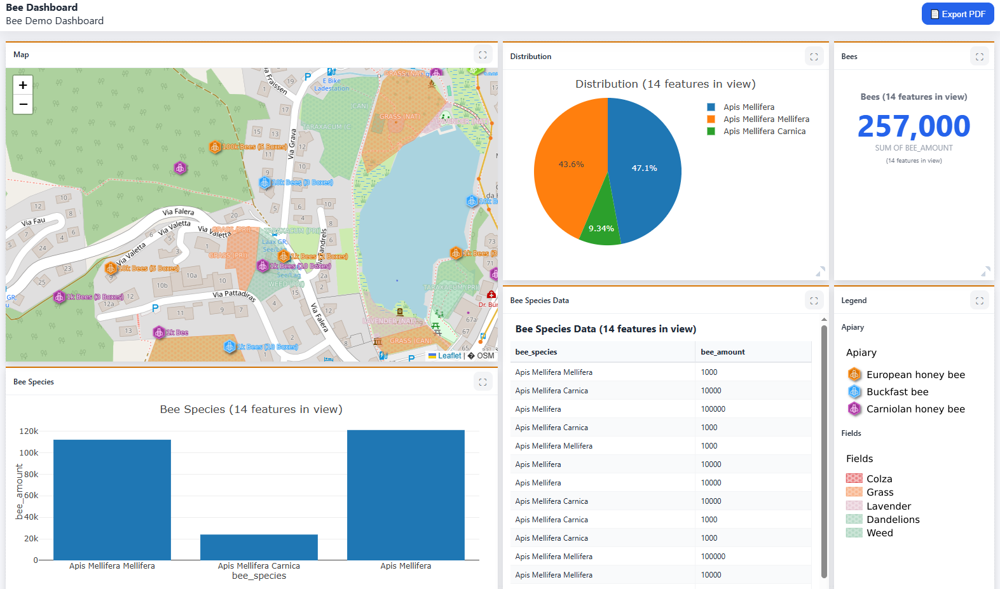

QCarta
==================================================

QCarta is a QGIS Map Portal and OGC Web Server.

   - Publish QGIS Projects via Plugin
   - Support for PostGIS, Raster, and Vector stores
   - Intergrated MapProxy for Layer Caching
   - Group Level permissions for Stores and Layers
   - Documents, Links, and GeoStories
   

Advanced Mapping Features

   - QGIS Print Layouts
   - Queries and Saved Queries
   - Plotly Charts
   - SQL Workshop

Additional Features

- Layer level permissions
- Maps
- Documents
- Links
- GeoStories
- SQL Views
- SQL Reports
- Plotlt Support
- SQL Workshop
- OGC Web Services (WMS, WFS, and WMTS)
- Topics and Keywords
- Metadata

.. include:: ../README.rst

.. toctree::
   :caption: Getting Started
   :maxdepth: 2

   intro
   installing
   plugin
   quickstart
   
   
   
.. toctree::
    :maxdepth: 3
    :caption: Administration

    sections/settings/index
    sections/users/index
    sections/usergroups/index
    sections/keys/index
    sections/stores/index
    sections/qgisstore/index
    sections/postgisstores/index   
    sections/layers/index
    sections/reports/index
    sections/filters/index
    sections/dashboards/index
    sections/geostory/index
    sections/workshop/index
    sections/preview/index  
    sections/capabilities/index
    sections/urls/index  
    sections/mapproxy/index
    sections/viewer/index
    sections/sample/index
    sections/security/index 
    sections/cors/index
    sections/api/index    
    sections/plugins/index
    sections/branding/index
    

.. toctree::
    :maxdepth: 2
    :caption: Resources

    resources/css
    resources/support
    resources/commercial
    resources/license

    
    
    

