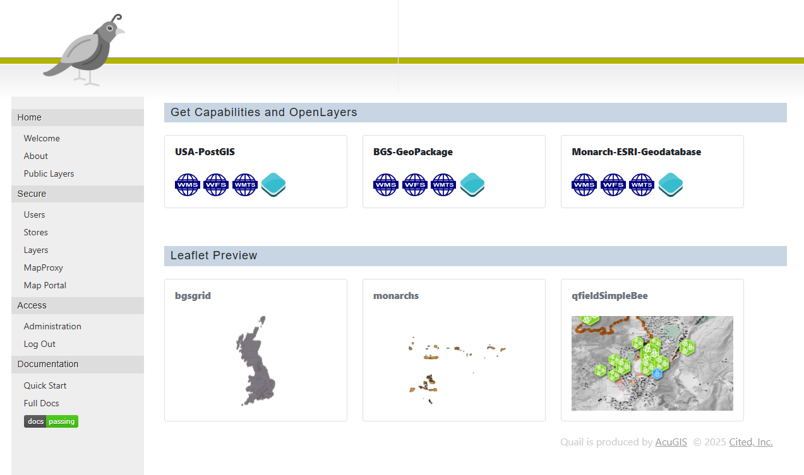

Quail
==================================================

Quail is a QGIS Server Administration UI and Layer Server.

   - Create OGC Web Services from your QGIS Projects
   - Create OGC Web Services directly from many Geospatial formats
   - Intergrated MapProxy for Caching
   - Group Level permissions for Stores and Layers

Quail also contains a basic Map Portal that automatically creates Leaflet Maps you can share and customize with Group Level permissions

.. include:: ../README.rst

.. toctree::
   :caption: Getting Started
   :maxdepth: 2

   intro
   installing
   quickstart
   
   
   
.. toctree::
    :maxdepth: 3
    :caption: Administration

    sections/users/index
    sections/usergroups/index
    sections/keys/index
    sections/stores/index
    sections/qgisstore/index
    sections/postgisstores/index   
    sections/layers/index
    sections/preview/index  
    sections/capabilities/index
    sections/urls/index  
    sections/mapproxy/index
    sections/viewer/index
    sections/sample/index
    sections/security/index 
    sections/cors/index
    sections/api/index    
    sections/plugins/index
    sections/branding/index
    
.. toctree::
    :maxdepth: 3
    :caption: End User

    endusers/index
 

.. toctree::
    :maxdepth: 2
    :caption: Resources

    resources/css
    resources/security
    resources/support
    resources/commercial
    resources/license

    
    
    

