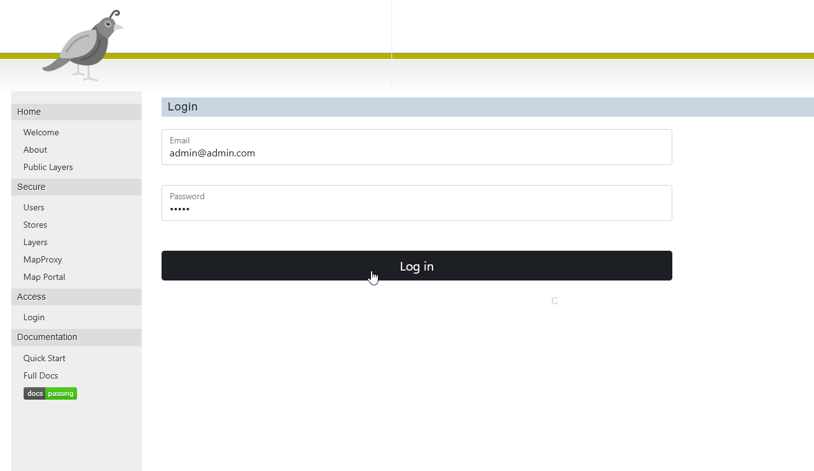
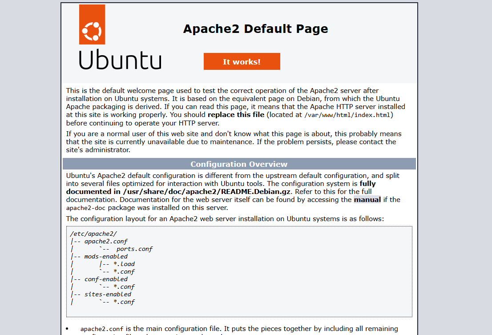

.. This is a comment. Note how any initial comments are moved by
   transforms to after the document title, subtitle, and docinfo.

.. demo.rst from: http://docutils.sourceforge.net/docs/user/rst/demo.txt

.. |EXAMPLE| image:: static/yi_jing_01_chien.jpg
   :width: 1em

************
Installation
************

.. contents:: Table of Contents

Installation is done via the install scripts located in the /installer directory.

System Requirements
=======================
* 2 GB RAM
* 15 GB Disk
* Tested on Ubuntu 24

.. note::
    Seeding and tile generation can be CPU intensive for larger data sets.  Plan accordingly.

ECW Support
========================

.. note::

   For ECW Support, use the Quail ECW Support installer prior to installation

   https://github.com/AcuGIS/quail-ecw-support

Installer (Recommended)
=======================

Download the Quail binary and unzip:

.. code-block:: console

    wget https://github.com/AcuGIS/quail/quail-2.11.0.zip
    unzip -q quail-server-1.11.0.zip
    

Change to the /quail-server-1.11.0 directory and run the installers in sequence below:

If you already have PostgreSQL with PostGIS enabled, skip the postgres.sh script.

.. code-block:: console
 
    cd quail-server-1.11.0
    ./installer/postgres.sh
    ./installer/app-install.sh [--no-mapproxy]

Optionally, run below to provision SSL using letsencrypt:

.. code-block:: console

   apt-get -y install python3-certbot-apache

   certbot --apache --agree-tos --email hostmaster@yourdomain.com --no-eff-email -d yourdomain.com

Login at https://yourdomain.com/login.php

Default credentials

* Email:  admin@admin.com
* Password: quail

Note: If you see below when navigating to your domain, remove the default index.html page from /var/www/html

Docker Install
=======================

.. warning::
   Docker is not recommended for Production hosting.

To install using Docker:

Go to the Docker directory open the quail.conf file and set the SERVER_NAME to your machines hostname.

Use your machines IP for DOCKER_IP below.

.. code-block:: console

    cd quail
    ./installer/docker-install.sh
    docker-compose build --build-arg DOCKER_IP=192.168.0.25 --build-arg DOCKER_PORT=8000
    docker-compose up

To clean persistent data, you can remove volumes with this command:

.. code-block:: console

    docker volume rm quail_{cache_qgis,data_layers,data_qgis,data_mapproxy,data_stores,html_layers,html_stores,pg_data,www_cache}

Navigate to http://yourdomain.com:8000

Default credentials

* Email:  admin@admin.com
* Password: quail

