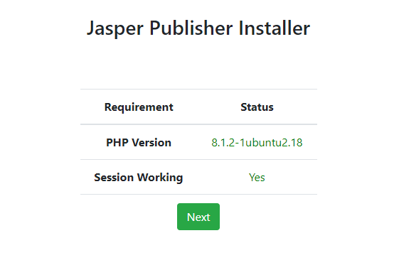
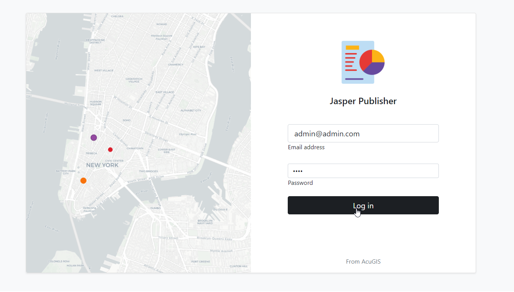

************
Installation
************

Installation is done via the install scripts located in the /installer directory.

System Requirements
=======================
* PostgreSQL 16
* PHP >= 8.1
* 4 GB RAM
* 15 GB Disk
* Tested on Ubuntu 22

Running the Installer
=======================

Download the Jasper Report Publisher and unzip:

.. code-block:: console

    wget https://github.com/AcuGIS/jasper-report-publisher/releases/download/2.11.0/jasper-report-publisher-2.11.0.zip
    unzip -q jasper-report-publisher-2.11.0.zip
    

Change to the /jasper-report-publisher-2.11.0 directory and run the installers in sequence below:

.. code-block:: console
 
    cd quail
    ./installer/postgres.sh
    ./installer/app-install.sh [--no-mapproxy]

Login with your default user of admin@admin.com and password from /root/auth.txt

Docker Install

.. code-block:: console

    cd quail
    ./installer/docker-install.sh
    docker-compose up

To clean persistent data, you can remove volumes with this command:

.. code-block:: console

    docker volume rm quail_{cache_qgis,data_layers,data_qgis,data_mapproxy,data_stores,html_layers,html_stores,pg_data,www_cache}

Optionally, run below to provision SSL using letsencrypt:

.. code-block:: console

   apt-get -y install python3-certbot-apache

   certbot --apache --agree-tos --email hostmaster@yourdomain.com --no-eff-email -d yourdomain.com

Navigate to https://yourdomain.com/admin/setup.php:

Enter the information for the PostgreSQL database you created:

The installer will create the required objects in PostgreSQL

When the installer completes, you can log in using the email and password you selected above.

Sample Data
===================

If you load the Sample Data, be sure to restart Tomcat when you log in.

You can restart Tomcat via Services on the left menu.

PhantomJS
===================

Printing of GroupedReports requires phantomjs to be installed on your server.

