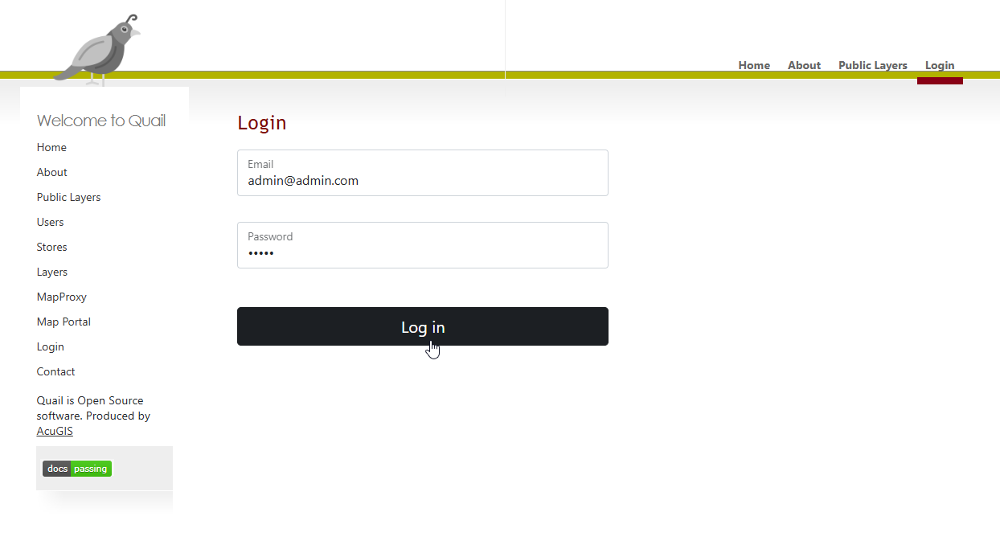

************
Installation
************

Installation is done via the install scripts located in the /installer directory.

System Requirements
=======================
* 2 GB RAM
* 15 GB Disk
* Tested on Ubuntu 24

Running the Installer
=======================

Download the Quail binary and unzip:

.. code-block:: console

    wget https://github.com/AcuGIS/quail/quail-2.11.0.zip
    unzip -q quail-server-1.11.0.zip
    

Change to the /quail-server-1.11.0 directory and run the installers in sequence below:

.. code-block:: console
 
    cd quail-server-1.11.0
    ./installer/postgres.sh
    ./installer/app-install.sh [--no-mapproxy]

Optionally, run below to provision SSL using letsencrypt:

.. code-block:: console

   apt-get -y install python3-certbot-apache

   certbot --apache --agree-tos --email hostmaster@yourdomain.com --no-eff-email -d yourdomain.com

Login at https://yourdomain.com/login.php with the default user of admin@admin.com and password quail

Note: If you see below when navigating to your domain, remove the default index.html page from /var/www/html

.. image:: error-page.png

Docker Install
=======================

To install using Docker:

.. code-block:: console

    cd quail
    ./installer/docker-install.sh
    docker-compose up

To clean persistent data, you can remove volumes with this command:

.. code-block:: console

    docker volume rm quail_{cache_qgis,data_layers,data_qgis,data_mapproxy,data_stores,html_layers,html_stores,pg_data,www_cache}

Navigate to http://yourdomain.com:8000

You can log in using the admin@admin.com and password 1234.

