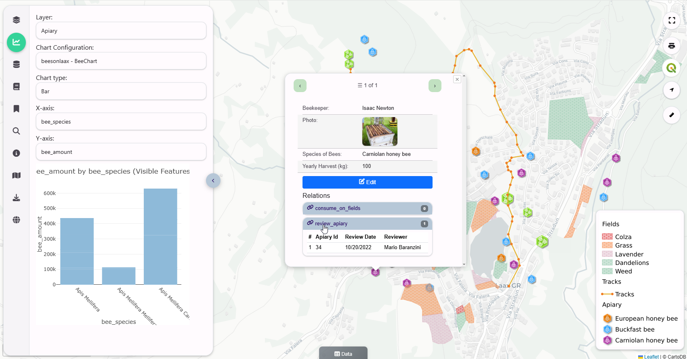

Intro
===========================

Overview
------------

QCarta is a complete GeoPortal for QGIS Maps.

Simply upload your QGIS Project via the QCarta QGIS Plugin (or via FTP) and select features and your map is online.

   - Maps
   - Dashboards
   - Filters
   - GeoStories
   - Plotly Support
   - SQL Reports
   - SQL Workshop
   - QGIS Relations
   - QGIS Plugin
   - Group Level Permissions
   - OGC Web Services (WMS, WFS, and WMTS)
   - Topics and Keywords
   - Metadata

The workflow is similar to GeoServer. You create Stores from data sources. From Stores, you create Layers.

Creation of Stores is simplified by providing only two Store types: QGIS and PostGIS

**QGIS Stores**

These consists of your QGIS Project and any Raster, Vector, and static files.

If your QGIS Project uses a PostGIS data source, you can create a PostGIS Store for it.

**PostGIS Stores**

These consist of any local or remote PostGIS connections.

You can also create PostGIS databases from a variety of formats, such as geopackages, shapefiles, backups, etc...

**Layers**

Layers are created from QGIS and PostGIS Stores.

Layers provide OGC Web Services that are served via MapProxy

**MapProxy**

QCarta also installs MapProxy, for caching. Quail Authentication is integrated with MapProxy.

Layers can also be seeded in advance.

**OGC Web Services**

You can publish WMS, WFS, and WMTS publically or via authentication.

**OpenLayers and Leaflet Preview**

You can preview all stores and layers in OpenLayers and Leafletjs.

**Users and Groups**

Create Users and Groups. All Stores and Layers provide Group level permissions.

**Map Portal**

QCarta has a built in Map Portal with User and Group level access. Users can log directly into your Map Portal as see only those maps they have permissions for.

Authors
-------
* `AcuGIS`_
* `David Ghedini`_
* `Kaloyan Petrov`_

.. _`David Ghedini`: https://github.com/DavidGhedini
.. _`Kaloyan Petrov`: https://github.com/kaloyan13
.. _`AcuGIS`: https://www.acugis.com

Components
-------------

* QGIS Server
* MapProxy
* PostgreSQL
* PHP
* SimpleWebrowser
* WFSExtension
* OpenLayers
* Leafletjs
* Bootstrap 5

Open Source
-----------

Quail is Free, Open Source Software.

GNU GENERAL PUBLIC LICENSE v3

    

