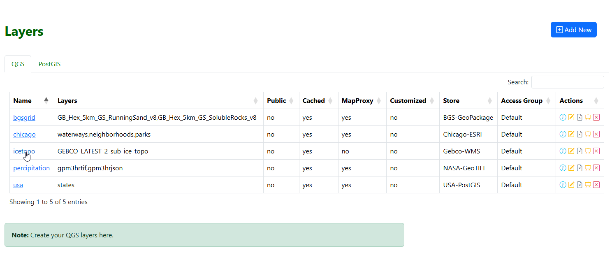

Intro
===========================

Overview
------------

Quail is a lightweight Administration tool and layer server for QGIS Server.

The workflow is similar to GeoServer. You create Stores from data sources. From Stores, you create Layers.

Creation of Stores is simplified by providing only two Store types: QGIS and PostGIS

**QGIS Stores**

These consists of your QGIS Project and any flat files required. Flat files are Raster files, Vector files, image files, etc ...

If your QGIS Project uses a PostGIS source, you can create a PostGIS Store for it.

**PostGIS Stores**

These consist of any local or remote PostGIS connections.

You can also create PostGIS databases from a variety of formats, such as geopackages, backups, etc...

**Layers**

Layers are created from QGIS and PostGIS Stores.

You can create any number of Layers from any given Store.

**MapProxy**

Quail also installs MapProxy, for caching. Quail Authentication is integrated with MapProxy.

Layers can also be seeded in advance.

**Documentation**

View full Documentation

.. _`JasperReportsIntegration`: https://github.com/daust/JasperReportsIntegration 

Authors
-------
* `David Ghedini`_
* `Kaloyan Petrov`_
* `AcuGIS`_

.. _`David Ghedini`: https://github.com/DavidGhedini
.. _`Kaloyan Petrov`: https://github.com/kaloyan13
.. _`AcuGIS`: https://www.acugis.com

Components
-------------

* QGIS Server
* MapProxy
* PostgreSQL
* PHP
* SimpleWebrowser
* WFSExtension

Open Source
-----------

Quail is Free, Open Source Software.

GNU GENERAL PUBLIC LICENSE v3

    

