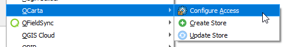
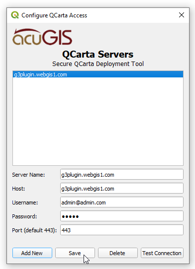
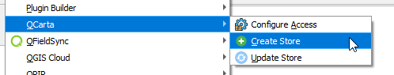
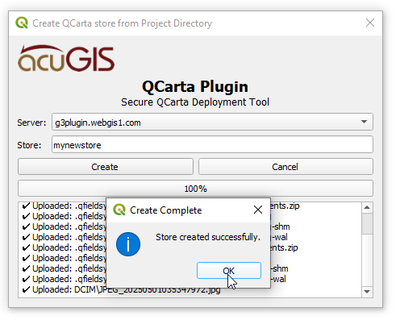
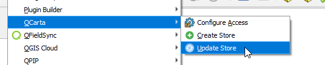
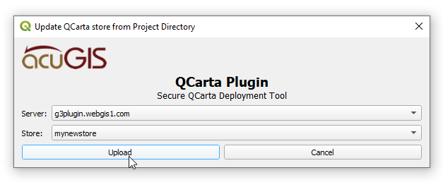

.. This is a comment. Note how any initial comments are moved by
   transforms to after the document title, subtitle, and docinfo.

.. demo.rst from: http://docutils.sourceforge.net/docs/user/rst/demo.txt

.. |EXAMPLE| image:: static/yi_jing_01_chien.jpg
   :width: 1em

************
QGIS Plugin
************

.. contents:: Table of Contents

Installation
==================

The plugin is available via the QGIS Plugin Repository

This is the recommended way to install it.

Manual Installation
==================

Download qcarta_qgis_plugin.zip to your desktop

In QGIS, go to Plugins > Manage and Install Plugins and click on "Install from Zip" in left menu.

Browse to location where you saved qcarta_qgis_plugin.zip and then click "Install Plugin"

Once installed, you should see the Plugins menu.

Usage
==================
  
Begin by selecting Configure SFTP servers:  

Click Add to add server(s).

Click Save.

Go to Create Store

Select the Server you wish to upload to.  

.. warning::
    The entire QGIS Project directory will be uploaded.

Click Upload

A success message will be displayed up completion.

.. note::
    If files exist, you will prompted if you wish to overwrite files.
    

Update Store
==================

You can update an existing Store using the Update Store function

Select the Server and Store:

