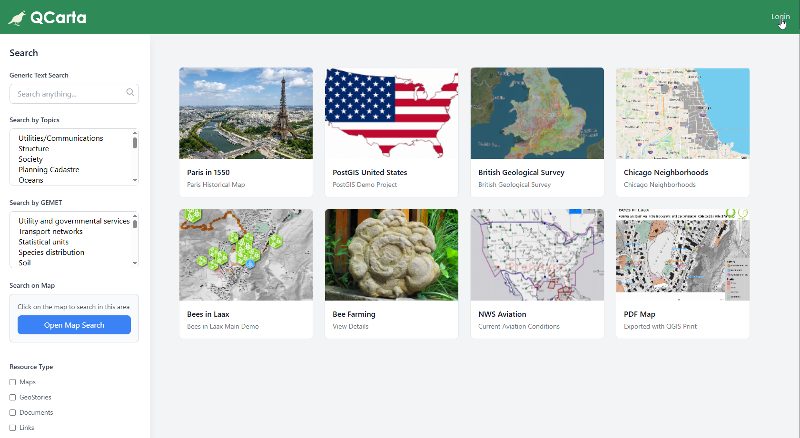
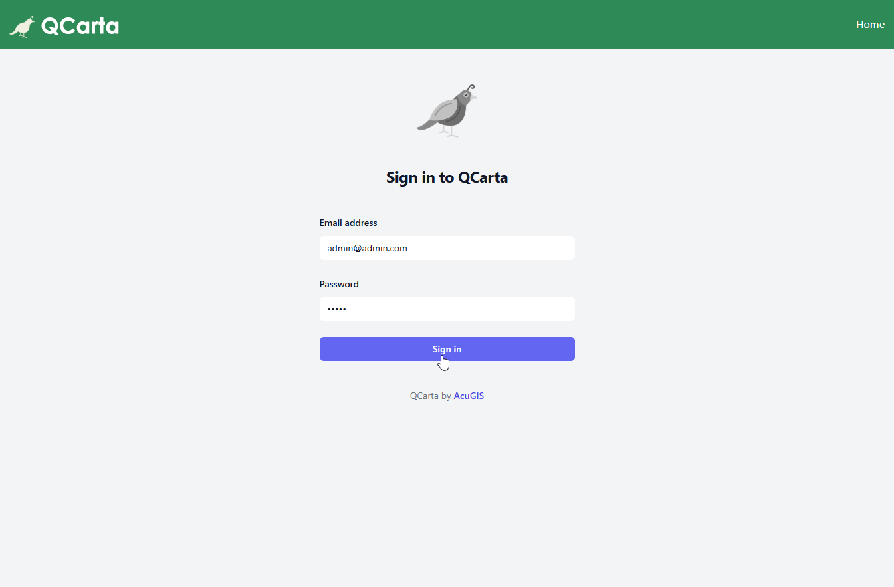

.. This is a comment. Note how any initial comments are moved by
   transforms to after the document title, subtitle, and docinfo.

.. demo.rst from: http://docutils.sourceforge.net/docs/user/rst/demo.txt

.. |EXAMPLE| image:: static/yi_jing_01_chien.jpg
   :width: 1em

************
QGIS Plugin
************

.. contents:: Table of Contents

Installation is done via the install scripts located in the /installer directory.

System Requirements
=======================
* 2 GB RAM
* 5 GB Disk
* Tested on Ubuntu 24 LTS

.. note::
    Seeding and tile generation can be CPU intensive for larger data sets.  Plan accordingly.

ECW Support
========================

For ECW Support, use the Quail ECW Support installer prior to installation

https://github.com/AcuGIS/qcarta-ecw-support

Installer (Recommended)
=======================

Clone the repository:

.. code-block:: console

    git clone https://github.com/AcuGIS/qcarta.git
   
Change to the /quail directory and run the installers in sequence below:

If you already have PostgreSQL with PostGIS enabled, skip the postgres.sh script.

.. code-block:: console
 
    cd quail
    ./installer/postgres.sh
    ./installer/app-install.sh [--no-mapproxy]

Optionally, run below to provision SSL using letsencrypt:

.. code-block:: console

   apt-get -y install python3-certbot-apache

   certbot --apache --agree-tos --email hostmaster@yourdomain.com --no-eff-email -d yourdomain.com

Login at https://yourdomain.com and click the login button at top right.

The login page is displayed as below

Default credentials

* Email:  admin@admin.com
* Password: quail

Note: If you see below when navigating to your domain, remove the default index.html page from /var/www/html

.. image:: error-page.png

Docker Install
=======================

.. warning::
   Docker is not recommended for Production hosting.

To install using Docker:

.. code-block:: console

    git clone https://github.com/AcuGIS/qcarta.git
    cd qcarta
    installer/docker-install.sh
    docker-compose pull

Next, go to docker/public.env and set the SERVER_NAME and IP to your machines hostname and IP.

.. code-block:: console

    docker-compose up

If you want to build from source, run next command.

.. code-block:: console
   docker-compose build
   
To clean persistent data, you can remove volumes with this command:

.. code-block:: console

    docker volume rm quail_{cache_qgis,data_layers,data_qgis,data_mapproxy,data_stores,html_layers,html_stores,pg_data,www_cache}

Navigate to http://yourdomain.com:8000

Default credentials

* Email:  admin@admin.com
* Password: quail

