.. This is a comment. Note how any initial comments are moved by
   transforms to after the document title, subtitle, and docinfo.

.. demo.rst from: http://docutils.sourceforge.net/docs/user/rst/demo.txt

.. |EXAMPLE| image:: static/yi_jing_01_chien.jpg
   :width: 1em

************
QGIS Plugin
************

.. contents:: Table of Contents

Installation
==================

The plugin is available via the QGIS Plugin Repository

This is the recommended way to install it.

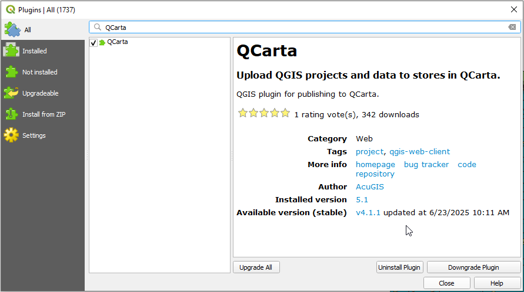

.. note::
    The plugin is NOT a requirement for publishing to QCarta, you can publish directly via QCarta admin interface as well.

==================
1. Launch Plugin
==================
  
Once installed, go to Web > QCarta > QCarta Console:

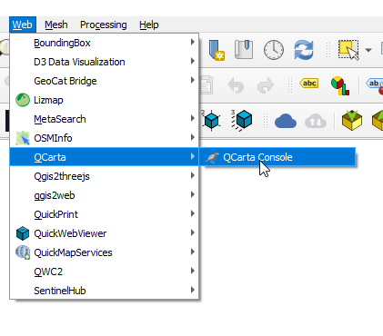

==================
2. Configure
==================

Click Configure to add your QCarta server(s)

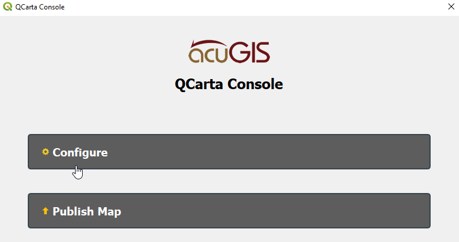

Enter your QCarta server details and click Test Connection

When Connection test passes, click Save

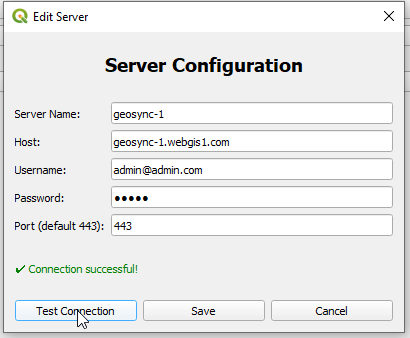

If you are using more than one QCarta installation, you must set the server as below:

.. image:: _static/Select-Server.png

==================
3. Publish Map
==================

Click Publish Map.

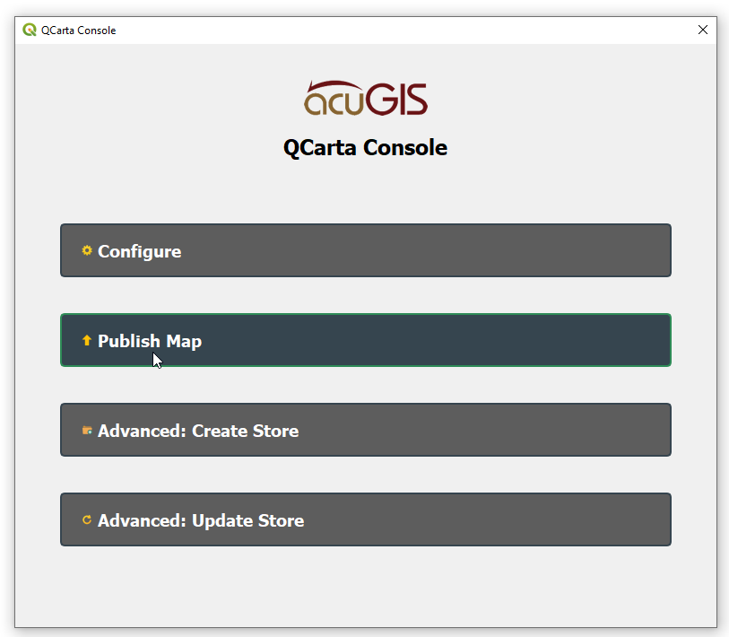

Select the options you wish to use and click Create

  ..Note::
   Options can be updated via UI or plugin later

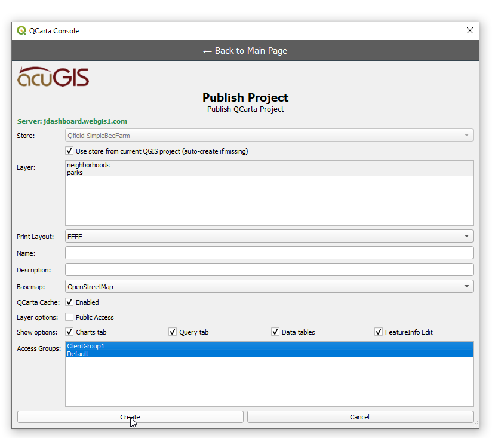

You'll see a message that your Store has now been Published

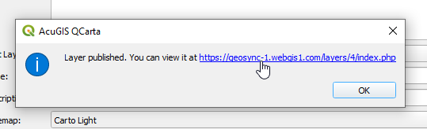

View the map

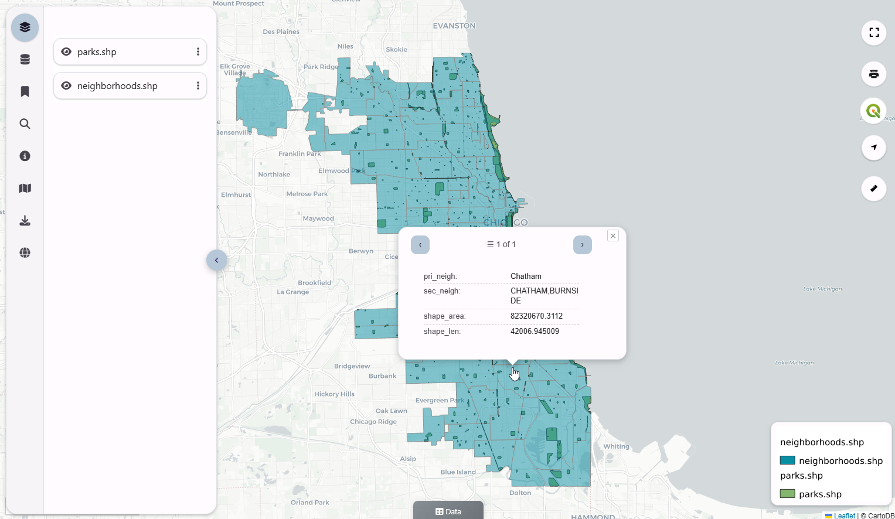

.. note::
    Just as you can do all above without using the Plugin, you can also edit Maps you have published directly in QCarta as well.

==================
Advanced: Create Store
==================

While the neccessity to create a Store prior to publishing maps was removed in QCarta 6, you can still do so if you wish to.

This can be for backwards-compatibility or if you simply want to select particular Store options

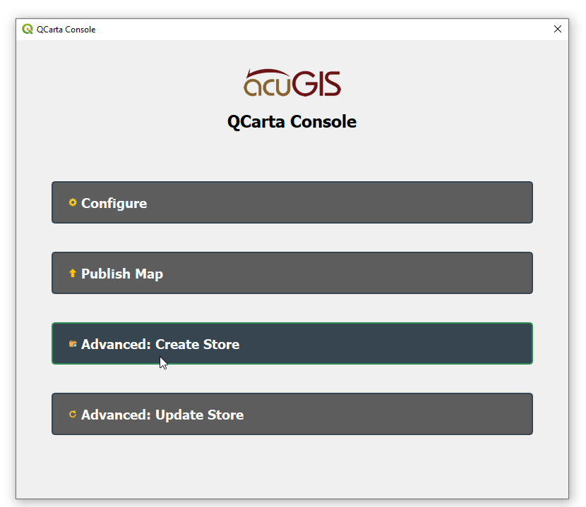

Enter the Store title and click Create

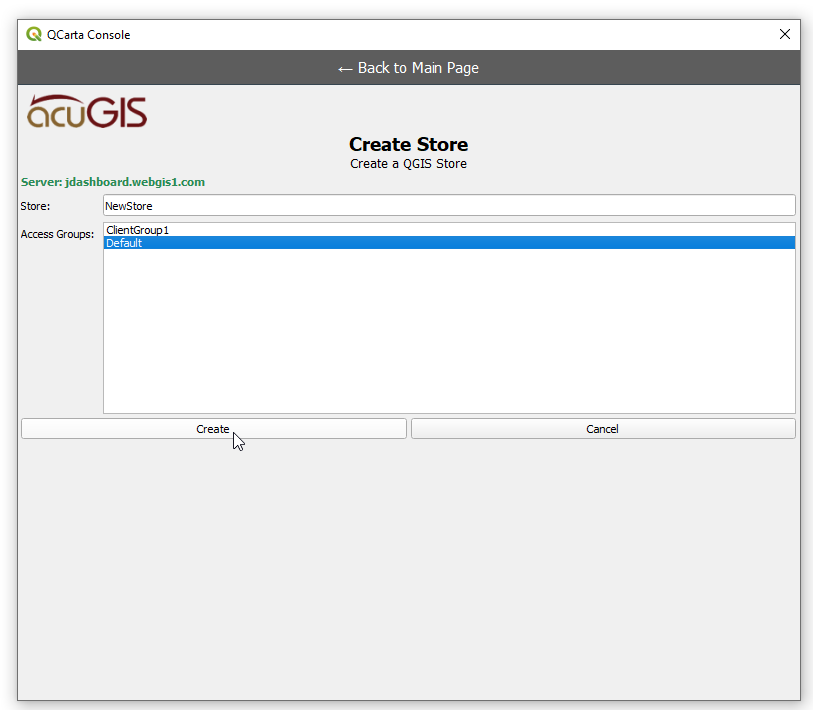

==================
Advanced: Update Store
==================

You can update an existing Store (QGIS Project Files) using the Update Store tab.

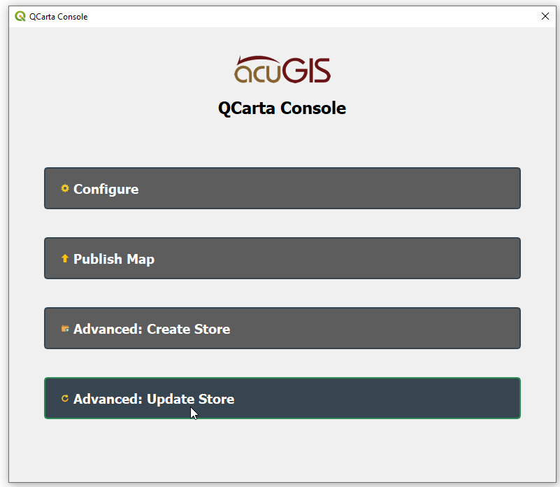

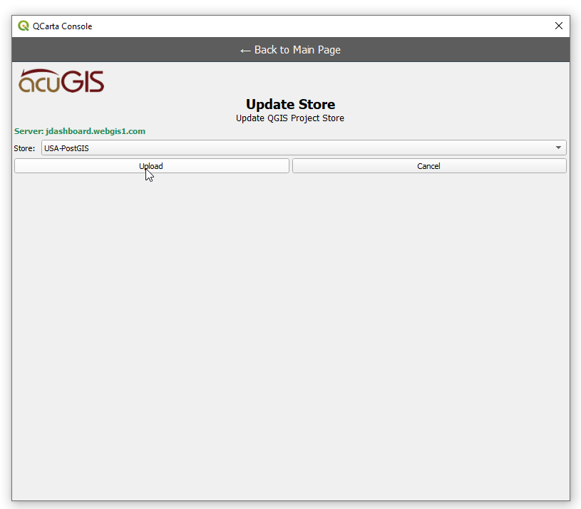

