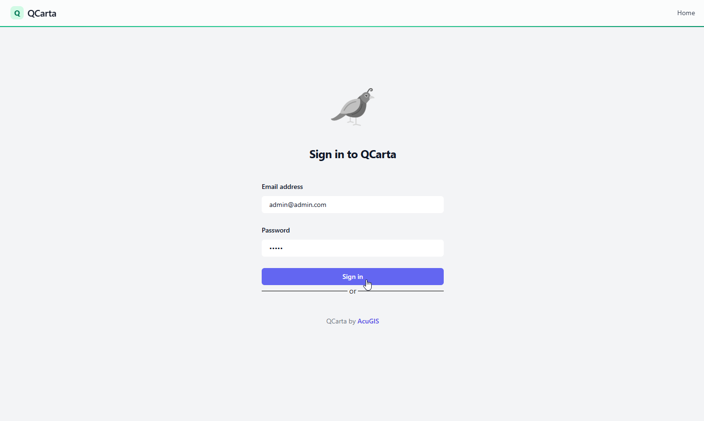
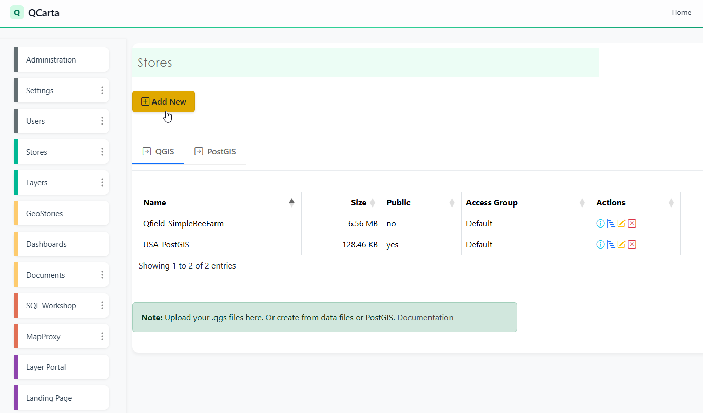
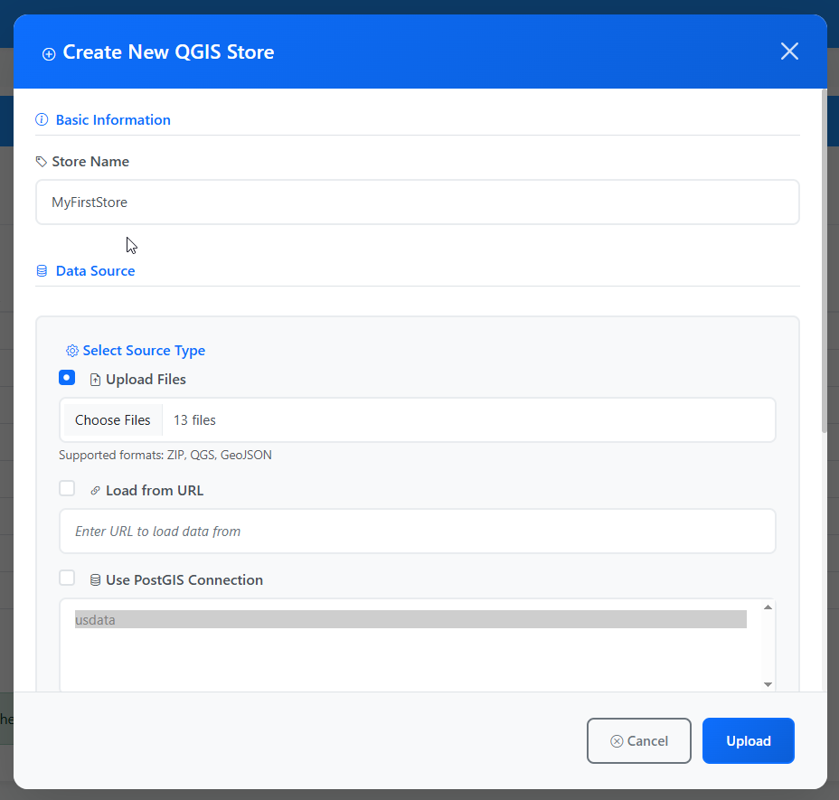
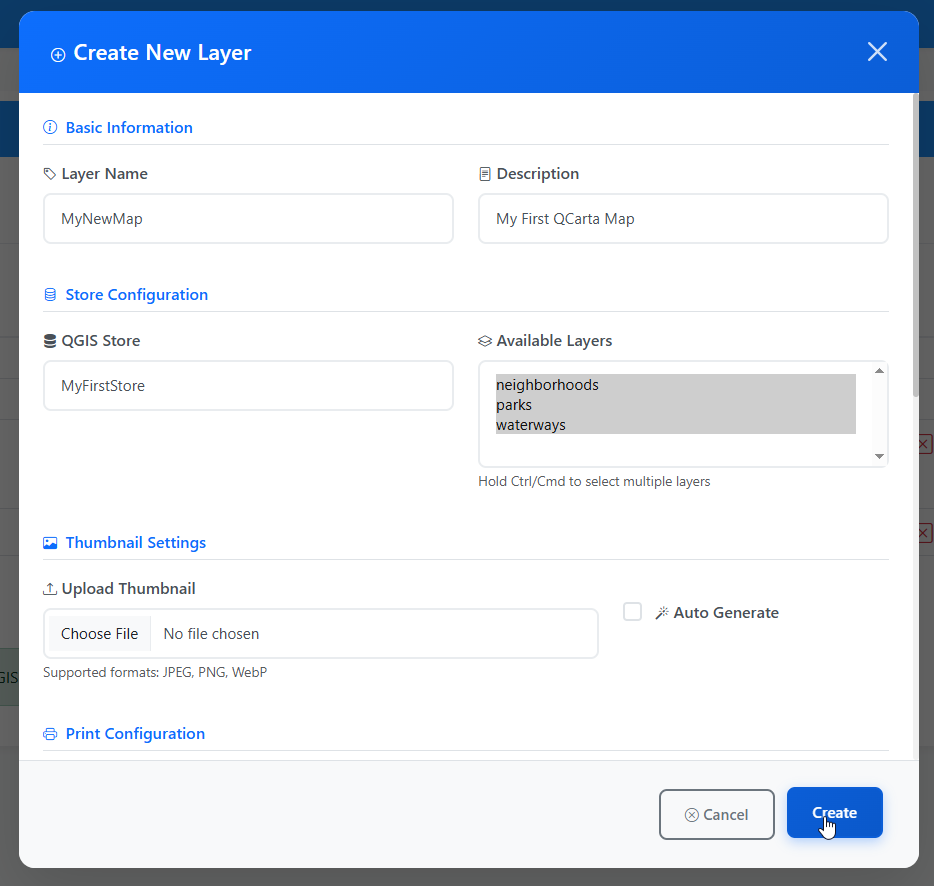
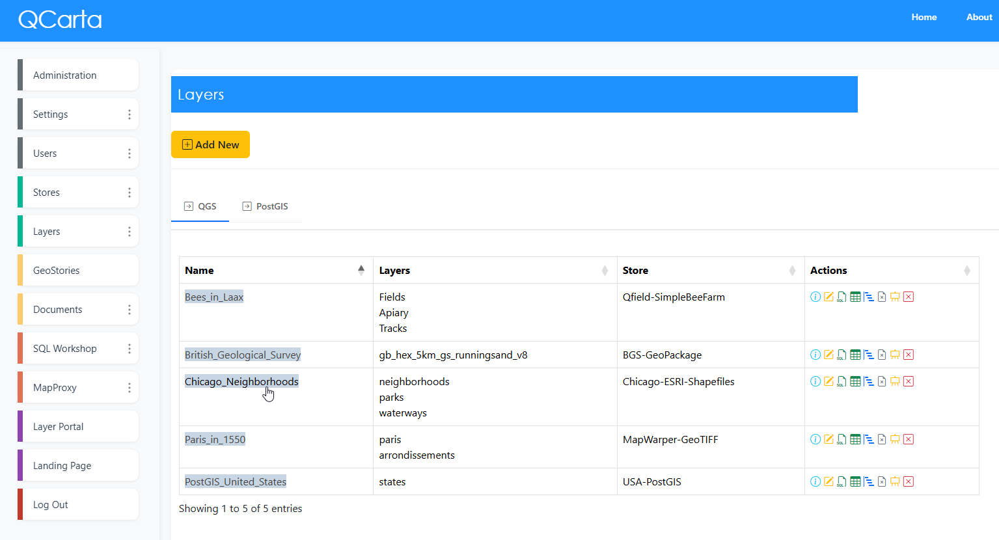
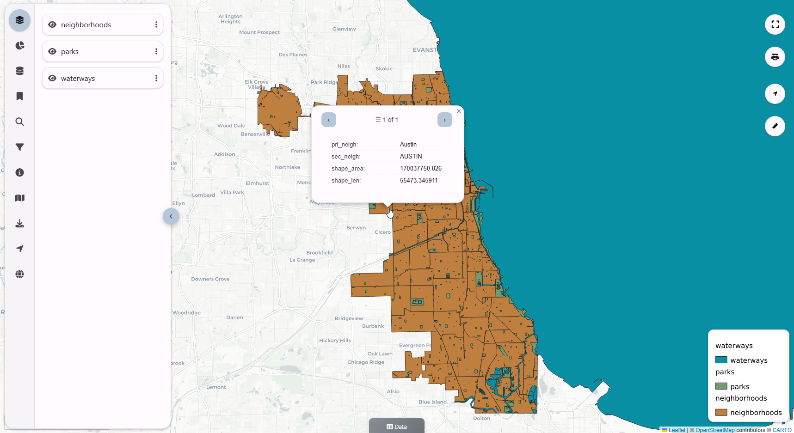

.. This is a comment. Note how any initial comments are moved by
   transforms to after the document title, subtitle, and docinfo.

.. demo.rst from: http://docutils.sourceforge.net/docs/user/rst/demo.txt

.. |EXAMPLE| image:: static/yi_jing_01_chien.jpg
   :width: 1em

************
Quick Start
************

.. contents:: Table of Contents

To get started quickly with Quail and see if it meets your needs, follow below.

=======================
Install with Docker
=======================

Install with Docker

.. warning::
   Docker is not recommended for Production hosting.
    

.. code-block:: console

   git clone https://github.com/AcuGIS/qcarta.git
   cd qcarta
   installer/docker-install.sh
   docker-compose pull

Before calling up set docker/public.env with the IP or hostname used on your device

.. code-block:: console

   docker-compose up

Note: To clean persistent data, you can remove volumes with this command:

.. code-block:: console

    docker volume rm quail_{cache_qgis,data_layers,data_qgis,data_mapproxy,data_stores,html_layers,html_stores,pg_data,www_cache}

Navigate to http://yourdomain.com:8000

Default credentials

* Email:  admin@admin.com
* Password: quail

Upload QGIS Project
==========================

You can upload QGIS Projects to create Stores using the QCarta QGIS Plugin.

Alternatively, you can upload via the admin panel as well.

Once logged in, go to Stores > Add New

Upload your QGIS Project and any required data files.  If your QGIS Project uses a PostGIS backend, create a PostGIS Data Store for it.

Your QGIS Store has now been created

Create Layer(s)
=========================

Go to Layers > Add New and select the Layer(s) to use from your Project.

View Layer(s)
=======================

You can now view your Map by clicking on the Poral link

Click the Show Info button at right:

