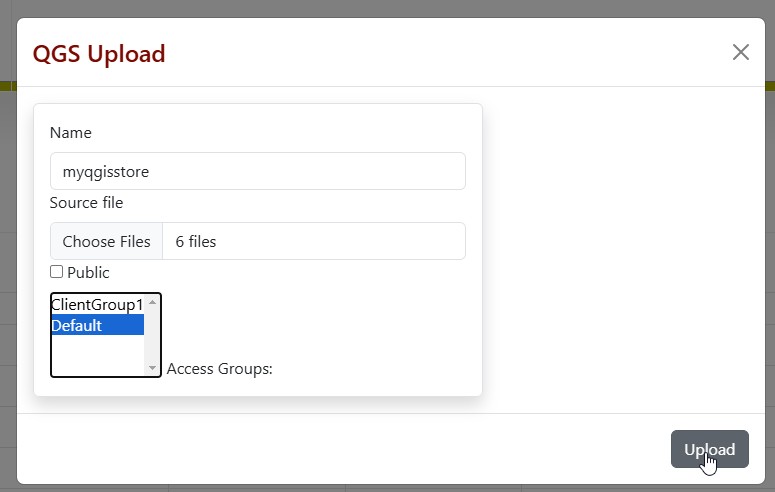
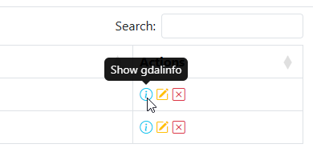

.. This is a comment. Note how any initial comments are moved by
   transforms to after the document title, subtitle, and docinfo.

.. demo.rst from: http://docutils.sourceforge.net/docs/user/rst/demo.txt

.. |EXAMPLE| image:: static/yi_jing_01_chien.jpg
   :width: 1em

************
Quick Start
************

.. contents:: Table of Contents

To get started quickly with Quail and see if it meets your needs, follow below.

=======================
Install with Docker
=======================

Install with Docker

.. warning::
    Docker is not recommended for Production hosting.
    

Download the Quail binary and unzip:

.. code-block:: console

    wget https://github.com/AcuGIS/quail/quail-2.11.0.zip
    unzip -q quail-server-1.11.0.zip
    

Change to the /quail-server-1.11.0 directory and run as below

.. code-block:: console

    cd quail
    ./installer/docker-install.sh
    docker-compose up

To clean persistent data, you can remove volumes with this command:

.. code-block:: console

    docker volume rm quail_{cache_qgis,data_layers,data_qgis,data_mapproxy,data_stores,html_layers,html_stores,pg_data,www_cache}

Navigate to http://yourdomain.com:8000

Default credentials

* Email:  admin@admin.com
* Password: quail

.. image:: _static/quail-login.png

Upload QGIS Project
==========================

Once logged in, go to Stores > Add New

Upload your QGIS Project and any required data files.  If your QGIS Project uses a PostGIS backend, create a PostGIS Data Store for it.

Click the Info/showGdal link at right.

You can now view Capabilities as well as OpenLayers previews

Create Layer(s)
=========================

Go to Layers > Add New and select the Layer(s) to use from your Project.

.. image:: sections/layers/create-layer-4.png

View Layer URLs and Preview
=======================

Click the Show Info button at right:

.. image:: sections/layers/layer-show-info.png

You can now see and test your Layer urla

.. image:: sections/layers/layer-show-info-2.png

You can nwo also view your Leaflet Layer Preview by clicking on the Layer name

