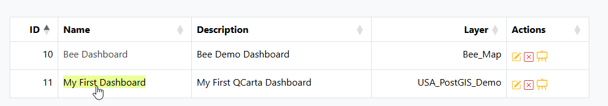

.. This is a comment. Note how any initial comments are moved by
   transforms to after the document title, subtitle, and docinfo.

.. demo.rst from: http://docutils.sourceforge.net/docs/user/rst/demo.txt

.. |EXAMPLE| image:: static/yi_jing_01_chien.jpg
   :width: 1em

**********************
Dashboards
**********************

.. contents:: Table of Contents
Overview
==================

A Dashboard allows you to add a Map along with Charts, Tables, Lgends, and Text.

The data elements adjust with map pan.

.. image:: ../../_static/qcarta-dashboards.png

If your QGIS Project uses a PostGIS data source, you can create a PostGIS Store.

Create a Dashboard
================

Below, we'll create a Dashboard from the USA PostGIS demo Layer.

Click on Dashboards in the left menu:

.. image:: dashboard-create-1.png

Click the Add New button

Give your Dashboard and Name and Description.

You can also set a thumbnail here (can be done later as well)

Select the QGIS Project Layer you will use from the dropdown and set Permissions.

Click the Creat button

Your Dashboard has now been created:

To cofigure your Dashboard, click the Edit Preview button

.. image:: dashboard-create-6.png

A default Dashboard layout will appear

Click the Clear button on top to clear the layout:

.. image:: dashboard-create-8.png

Add Map
===================

Click the Map button at left to add the map canvas:

Add Charts
===================

Click the Chart button at left

.. image:: dashboard-create-10.png

On the Chart element click the Configure button

Give chart a name and select layer, X, Y, and other fields.  

Click the Apply button.

Your Chart has now been configured.  You can edit the configuration at any time.

.. image:: dashboard-create-13.png

Add Tables
===================

Click the Table button at left

Click the configure button on the Table element

Select fields to include and field order. Click the Apply button

.. image:: dashboard-create-16.png

Your Table has been configured

.. image:: dashboard-create-17.png

Add Legends
===================

Click the Legend button at left

.. image:: dashboard-create-18.png

Click the configure button on the Legend element

Give Legend and name and select layers to include.  Click Apply

Your Legend has now been added.

Grid
===================

Add any additional Chart, Table, Legend or Text elements you wish to.

Drag the elements to the location you wish to use.  Click Save.

Give your Store a name.  Below we are using 'MyFirstStore'.

.. image:: qcarta-create-store-1.png

JSON
===================

You can also export JSON files and use as Template for other dashboards.

