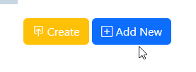
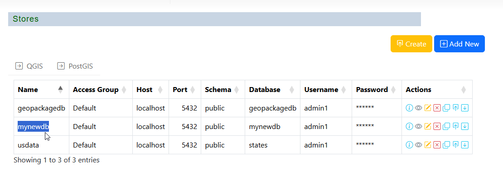
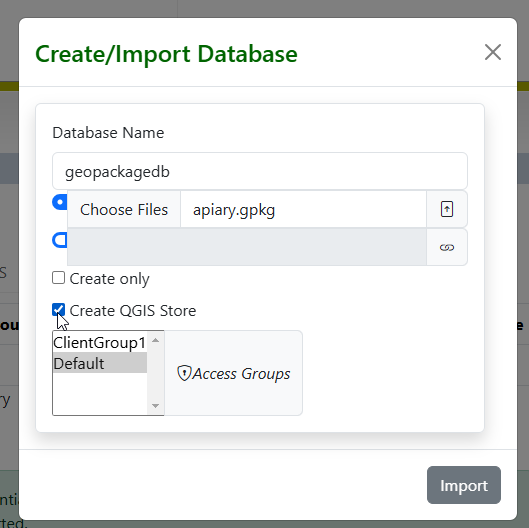
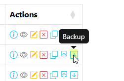
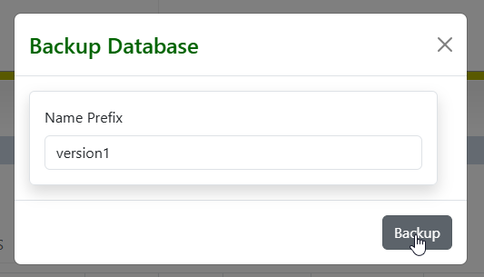
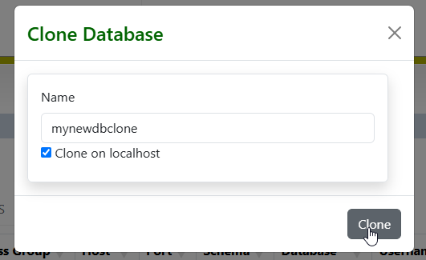
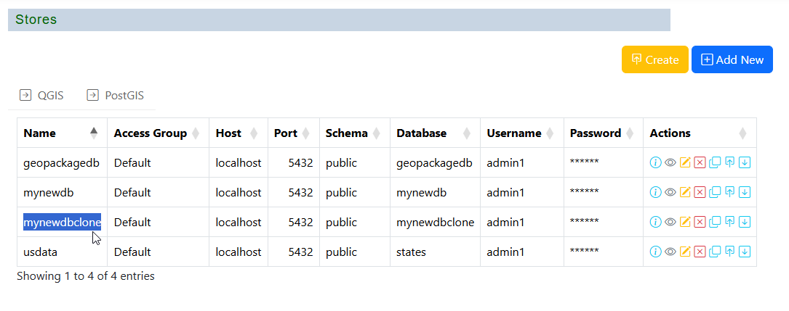
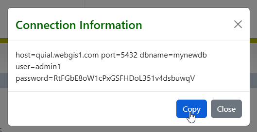

.. This is a comment. Note how any initial comments are moved by
   transforms to after the document title, subtitle, and docinfo.

.. demo.rst from: http://docutils.sourceforge.net/docs/user/rst/demo.txt

.. |EXAMPLE| image:: static/yi_jing_01_chien.jpg
   :width: 1em

**********************
Database Functions
**********************

.. contents:: Table of Contents
Overview
==================

PostGIS Stores are connections to PostGIS databases.

These can be existing local or remote PostGIS databases.

You can also create new PostGIS databases from GeoPackages, ESRI Shapefiles, and PostgreSQL backups.

You can also create new, empty PostGIS databases as well.

Create From Connection
================

To add a new Link, click the "Add New" button at top.

Populate the required fields for your PostgreSQL connection

Under Database, click the "Load Database Names" icon

.. image:: ../postgisstores/3-add-new.png

The list of available databases will appear.  Select the database you wish to connect to.

Select the Group(s) that will have permission to the Store

.. image:: ../postgisstores/5-add-new.png

Click Save.  Your Store has been created.

Create From File(s)
=====================

You can create a PostGIS database from most common data sources, such as ESRI Shapefiles and GeoPackages

You can also create databases from PostGIS backups.

To create a PostGIS database from a file, click the Create button at top right

.. image:: ../postgisstores/create-new-store.png

Give your database a name and click the Choose Files button.

.. image:: ../postgisstores/create-store-from-geopackage-0.png

Browse to the file(s) location

Click the Impprt button

The import results are displayed at the bottom of the page.

.. image:: ../postgisstores/create-store-from-geopackage-3.png

.. note::
   You may need to click the PostGIS tab to refresh before seeing your new database

Create Empty Database
=====================

You can create an empty PostGIS database.

An empty database is useful if you have a QGIS Project and want to connect to the database to import layers.

To create an empty PostGIS database, 

Click the Create Button

.. image:: ../postgisstores/create-new-store.png

Give your database a name and check the "Create Only" box.

.. image:: ../postgisstores/create-db-only.png

Your database has been created and added as a PostGIS Store

.. image:: ../postgisstores/db-connection-info.png

To view the database connection information, click the Connection icon at right

This information can be used in your pg_service.conf file and any other location

.. image:: ../postgisstores/pg-service-connection.png

Layer Creation
=====================

If your QGIS Project uses a PostGIS backend, the PostGIS Store will be automatically detected when the QGIS Store is added.

Once you have created a PostGIS Store, it can be used to create a PostGIS Layer.

create-postgis-completed.png

create-postgis-completed-qgs-confirm.png

.. image:: ../postgisstores/create-postgis-completed-qgs-confirm.png

create-postgis-database.png

create-postgis-database-completed.png

create-postgis-import.png

create-postgis-upload.png

create-postgis-upload-qgs-option.png

create-postgis-upload-selected.png

postgis-backup.png

postgis-backup-name.png

postgis-clone.png

.. image:: ../postgisstores/postgis-clone.png

postgis-clone-clone.png

postgis-clone-verified.png

postgis-restore.png

.. image:: ../postgisstores/postgis-restore.png

postgis-restore-select.png

.. image:: ../postgisstores/postgis-restore-select.png

postgis-show-connection.png

.. image:: ../postgisstores/postgis-show-connection.png

postgis-show-connection-show.png

