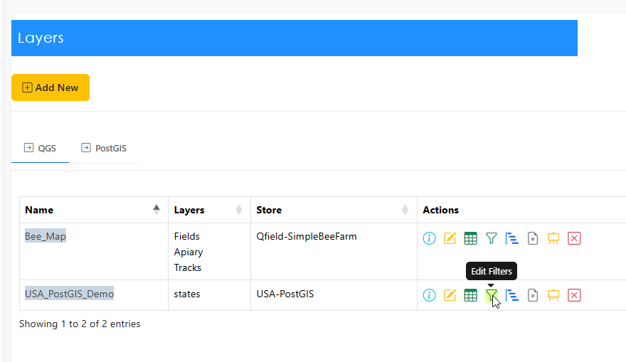
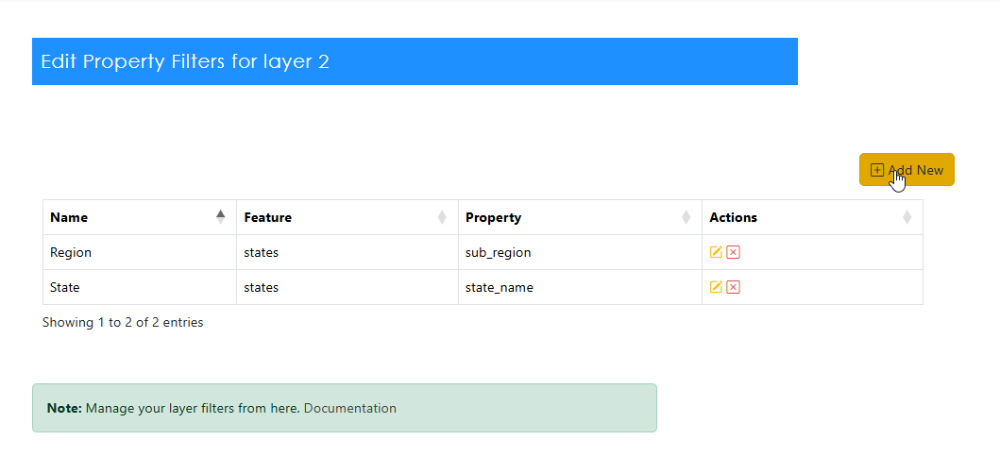
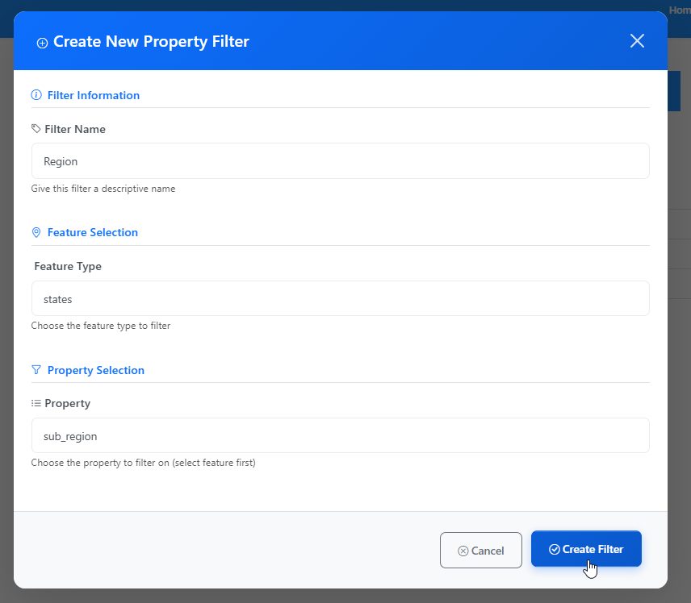
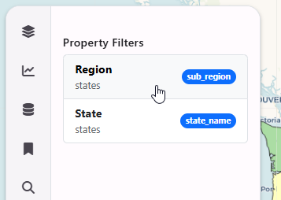
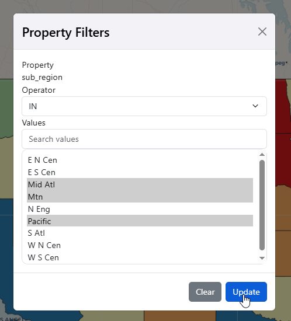
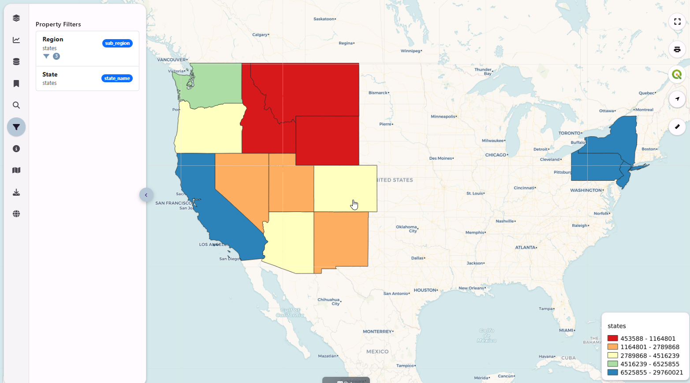
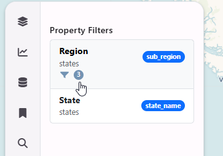

**********************
Filters
**********************

.. contents:: Table of Contents

Overview
==================

Filters are used to filter columns from your data source.

Add Filters
==================

To create a new Filter, click the Layer menu at left and then click the Filter icon

Click the Add New button

Enter your Filter name and description and the column you wish to Filter.

Go to your map and verify the Filter is present

Test the Filter

Filter applied

Note:  When Filter(s) are applied, small filter icon with the number of filtered values is displayed

Edit Filters
==================

To edit a Filter, click the Filter icon for the layer.

Edit the Filter and save it.

