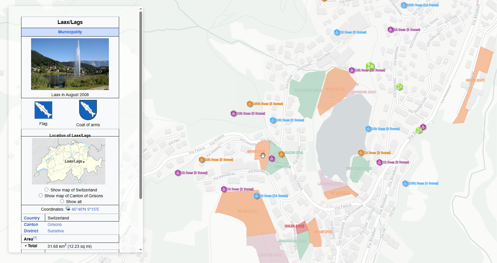
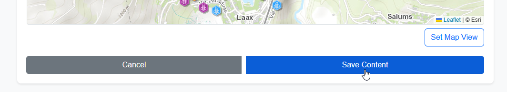

.. This is a comment. Note how any initial comments are moved by
   transforms to after the document title, subtitle, and docinfo.

.. demo.rst from: http://docutils.sourceforge.net/docs/user/rst/demo.txt

.. |EXAMPLE| image:: static/yi_jing_01_chien.jpg
   :width: 1em

**********************
GeoStories
**********************

.. contents:: Table of Contents
Overview
==================

GeoStores allow you to add Layers and HTML into horizontal or veritical presentations.

Create GeoStory
================

Below, we'll create a GeoStory using the City Bees QGIS demo Project.

Click GeoStories on the left menu:

Click Add New

Add a WMS section:

Add a Title, select the QGIS layer, and select Basemap

Scoll down to the Map Preview section and pan the map to where you want it.

Click the Set Map View button

Add any HTML content you wish to add to the HTML editor above the map

Give Save Content

Add additional sections.  HTML example below:

.. image:: qcarta-geostory-8.png

Once you have added your sections, give your GeoStory a Name, Description, and set Permissions. 

Click Export Vertical Story for vertical scrolling or Export Horiztonal Story for horizontal scrolling.

Your GeoStory has been created:

