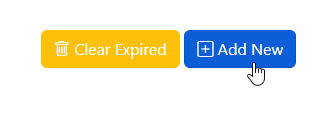
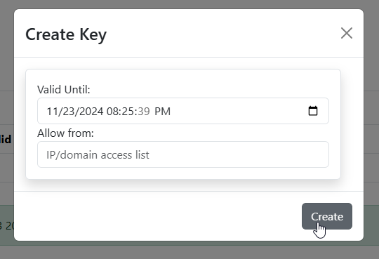
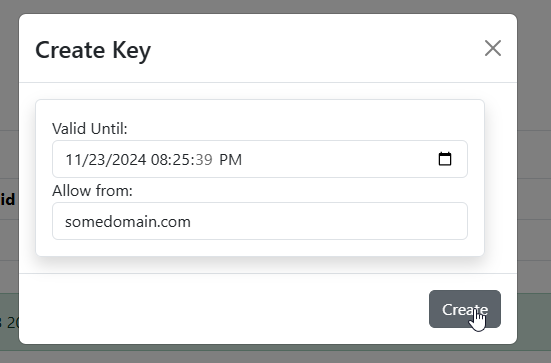
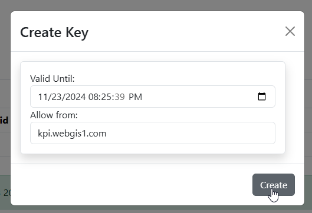
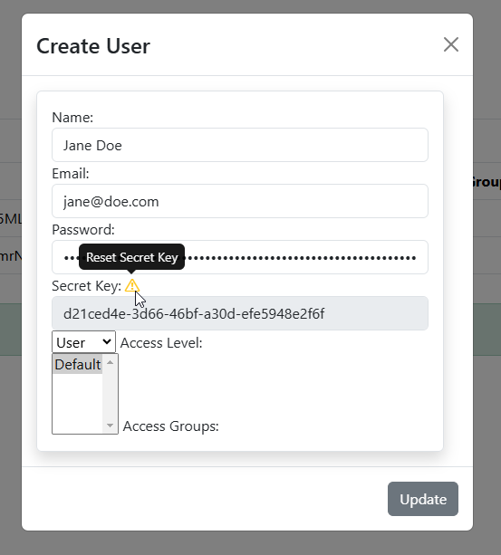
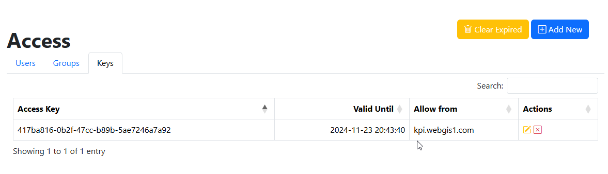
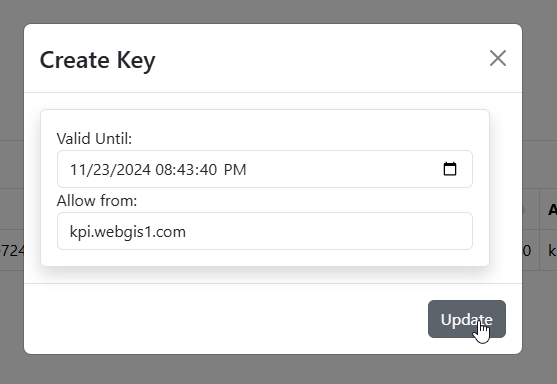
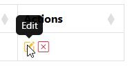

.. This is a comment. Note how any initial comments are moved by
   transforms to after the document title, subtitle, and docinfo.

.. demo.rst from: http://docutils.sourceforge.net/docs/user/rst/demo.txt

.. |EXAMPLE| image:: static/yi_jing_01_chien.jpg
   :width: 1em

**********************
Keys
**********************

.. contents:: Table of Contents
Overview
==================

Remote access to layers is handles via Keys.

Add Link
================

To add a new Link, click the "Add New" button at top.

Give your link a Name, Description, and URL:

add new

clear-expired

.. image:: clear-expired.png

 create-key-1

 create-key-2

 create-key-3

 key-1

.. image:: key-1.png

keys-rest

show-use.png

show-use-3.png

show-use-edit.png

The link will appear on the user dashboard as below:

.. note::
    By default, links open in a new window.

