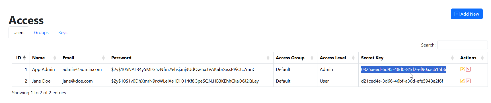
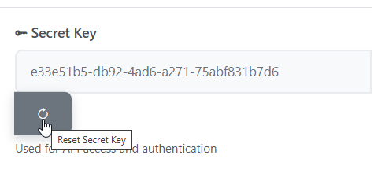
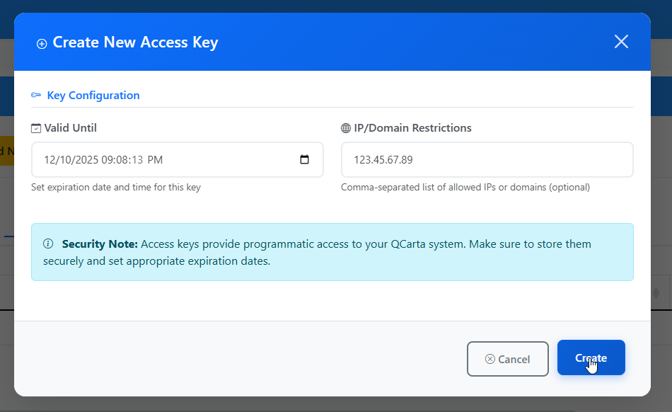
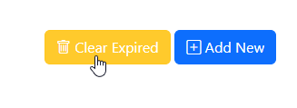

.. This is a comment. Note how any initial comments are moved by
   transforms to after the document title, subtitle, and docinfo.

.. demo.rst from: http://docutils.sourceforge.net/docs/user/rst/demo.txt

.. |EXAMPLE| image:: static/yi_jing_01_chien.jpg
   :width: 1em

**********************
Keys
**********************

.. contents:: Table of Contents
Overview
==================

Remote access to layers is handles via Keys.

Each user has a secret key, which can be refreshed when needed.

Secret Key
================

Use Secret Keys are displayed on the Users tab:

To reset a User's Secret Key, click on the Edit button.

In the modal box, click the Reset Key icon:

Add Key
================

New add a new Key, click the Add New button.

Enter the expiry data and any IP restriction(s).

Click the Create button

Clear Expired
===============

To clear Expired Keys, click the Clear Expired button

