**********************
Layers
**********************

.. contents:: Table of Contents

Overview
==================

Layers are layers from your QGIS project.

Layers are created from Stores.  Stores contain all Layers.

The Layer section allows you to select how these Layers are served.

The Layer table is show below.

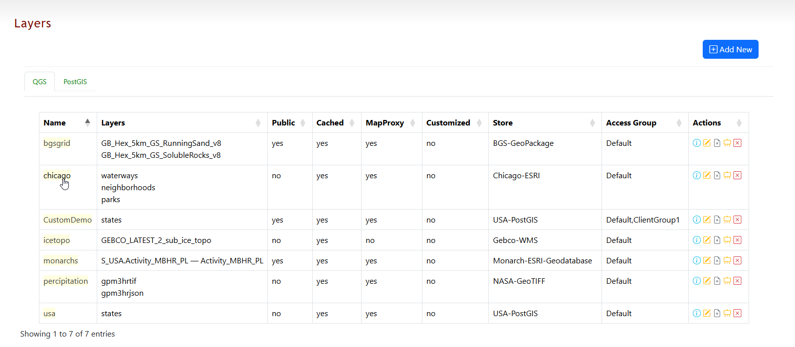

The fields are below

* **Name**. The Layer name. Clicking the Layer name will open the Layer in a Leafletjs map preview.	
* **Layers**. The Layers used fromt the QGIS Project.  You can select which Layers to include.
* **Public**. Public access allows anyone to view the Layer	 (Yes/No)
* **Cached**. Session Caching enabled (Yes/No)
* **MapProxy**. This indicates if MapProxy is enabled (Yes/No)
* **Customized**. This inidicates if Layer is a Custom Leaflet map
* **Store**. The Store used for the Layer	
* **Access Group**. The Group(s) with access to the Layer.
* **Actions**.  Layer actions

Add Layer
==================

To create a new Layer, click the Add New button at top right.

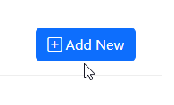

Give your Layer a name:

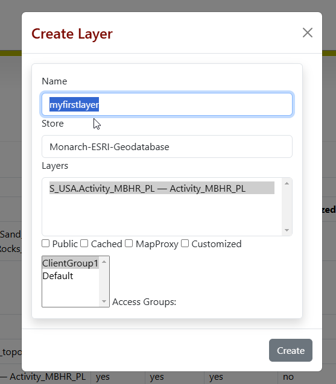

Select the Store from the dropdown

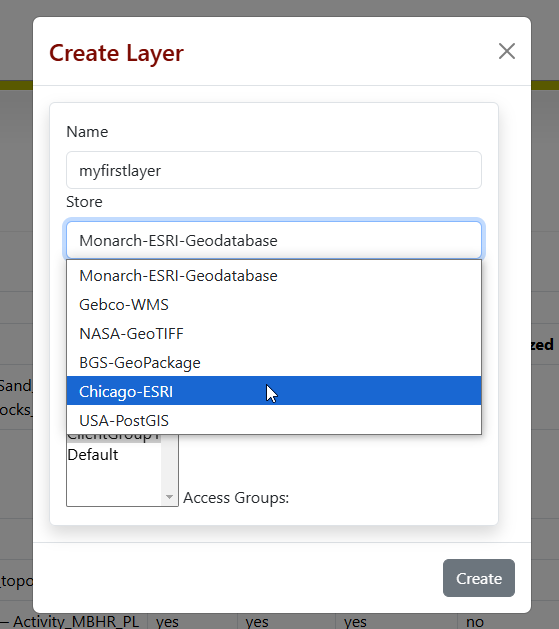

Select the Layer(s) from the Store to include

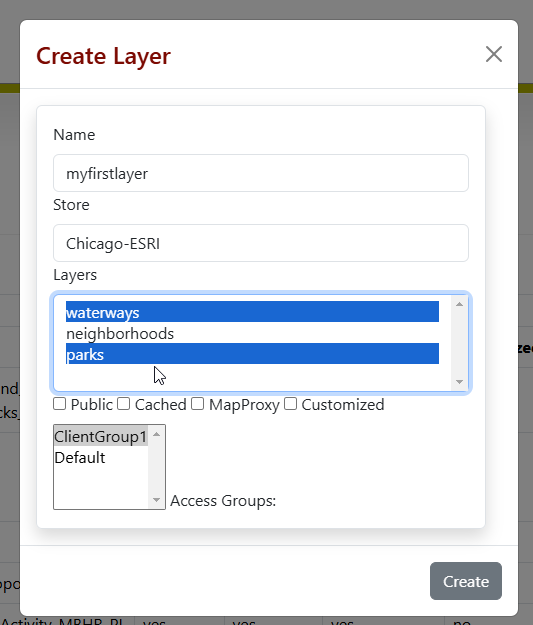

The Select options are explained below

* **Public**. The Layer will be Public, with no authentication required.
* **Cache**. Session Cache.  This is distinct from MapProxy Cache.
* **MapProxy**. This will enable MapProxy for the Layer
* **Custom**. This option is to signify that this Layer does not use the default map template for Preview   
   

Click the Create button.

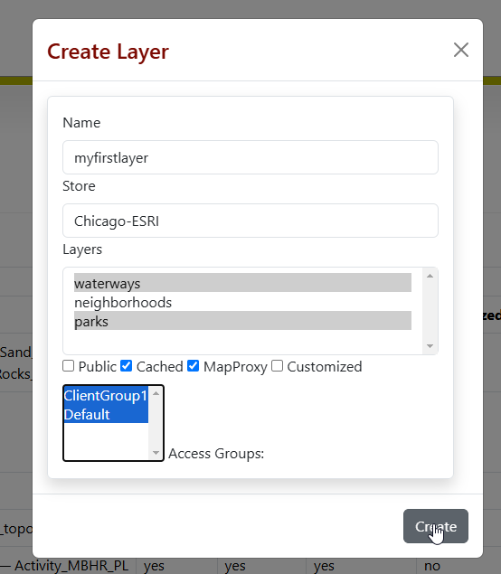

Your Layer has now been created.

No, click on the Layer name to preview the Layer you just created using Leafletjs

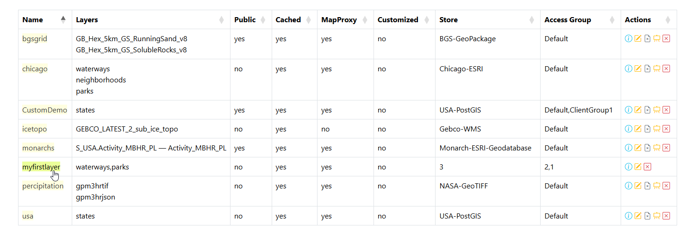

The Layer shows the two QGIS project layers we selected, Parks and Waterways

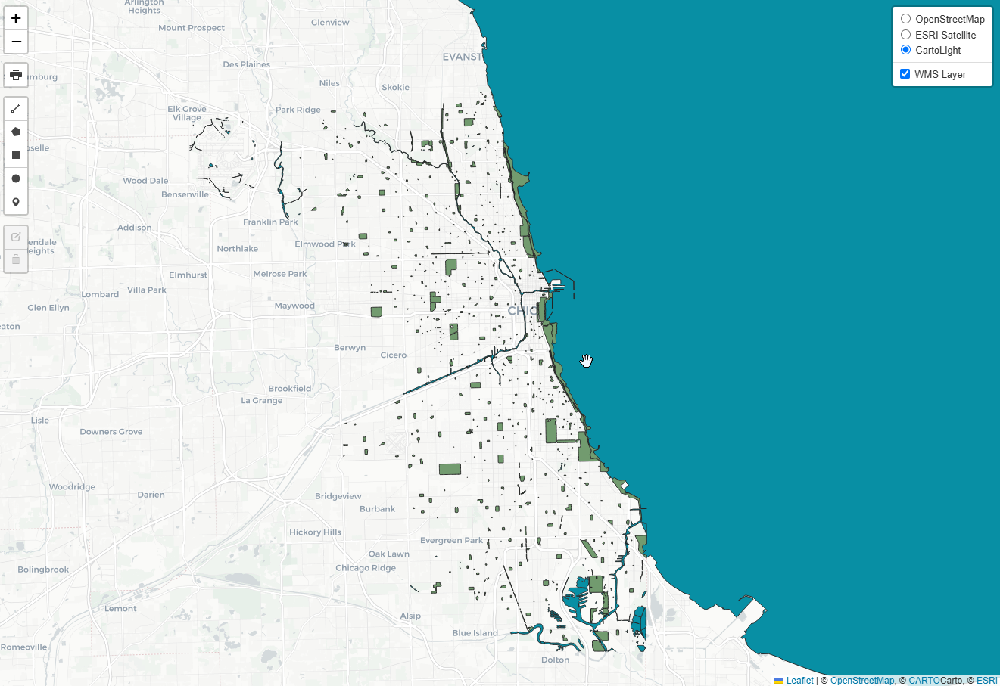

Edit Layer
==================

To edit a Layer, click the Edit button at right as shown below

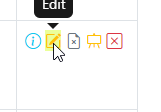

The Layer information is displayed. Make any changes you wish to make and click the Update button

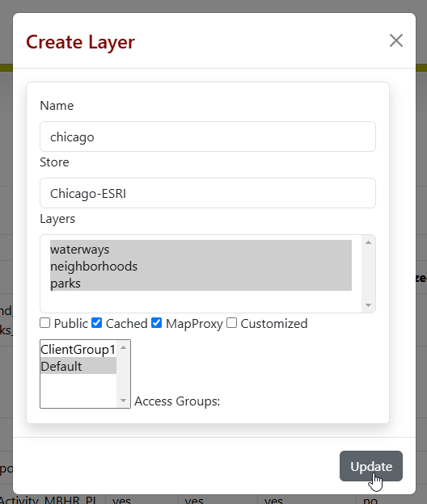

Clear Cache
==================

To clear Session cache, click the Clear Cache button as shown below

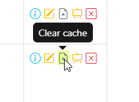

Note: This does not clear MapProxy cache.  Clearing MapProxy cache is done via the MapProxy page.

Show Layer Info
==================

To display information on a layer, click the Show Info button at right

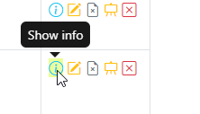

The information is displayed below

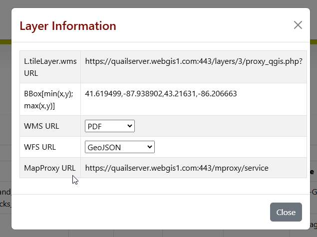

* **L.tileLayer.wms URL**	This is the WMS tile layer

* **BBox[min(x,y); max(x,y)]**	Bounding Box 

* **WMS URL**.  This opens the Layer in the following WMS formats
   * PNG
   * PDF
   * WebP
   * JPEG
   * PNG 1 Bit
   * PNG 8 Bit
   * PNG 16 Bit

* **WFS URL**	This opens the Layer in the following formats
   * GML2
   * GML2.1.2
   * GML3.1
   * GML3.1.1
   * GeoJson
   * VND Geo+Json
   * Geo+Json
   * Geo JSON
  

Edit Preview
==================

To edit the Leaflet Preview for a Layer, click the Edit Preview button

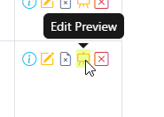

Make any edits you wish to and then click Submit

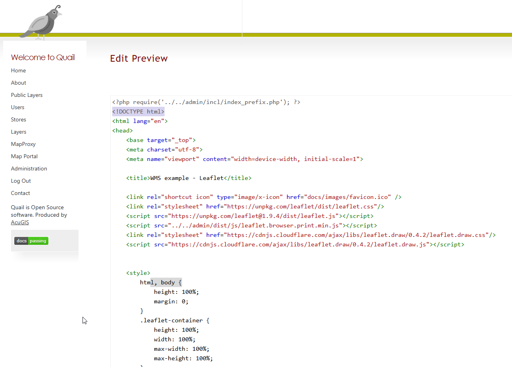

Layer Preview Template
=====================

The template used to create the Layer Preview map is wms_index.php

It is located at::

   /var/www/html/admin/snippets/wms_index.php

You can edit this in any way you like to change the template used to create previews::

      <?php
	require('../../admin/incl/index_prefix.php');
	$wms_url = 'WMS_URL';
	if(str_starts_with($wms_url, '/mproxy/')){
		$content = file_get_contents('https://'.$_SERVER['HTTP_HOST'].'/admin/action/authorize.php?secret_key=SECRET_KEY&ip='.$_SERVER['REMOTE_ADDR']);
		$auth = json_decode($content);
		$wms_url .= '?access_key='.$auth->access_key;
	}
	?>
	<!DOCTYPE html>
	<html lang="en">
	<head>
	<base target="_top">
	<meta charset="utf-8">
	<meta name="viewport" content="width=device-width, initial-scale=1">
	
	<title>WMS example - Leaflet</title>
	
	<link rel="shortcut icon" type="image/x-icon" href="docs/images/favicon.ico" />
	<link rel="stylesheet" href="https://unpkg.com/leaflet/dist/leaflet.css"/>
	
	
	<link rel="stylesheet" href="https://cdnjs.cloudflare.com/ajax/libs/leaflet.draw/0.4.2/leaflet.draw.css"/>
	
	
	

	
	</head>
	<body>

	

	

	</body>
	</html>

You can edit above in any way you wish to.

