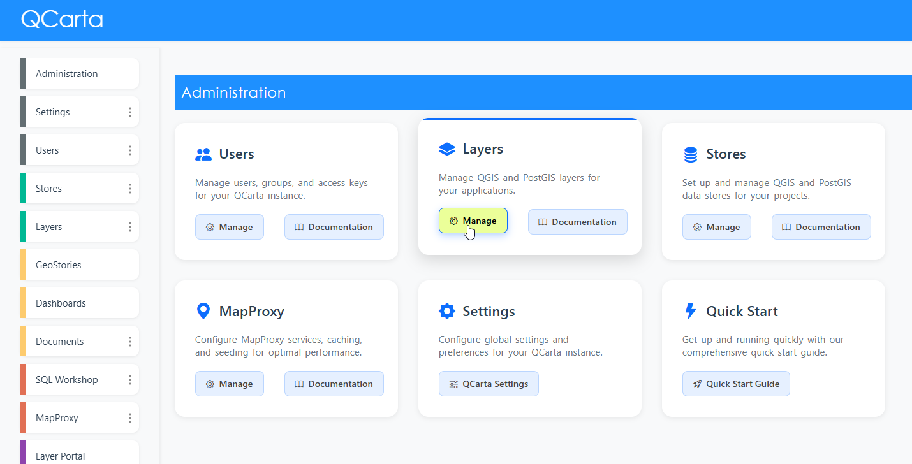
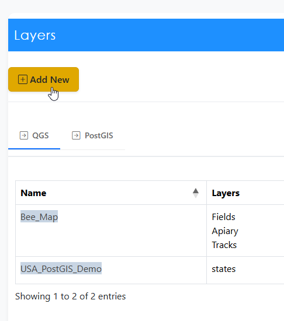
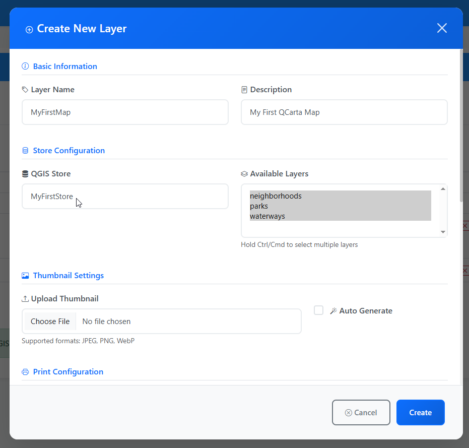
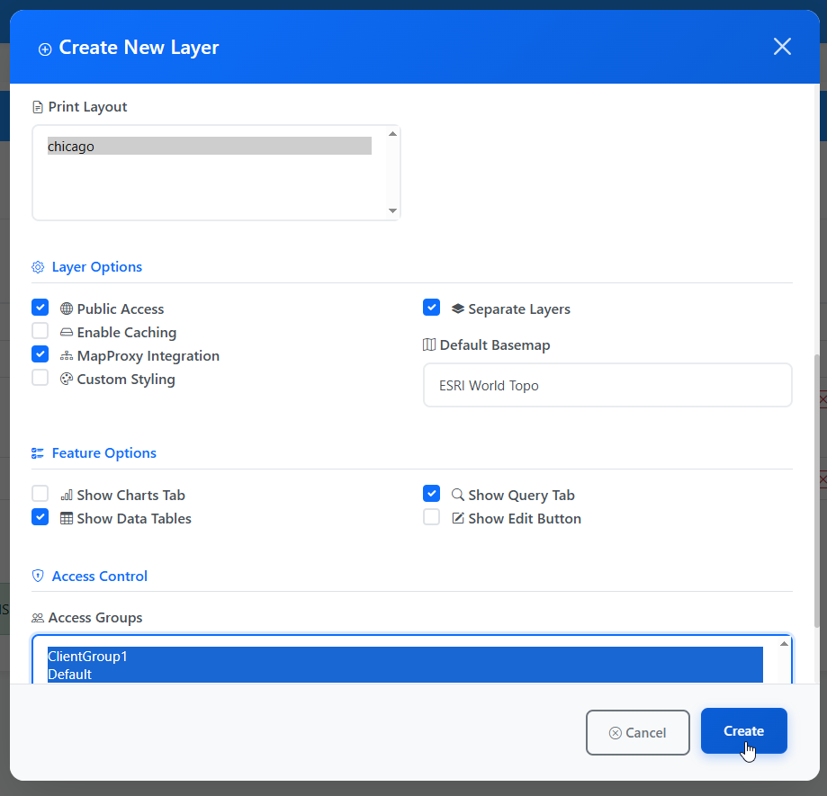
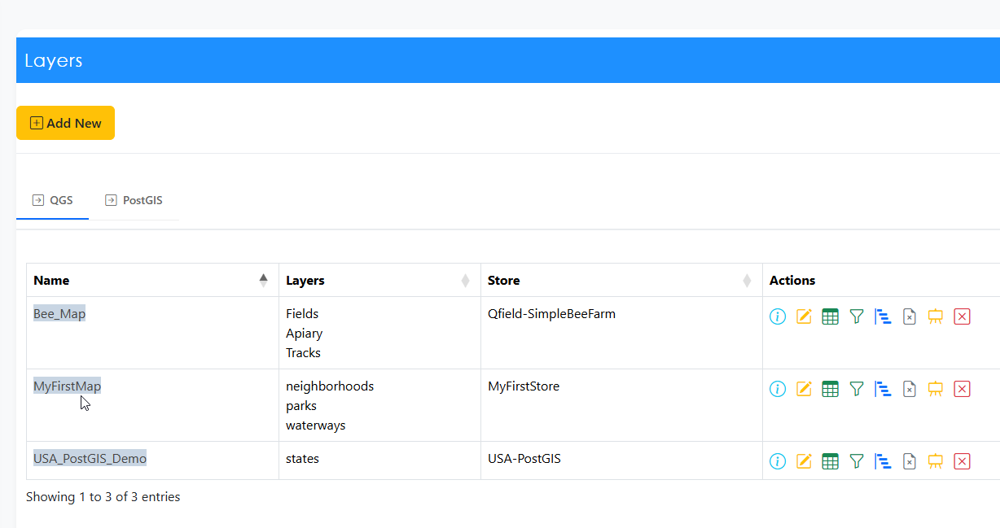
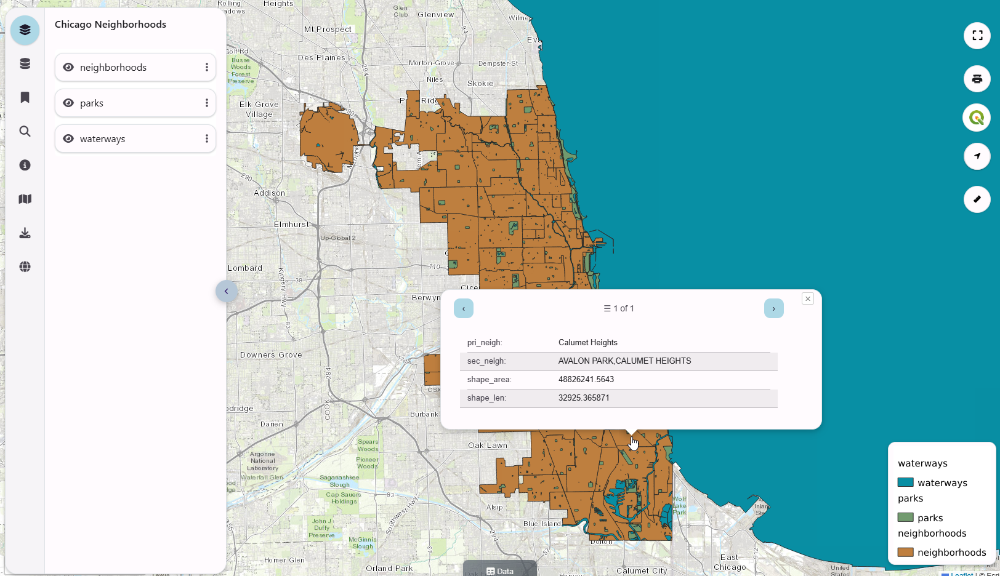
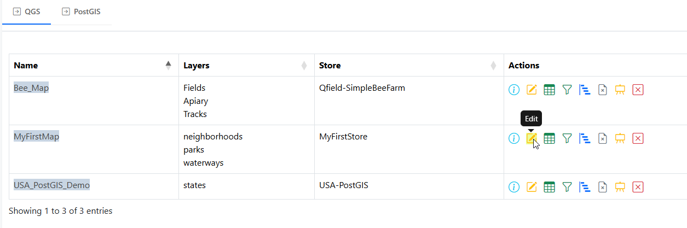
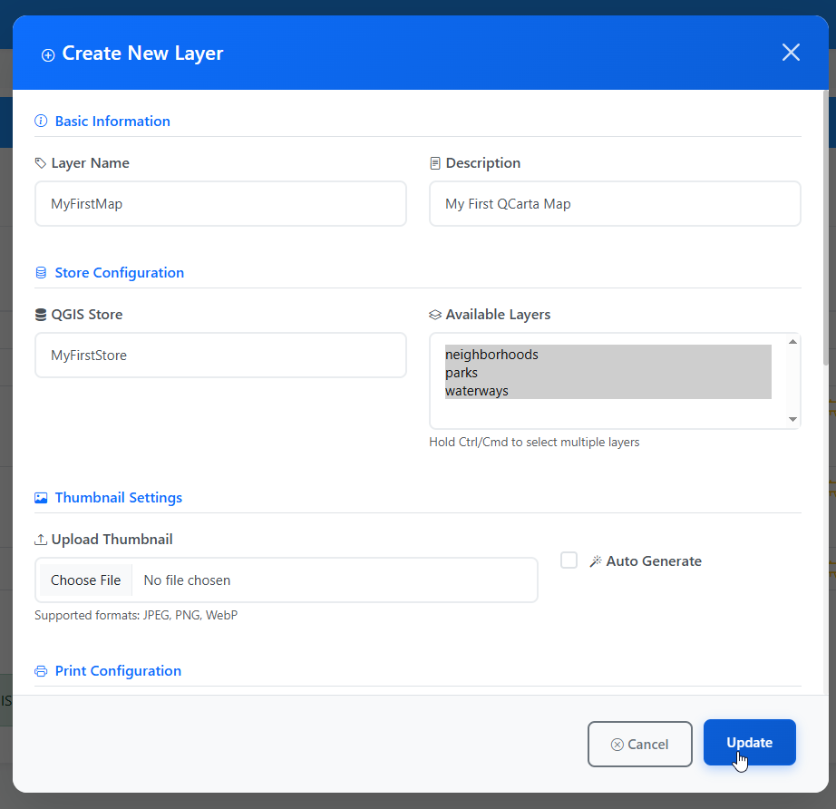
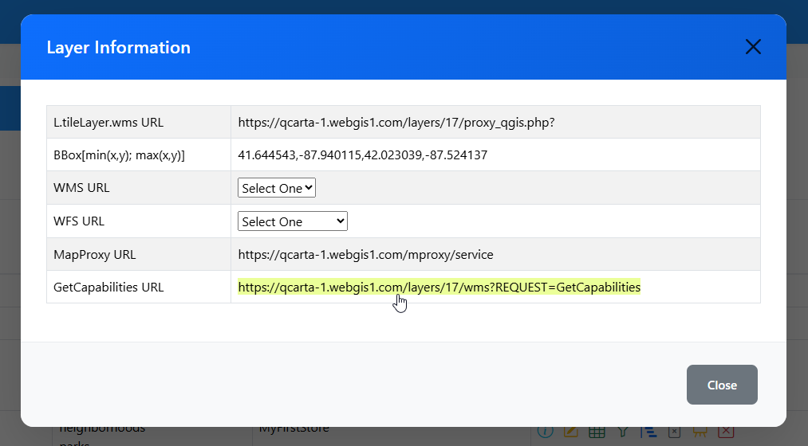

**********************
Layers (Maps)
**********************

.. contents:: Table of Contents

Overview
==================

Layers are layers from your QGIS project.

Add Layer
==================

To create a new Layer, click the Layer menu at left or the Layer card on the home page.

Click the Add New button

Give you layer a Name and Description.

From the QGIS Store dropdown, select the QGIS Project.  select the Layer(s) you wish to include

Select the Print Layout, Layout Options and Feature Options

Your Layer has been created:

Visit the Layer to view:

The Select options are explained below

* **Public**. The Layer will be Public, with no authentication required.
* **Cache**. Session Cache.  This is distinct from MapProxy Cache.
* **MapProxy**. This will enable MapProxy for the Layer
* **Custom**. This option is to signify that this Layer does not use the default map template for Preview   
* **Separate Layers**. This option will cause enable a layer control for each Layers in Layer Preview
   

Edit Layer
==================

To edit a Layer, click the Edit button at right as shown below

The Layer information is displayed. Make any changes you wish to make and click the Update button

Clear Cache
==================

To clear Session cache, click the Clear Cache button as shown below

.. image:: layer-clear-cache.png

Note: This does not clear MapProxy cache.  Clearing MapProxy cache is done via the MapProxy page.

Show Layer Info
==================

To display information on a layer, click the Show Info button at right

.. image:: layer-show-info.png

The information is displayed below

* **L.tileLayer.wms URL**	This is the WMS tile layer

* **BBox[min(x,y); max(x,y)]**	Bounding Box 

* **WMS URL**.  This opens the Layer in the following WMS formats
   * PNG
   * PDF
   * WebP
   * JPEG
   * PNG 1 Bit
   * PNG 8 Bit
   * PNG 16 Bit

* **WFS URL**	This opens the Layer in the following formats
   * GML2
   * GML2.1.2
   * GML3.1
   * GML3.1.1
   * GeoJson
   * VND Geo+Json
   * Geo+Json
   * Geo JSON
  

Edit Preview
==================

To edit the Leaflet Preview for a Layer, click the Edit Preview button

.. image:: show-layer-preview.png

Make any edits you wish to and then click Submit

Layer Preview Template
=====================

The template used to create the Layer Preview map is wms_index.php

It is located at::

   /var/www/html/admin/snippets/wms_index.php

