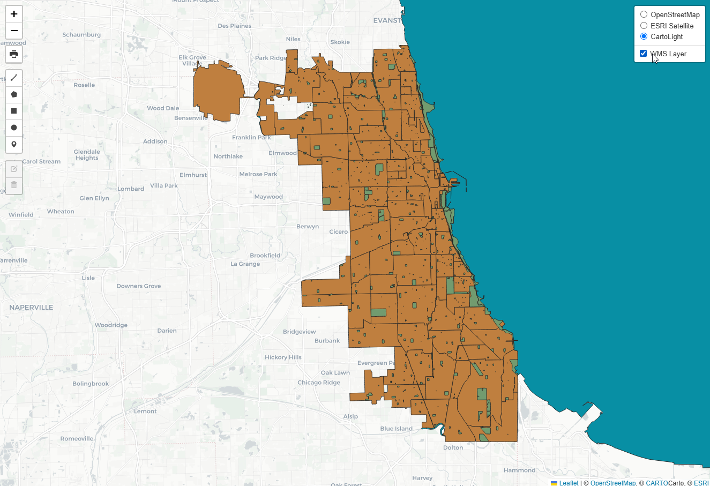
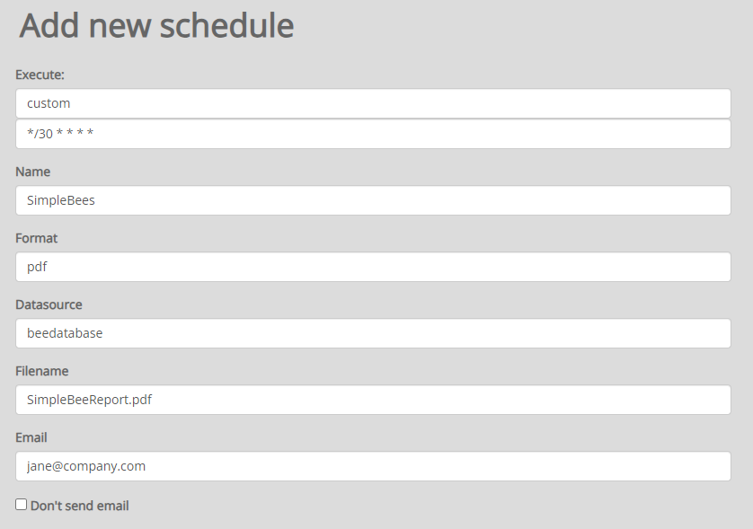
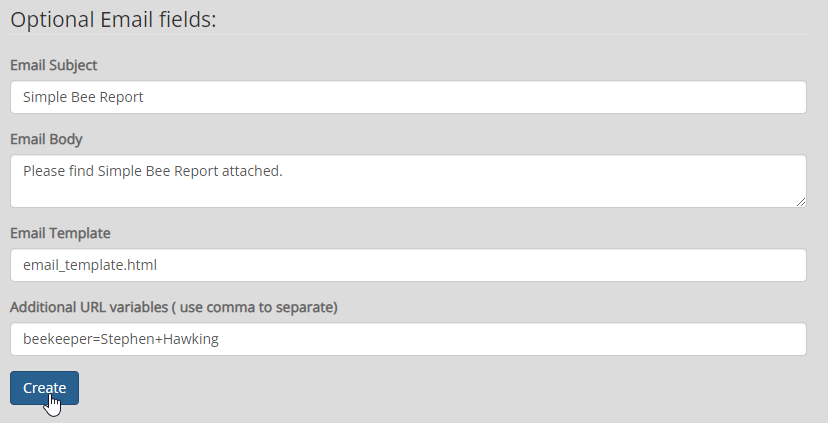

**********************
Layers
**********************

.. contents:: Table of Contents
Scheduling Reports
==================

Layers are created from Stores.

The Layers refer to the layers in a QGIS project.

layer-1.png

.. image:: layer-1.png

layer-clear-cache.png

.. image:: layer-clear-cache.png

layer-edit-1.png

.. image:: layer-edit-1.png

layer-show-info.png

.. image:: layer-show-info.png

layer-show-info-2.png

.. image:: layer-show-info-2.png

layer-show-preview.png

layer-show-preview-edit.png

.. image:: layer-show-preview-edit.png

show-layer-edit.png

.. image:: show-layer-edit.png

show-layer-preview.png

.. image:: show-layer-preview.png

The top section includes required fields:

The bottom section includes optional fields for email reports

Scheduling Options
==================

   

