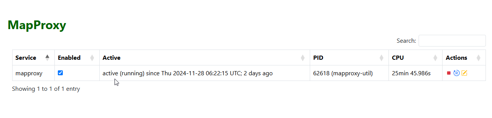
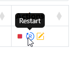
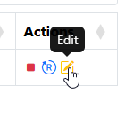
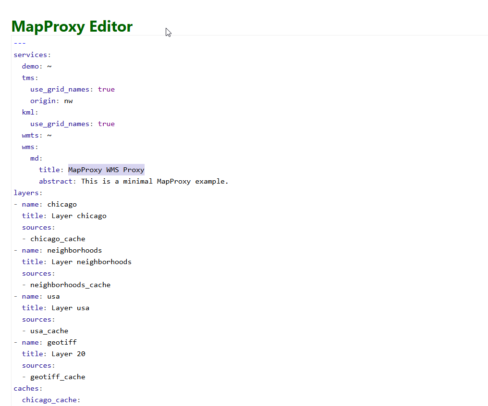
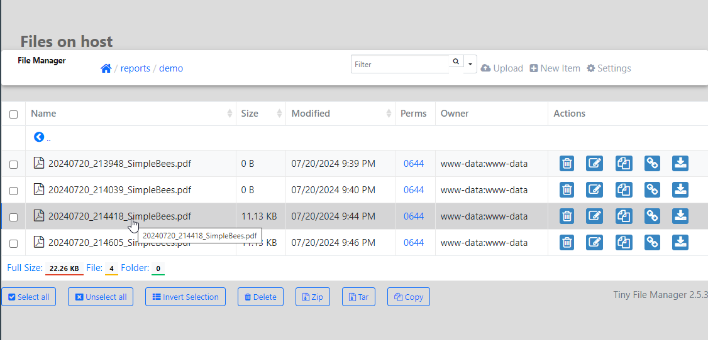

**********************
MapProxy
**********************

.. contents:: Table of Contents
Overview
==================

MapProxy is run as a service.

To access MapProxy, click the MapProxy link on the left menu

Restart
================

To stop/start/restart MapProxy, click the Stop or Restart button as shown below.

Edit
================

To edit the mapproxy.yaml file, click the edit button as shown below.

This will open the mapporxy.yaml file for editing.

.. note::
    Be sure to click the Submit button at bottom after making changes.

If more than 3 reports are present, a "More" option will appear.

Clicking the "More" option will take you to the file output location to access all reports

