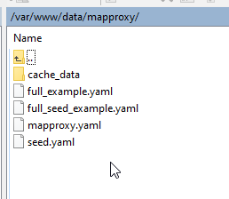
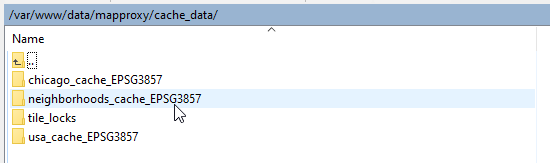

**********************
MapProxy
**********************

.. contents:: Table of Contents
Overview
==================

MapProxy is run as a service.

To access MapProxy, click the MapProxy link on the left menu

.. image:: mapproxy-1.png

Restart
================

To stop/start/restart MapProxy, click the Stop or Restart button as shown below.

.. image:: mapproxy-restart.png

Edit
================

To edit the mapproxy.yaml file, click the edit button as shown below.

.. image:: mapproxy-edit.png

This will open the mapporxy.yaml file for editing.

.. image:: mapproxy-edit-2.png

.. note::
    Be sure to click the Submit button at bottom after making changes.

MapProxy Directory
================

The MapProxy config directory is located at::

        /var/www/data/mapproxy

The default configuration files are shown below

Cache Directory
================

The MapProxy config directory is located at::

        /var/www/data/mapproxy/cache_data

The ouput from the demo data is shown below

Authentication
================

When a Layer is set to Private, MapProxy authenticates requests against the QeoSerer user database.

Authentication is accomplished using the wsgiapp_authorize.patch file::

	patch -d /usr/lib/python3/dist-packages/mapproxy -p0 < installer/wsgiapp_authorize.patch

This file is located in the QeoServer installer directory.

Layer Preview
================

To change Layer Preview or Custom Layers to use MapProxy in place of PHP Session Cache, change section below from::

	    const wmsLayer = L.tileLayer.wms('proxy_qgis.php?', {
		    layers: '<?=implode(',', QGIS_LAYERS)?>'
	    }).addTo(map);

to::

        const wmsLayer = L.tileLayer.wms('/mproxy/service', {
            layers: 'neighborhoods'
        }).addTo(map);

Note that in addition to the new url, we are also referencing the Layer name explicitly.

Service File
=================

MapProxy is configured to run as a systemd service.

The mapproxy.service file contains below by default::

	[Unit]
	Description=MapProxy
	After=multi-user.target

	[Service]
	User=www-data
	Group=www-data

	WorkingDirectory=/var/www/data/mapproxy
	Type=simple
	Restart=always

	EnvironmentFile=/etc/environment
	Environment=PGSYSCONFDIR=/var/www/data/qgis/
	Environment=SKIP_AUTH=fish.webgis1.com

	ExecStart=mapproxy-util serve-develop /var/www/data/mapproxy/mapproxy.yaml -b 127.0.0.1:8011

	[Install]
	WantedBy=multi-user.target

