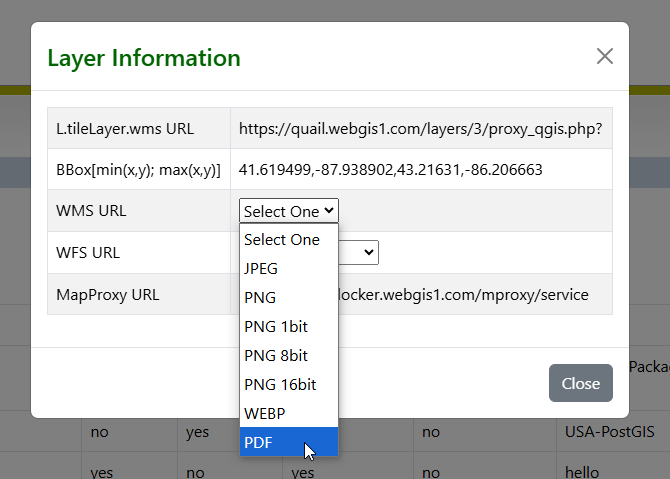
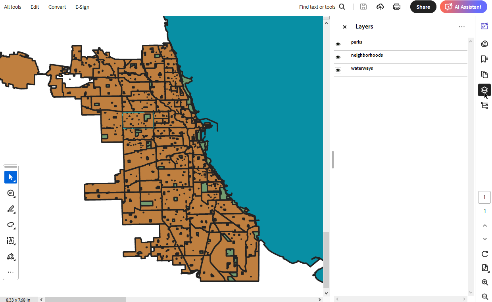
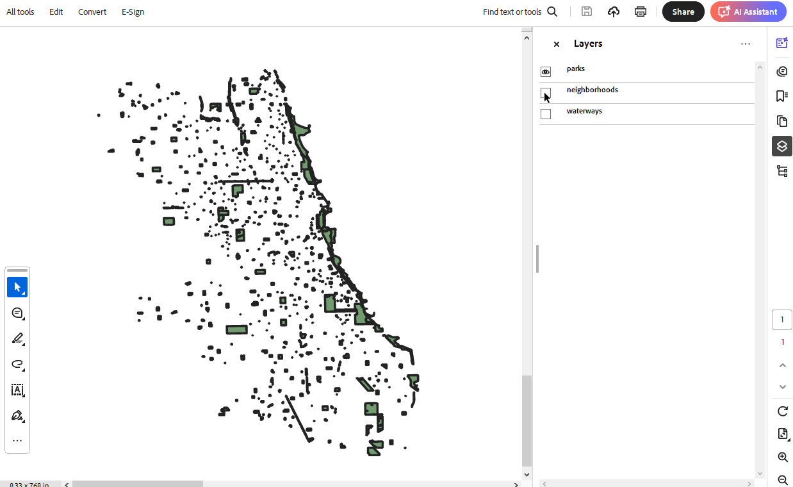
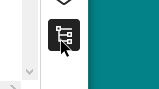
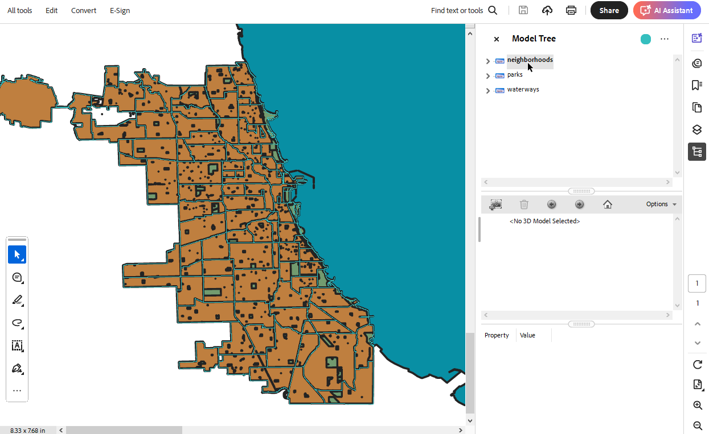
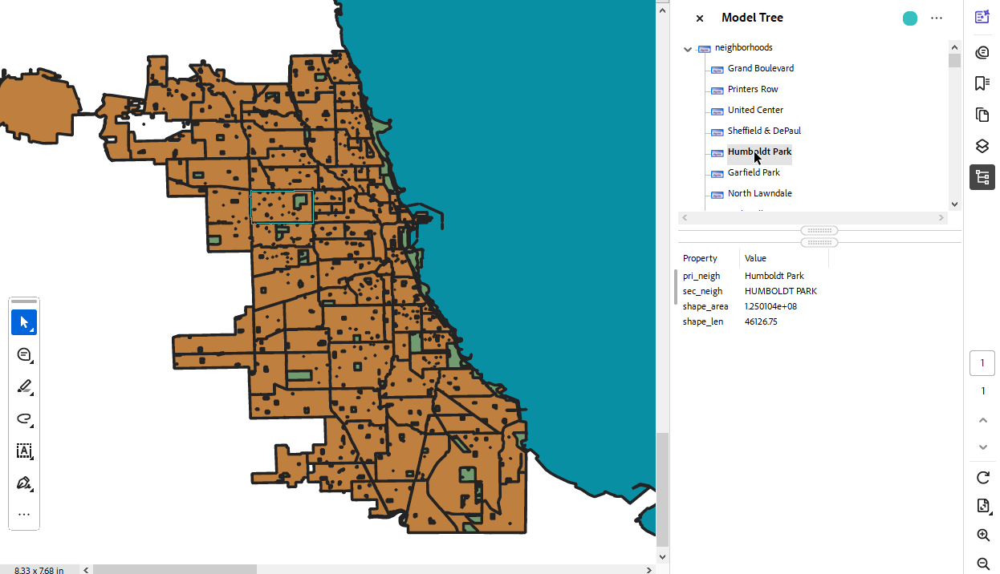

.. This is a comment. Note how any initial comments are moved by
   transforms to after the document title, subtitle, and docinfo.

.. demo.rst from: http://docutils.sourceforge.net/docs/user/rst/demo.txt

.. |EXAMPLE| image:: static/yi_jing_01_chien.jpg
   :width: 1em

**********************
PDF Export
**********************

.. contents:: Table of Contents
Overview
==================

You can obtain PDF format of Layers using the WMS url

Preview
================

To preview a PDF, simply use the WMS url with OUTPUTFORMAT=PDF as below

**In the right menu, click the Layers icon**

**From here, you can toggle layer visibility**

**Click the Tree icon**

**The Tree Model displays feature information**

**Expand the nodes to view**

