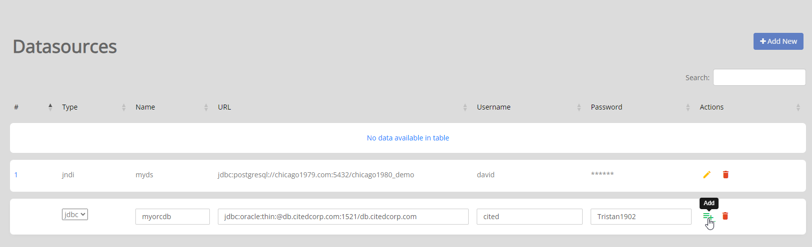

.. This is a comment. Note how any initial comments are moved by
   transforms to after the document title, subtitle, and docinfo.

.. demo.rst from: http://docutils.sourceforge.net/docs/user/rst/demo.txt

.. |EXAMPLE| image:: static/yi_jing_01_chien.jpg
   :width: 1em

**********************
PostGIS Stores
**********************

.. contents:: Table of Contents
Overview
==================

Data Sources are added via the Data Source menu.

By default, Jasper Report Publisher includes support for the following:

PostgreSQL (JNDI)
Oracle (JDBC and JNDI)
MySQL (JNDI)
MSSQL (JNDI)

Add PostGIS Store
================

To add a new Link, click the "Add New" button at top.

1-add-new.png

.. image:: 1-add-new.png

Populate the required fields for your PostgreSQL connection

.. image:: 2-add-new.png

Under Database, click the "Load Database Names" icon

.. image:: 3-add-new.png

The list of available databases will appear.  Select the database you wish to connect to.

.. image:: 4-add-new.png

Select the Group(s) that will have permission to the Store

.. image:: 5-add-new.png

Click Save.  Your Store has been created.

.. image:: 6-add-new.png

Select Type (JNDI or JDBC)

Data Source Name (this should match name used in Jasper Report Adapter)

URL: The JDBC URL (e.g. jdbc:postgresql://localhost:5432/beedatabase)

Username

Password

You can add as many Data Sources as you wish to:

Restart Tomcat
================

You must restart Tomcat after adding or editing Data Sources in order to pick up the new configuration

.. image:: ../../_static/tomcat-restart.png

