.. This is a comment. Note how any initial comments are moved by
   transforms to after the document title, subtitle, and docinfo.

.. demo.rst from: http://docutils.sourceforge.net/docs/user/rst/demo.txt

.. |EXAMPLE| image:: static/yi_jing_01_chien.jpg
   :width: 1em

**********************
PostGIS Stores
**********************

.. contents:: Table of Contents
Overview
==================

PostGIS Stores are connections to PostGIS databases.

These can be existing local or remote PostGIS databases.

You can also create new PostGIS databases from GeoPackages, ESRI Shapefiles, and PostgreSQL backups.

You can also create new, empty PostGIS databases as well.

Create From Connection
================

To add a new Link, click the "Add New" button at top.

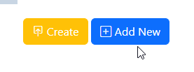

Populate the required fields for your PostgreSQL connection

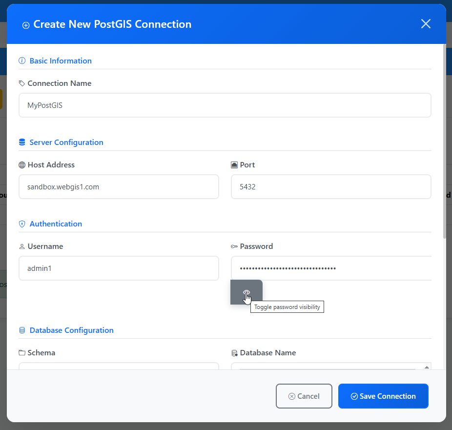

Under Database, click the "Load Database Names" icon

The list of available databases will appear.  Select the database you wish to connect to.

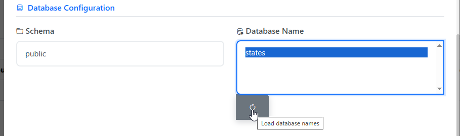

Select the Group(s) that will have permission to the Store

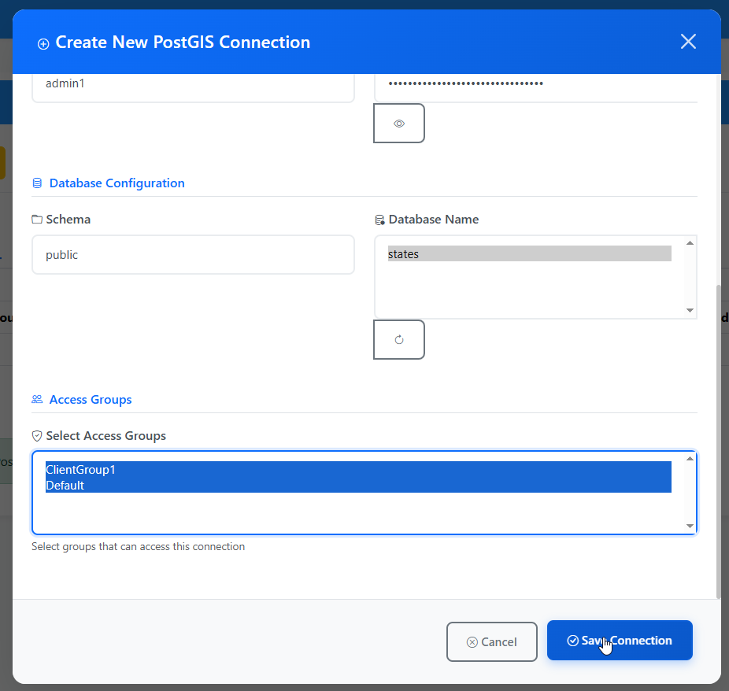

Click Save Connection.  Your Store has been created.

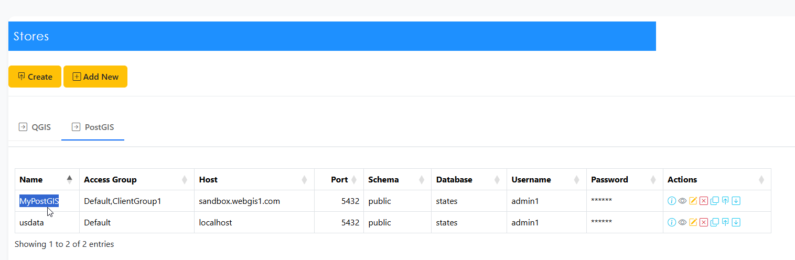

Create From File(s)
=====================

You can create a PostGIS database from most common data sources, such as ESRI Shapefiles and GeoPackages

You can also create databases from PostGIS backups.

To create a PostGIS database from a file, click the Create button at top right

Give your database a name and click the Choose Files button.

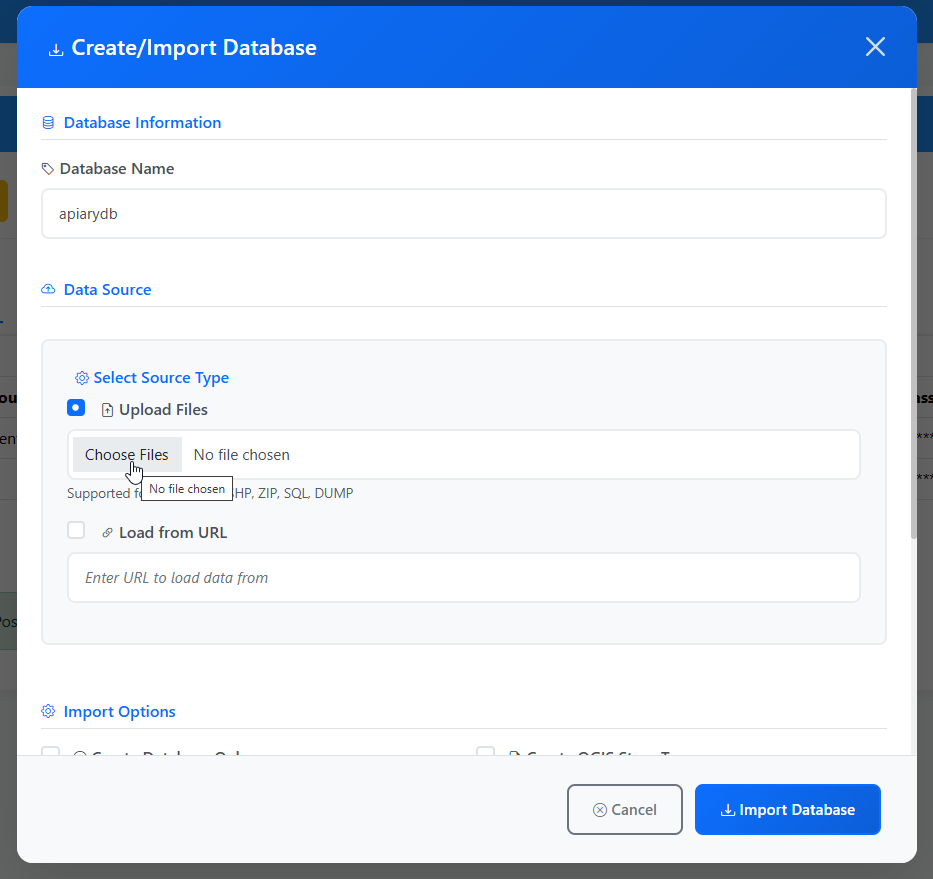

Browse to the file(s) location

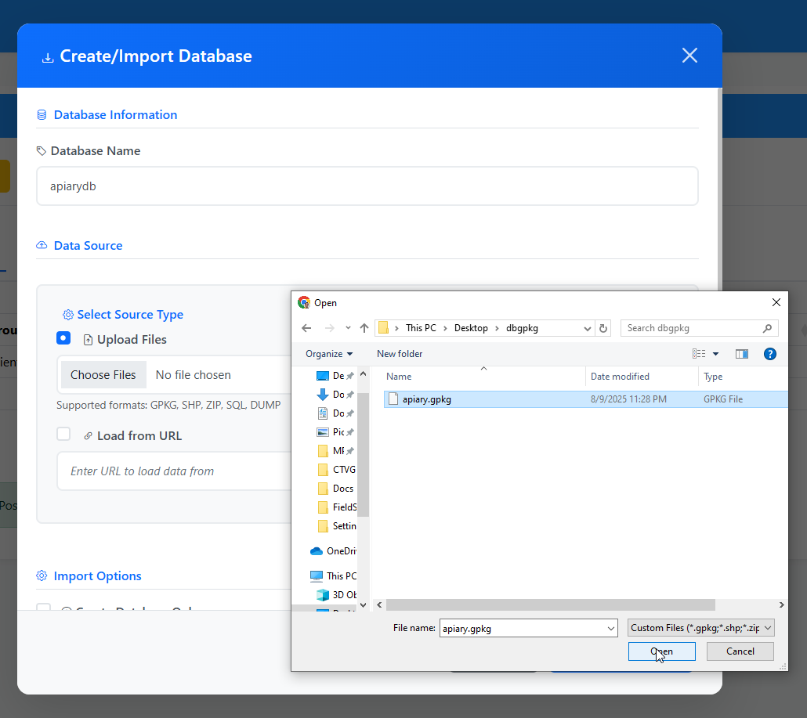

Click the Impprt button

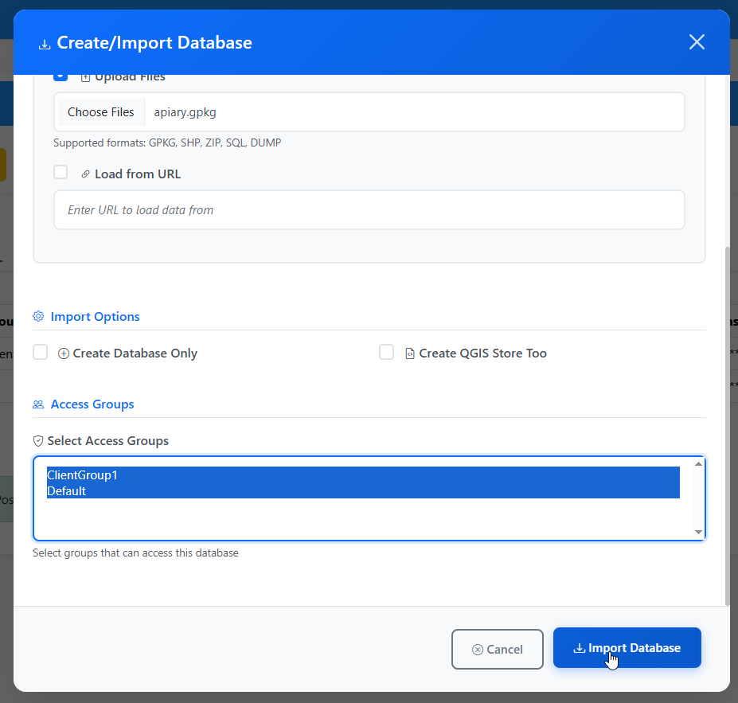

The import results are displayed at the bottom of the page.

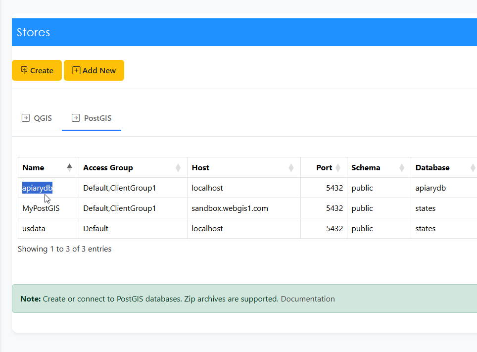

.. note::
   You may need to click the PostGIS tab to refresh before seeing your new database

Create Empty Database
=====================

You can create an empty PostGIS database.

An empty database is useful if you have a QGIS Project and want to connect to the database to import layers.

To create an empty PostGIS database, 

Click the Create Button

Give your database a name

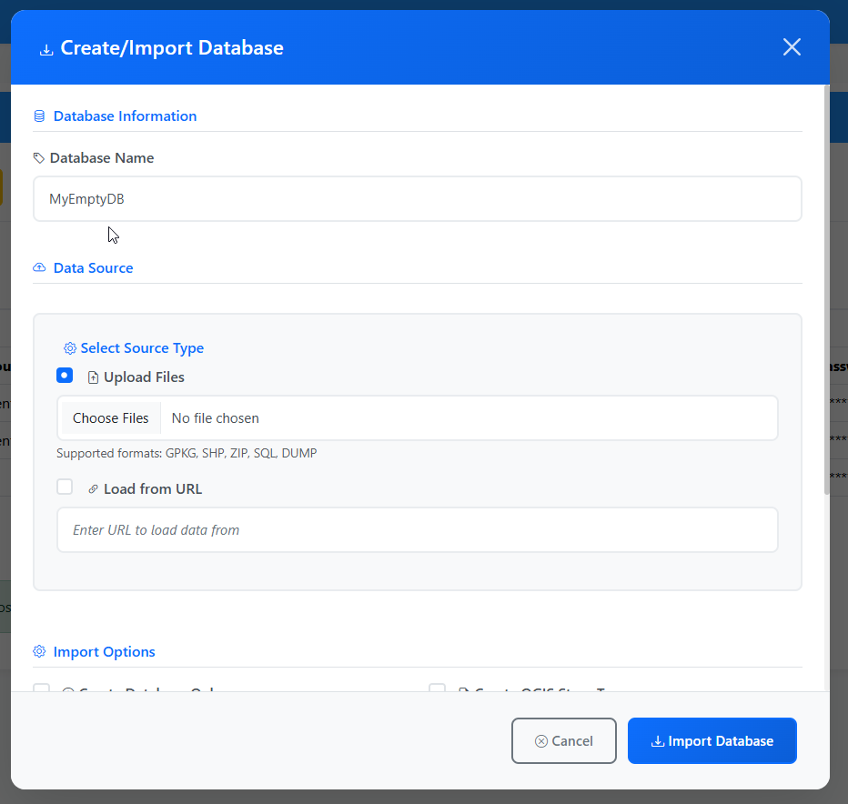

Check the "Create Database Only" checkbox.

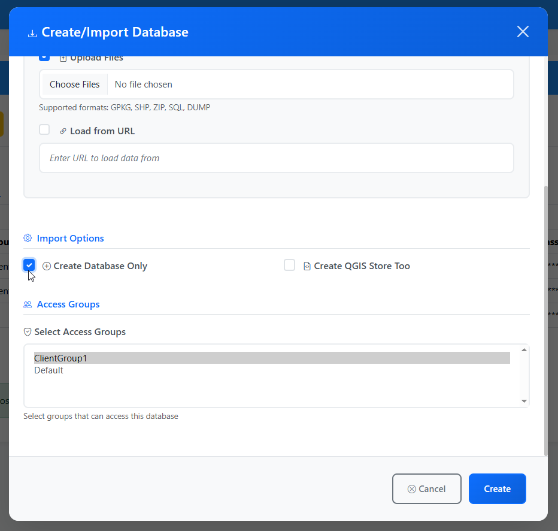

Click the Create button.

Your database has been created and added as a PostGIS Store

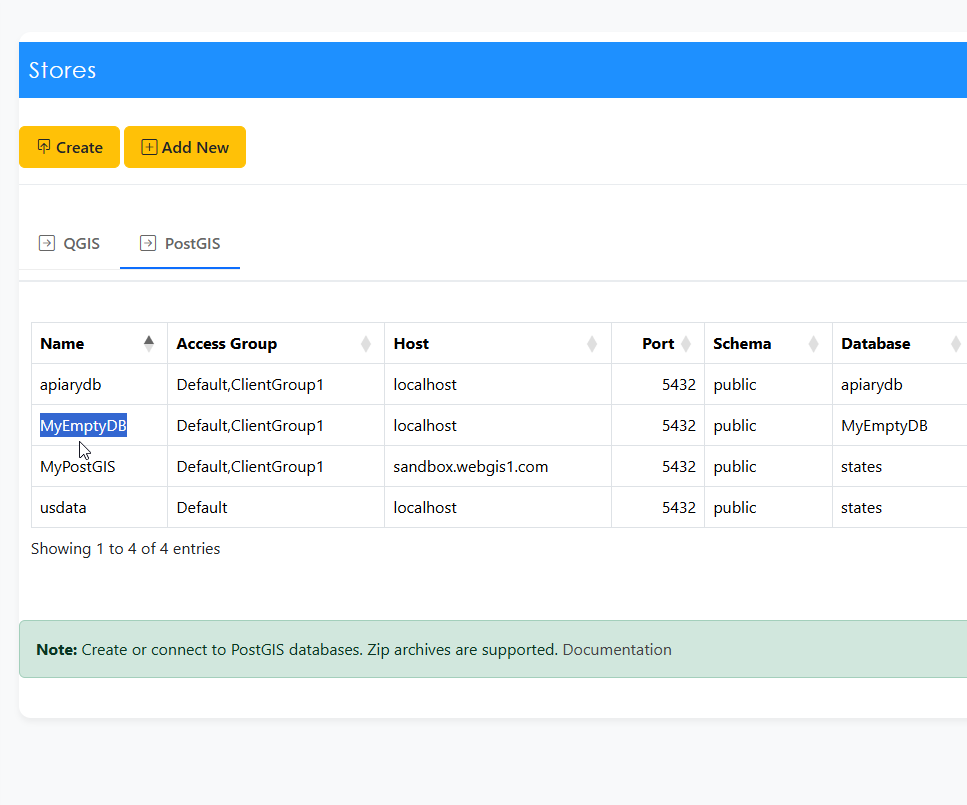

To view the database connection information, click the Connection icon at right

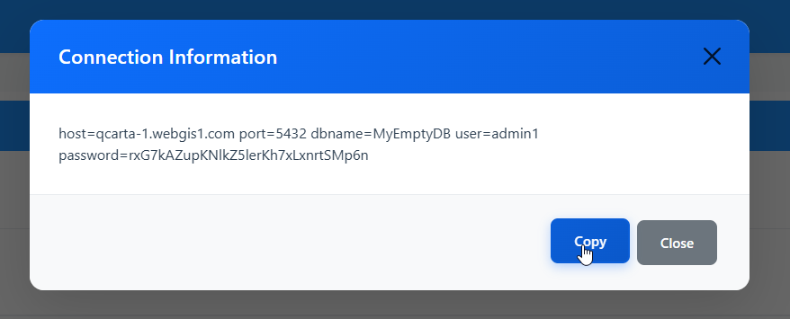

This information can be used in your pg_service.conf file and any other location

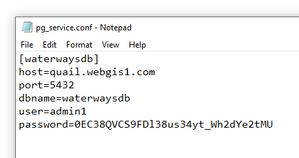

Layer Creation
=====================

If your QGIS Project uses a PostGIS backend, the PostGIS Store will be automatically detected when the QGIS Store is added.

Once you have created a PostGIS Store, it can be used to create a PostGIS Layer.

Backup, Clone, and Restore
=====================

You can Backup, Clone, and Restore your databases via the PostGIS tab.

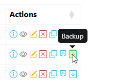

postgis-backup-name.png

.. image:: postgis-backup-name.png

postgis-clone.png

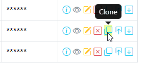

postgis-clone-clone.png

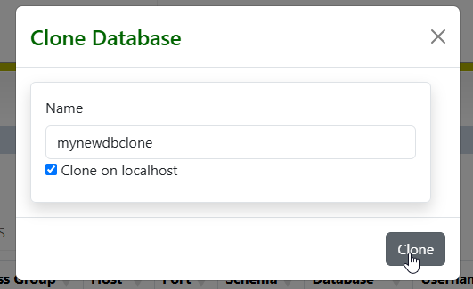

postgis-clone-verified.png

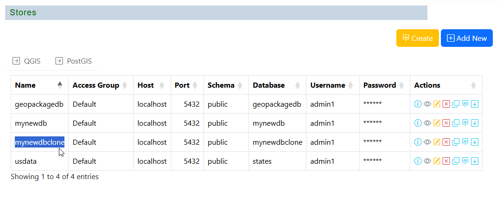

postgis-restore.png

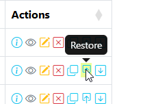

postgis-restore-select.png

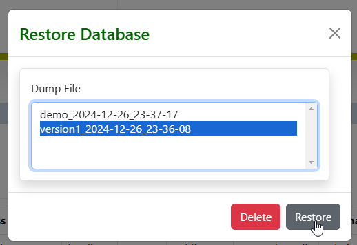

postgis-show-connection.png

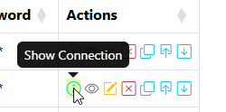

postgis-show-connection-show.png

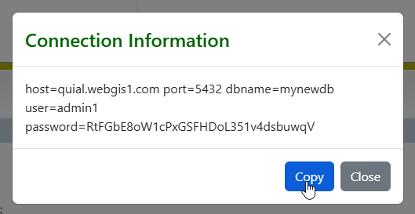

