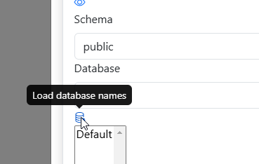
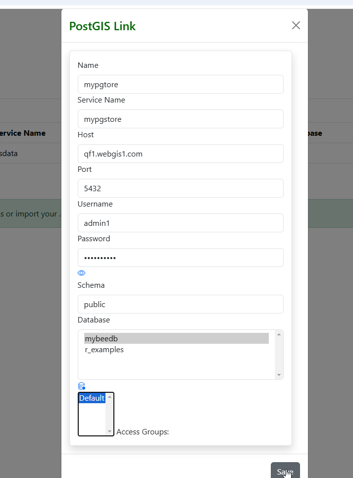
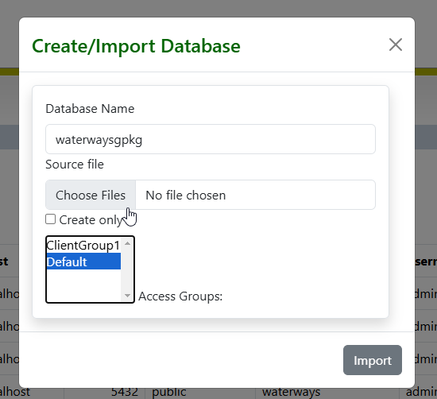
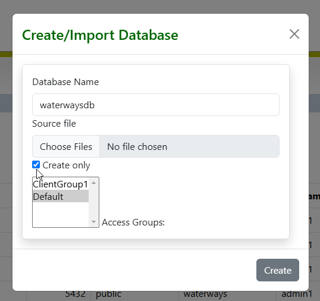
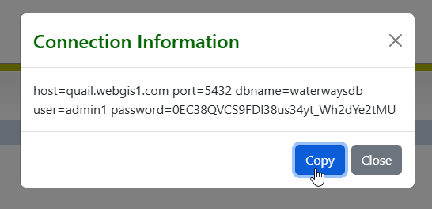

.. This is a comment. Note how any initial comments are moved by
   transforms to after the document title, subtitle, and docinfo.

.. demo.rst from: http://docutils.sourceforge.net/docs/user/rst/demo.txt

.. |EXAMPLE| image:: static/yi_jing_01_chien.jpg
   :width: 1em

**********************
PostGIS Stores
**********************

.. contents:: Table of Contents
Overview
==================

PostGIS Stores are connections to PostGIS databases.

These can be existing local or remote PostGIS databases.

You can also create new PostGIS databases from GeoPackages, ESRI Shapefiles, and PostgreSQL backups.

Create From Connection
================

To add a new Link, click the "Add New" button at top.

.. image:: add-new-postgis-store.png

Populate the required fields for your PostgreSQL connection

.. image:: 2-add-new.png

Under Database, click the "Load Database Names" icon

The list of available databases will appear.  Select the database you wish to connect to.

.. image:: 4-add-new.png

Select the Group(s) that will have permission to the Store

Click Save.  Your Store has been created.

.. image:: 6-add-new.png

Create From File(s)
=====================

You can create a PostGIS database from most common data sources, such as ESRI Shapefiles and GeoPackages

You can also create databases from PostGIS backups.

To create a PostGIS database from a file, click the Create button at top right

.. image:: create-new-store.png

Give your database a name and click the Choose Files button.

Browse to the file(s) location

.. image:: create-store-from-geopackage.png

Click the Impprt button

.. image:: create-store-from-geopackage-2.png

The import results are displayed at the bottom of the page.

.. image:: create-store-from-geopackage-3.png

.. note::
   You may need to click the PostGIS tab to refresh before seeing your new database

Create Empty Database
=====================

You can create an empty PostGIS database.

An empty database is useful if you have a QGIS Project and want to connect to the database to import layers.

To create an empty PostGIS database, 

Click the Create Button

.. image:: create-new-store.png

Give your database a name and check the "Create Only" box.

Your database has been created and added as a PostGIS Store

To view the database connection information, click the Connection icon at right

.. image:: show-connection.png

This information can be used in your pg_service.conf file and any other location

