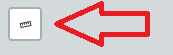

.. This is a comment. Note how any initial comments are moved by
   transforms to after the document title, subtitle, and docinfo.

.. demo.rst from: http://docutils.sourceforge.net/docs/user/rst/demo.txt

.. |EXAMPLE| image:: static/yi_jing_01_chien.jpg
   :width: 1em

************
Layer Template
************

.. contents:: Table of Contents

Quail offers a basic REST API that supports GET HTTP Requests.

The request returns json.

The /workspaces uri was added to allow compatibility for tools that query GeoServer.

Template
=======================
  
Get Query using Username and Password:

.. code-block:: console

  <?php
	require('../../admin/incl/index_prefix.php');
	$wms_url = 'WMS_URL';
	if(str_starts_with($wms_url, '/mproxy/')){
		$content = file_get_contents('https://'.$_SERVER['HTTP_HOST'].'/admin/action/authorize.php?secret_key=SECRET_KEY&ip='.$_SERVER['REMOTE_ADDR']);
		$auth = json_decode($content);
		$wms_url .= '?access_key='.$auth->access_key;
	}
   ?>
   <!DOCTYPE html>
   <html lang="en">
   <head>
	<base target="_top">
	<meta charset="utf-8">
	<meta name="viewport" content="width=device-width, initial-scale=1">
	
	<title>WMS example - Leaflet</title>
	
	<link rel="shortcut icon" type="image/x-icon" href="docs/images/favicon.ico" />
	<link rel="stylesheet" href="https://unpkg.com/leaflet/dist/leaflet.css"/>
	
	
	<link rel="stylesheet" href="https://cdnjs.cloudflare.com/ajax/libs/leaflet.draw/0.4.2/leaflet.draw.css"/>

   <link rel="stylesheet" href="../../assets/dist/css/Control.MiniMap.css"/>
   <link rel="stylesheet" href="../../assets/dist/css/leaflet.measurecontrol.css"/>

	
	
	
	
	

   
   </head>
   <body>

   

   
   	</body>
   	</html>

You can update to whatever

Elements
=========================

Get Layers using Access Key:

Print

Header include files

.. code-block:: console

	

Javascript

.. code-block:: console

	L.control.browserPrint({
                      title: 'Just print me!',
                      documentTitle: 'My Leaflet Map',
                      printLayer: L.tileLayer('https://tile.openstreetmap.org/{z}/{x}/{y}.png', {
                                      attribution: 'Map tiles by <a href="http://openstreetmap.com">OpenStreetMap</a>',
                                      subdomains: 'abcd',
                                      minZoom: 1,
                                      maxZoom: 16,
                                      ext: 'png'
                              }),
              closePopupsOnPrint: false,
              printModes: [
              L.BrowserPrint.Mode.Landscape(),
              "Portrait",
              L.BrowserPrint.Mode.Auto("B4",{title: "Auto"}),
              L.BrowserPrint.Mode.Custom("B5",{title:"Select area"})
                      ],
                      manualMode: false
              }).addTo(map);

Draw

Header include files

.. code-block:: console

		

Javacript

.. code-block:: console

	// Draw

   	var drawnItems = new L.FeatureGroup();
        	map.addLayer(drawnItems);

        var drawControl = new L.Control.Draw({
            edit: {
                featureGroup: drawnItems
            }
        	});
        	map.addControl(drawControl);

        	map.on('draw:created', function (e) {
            	var type = e.layerType,
                	layer = e.layer;
            	drawnItems.addLayer(layer);
        	});

Measure

Header include files

.. code-block:: console

	
	<link rel="stylesheet" href="../../assets/dist/css/leaflet.measurecontrol.css"/>

Javascript

.. code-block:: console

	// Measure

   	L.Control.measureControl().addTo(map);

Legend

Header include files

.. code-block:: console

	Directly from QGIS Server

.. code-block:: console

	// Legend

	var legend = L.control({position: 'bottomleft'}); 
	legend.onAdd = function (map) {        
    	var div = L.DomUtil.create('div', 'info legend');
    	div.innerHTML = '&FORMAT=image/png">';     
    	return div;
	};      
	legend.addTo(map);

Layer Selector

Header include files

.. code-block:: console

	Core Leafletjs

.. code-block:: console

	// Group overlays and basemaps

	var overlayMap = {
	"WMS Layer" :wmsLayer  
	};

	var baseMap = {
	"OpenStreetMap" :osm,
	"ESRI Satellite" :esri,
	"CartoLight" :carto,
	};

	// Layer Selector

	L.control.layers(baseMap, overlayMap,{collapsed:false}).addTo(map);

MiniMap

.. image:: min-map.png

Header include files

.. code-block:: console

	<link rel="stylesheet" href="../../assets/dist/css/Control.MiniMap.css"/>
	

Javacript

.. code-block:: console

		// Minimap

		var osmUrl='http://{s}.tile.openstreetmap.org/{z}/{x}/{y}.png';
		var osmAttrib='Map data � OpenStreetMap contributors';
		var osmmini = new L.TileLayer(osmUrl, {minZoom: 0, maxZoom: 13, attribution: osmAttrib });
		var miniMap = new L.Control.MiniMap(osmmini, { toggleDisplay: true }).addTo(map);

Sample Output
====================

Below is sample json output for /workspaces

.. code-block:: console

   {
     "success": true,
     "workspaces": {
       "workspace": [
         {
           "id": "7",
           "name": "Monarch-ESRI-Geodatabase",
           "type": "qgs",
           "owner_id": "1",
           "public": "t",
           "wms_url": "https://domain.com/stores/7/wms.php",
           "wfs_url": "https://domain.com/stores/7/wfs.php",
           "wmts_url": "https://domain.com/stores/7/wmts.php"
         },
         {
           "id": "6",
           "name": "Gebco-WMS",
           "type": "qgs",
           "owner_id": "1",
           "public": "f",
           "wms_url": "https://domain.com/stores/6/wms.php",
           "wfs_url": "https://domain.com/stores/6/wfs.php",
           "wmts_url": "https://domain.com/stores/6/wmts.php"
         },
         {
           "id": "5",
           "name": "NASA-GeoTIFF",
           "type": "qgs",
           "owner_id": "1",
           "public": "f",
           "wms_url": "https://domain.com/stores/5/wms.php",
           "wfs_url": "https://domain.com/stores/5/wfs.php",
           "wmts_url": "https://domain.com/stores/5/wmts.php"
         },
         {
           "id": "4",
           "name": "BGS-GeoPackage",
           "type": "qgs",
           "owner_id": "1",
           "public": "t",
           "wms_url": "https://domain.com/stores/4/wms.php",
           "wfs_url": "https://domain.com/stores/4/wfs.php",
           "wmts_url": "https://domain.com/stores/4/wmts.php"
         },
         {
           "id": "3",
           "name": "Chicago-ESRI",
           "type": "qgs",
           "owner_id": "1",
           "public": "f",
           "wms_url": "https://domain.com/stores/3/wms.php",
           "wfs_url": "https://domain.com/stores/3/wfs.php",
           "wmts_url": "https://domain.com/stores/3/wmts.php"
        },
         {
           "id": "2",
           "name": "USA-PostGIS",
           "type": "qgs",
           "owner_id": "1",
           "public": "f",
           "wms_url": "https://domain.com/stores/2/wms.php",
           "wfs_url": "https://domain.com/stores/2/wfs.php",
           "wmts_url": "https://domain.com/stores/2/wmts.php"
         }
       ]
     }
   }

REST API File
=======================

If you wish to update the API, the code is located at::

   /var/www/html/admin/action/rest.php

