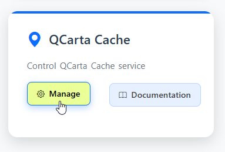
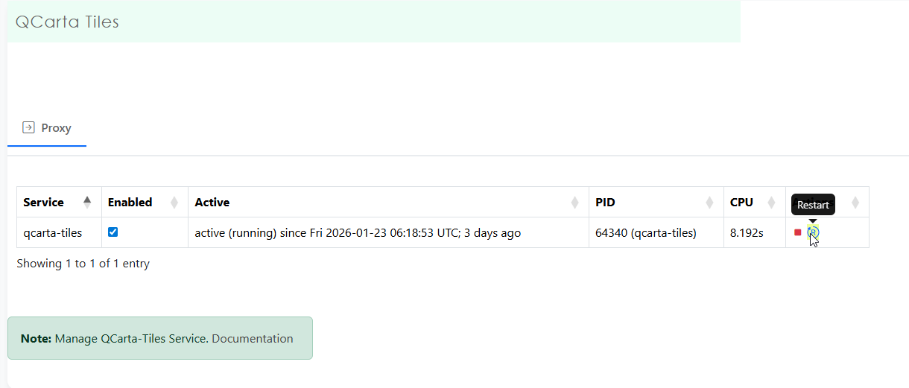

**********************
QCarta Cache
**********************

.. contents:: Table of Contents
Overview
==================

QCarta Cache is written in Go and runs as a service.

To access QCarta Cache, click the QCarta Cache link on the dashboard:

Or on the left menu

Restart
================

To stop/start/restart MapProxy, click the Stop or Restart button as shown below.

QCarta Cache Directory
================

The MapProxy config directory is located at::

        /var/www/data/mapproxy

The default configuration files are shown below

.. image:: mapproxy-files.png

Cache Directory
================

The MapProxy config directory is located at::

        /var/www/data/qcarta-tiles/cache_data/wms

The ouput from the demo data is shown below

.. image:: maproxy-cache-directory.png

Service File
=================

QCarta Cache is configured to run as a systemd service.

The qcarta-tiles.service file contains below by default::

	[Unit]
	Description=QCarta Tile Service (replaces MapProxy)
	After=network.target qgis-server.service
	Requires=network.target
	Conflicts=mapproxy.service

	[Service]
	Type=simple
	User=www-data
	Group=www-data
	WorkingDirectory=/var/www/data/qcarta-tiles
	ExecStart=/usr/local/bin/qcarta-tiles
	Restart=always
	RestartSec=5
	StandardOutput=journal
	StandardError=journal

	# Environment variables
	Environment="QGIS_SERVER_URL=http://localhost/cgi-bin/qgis_mapserv.fcgi"
	Environment="QCARTA_CACHE_PURGE_TOKEN=YourSecretToken"

	# Security settings
	NoNewPrivileges=true
	PrivateTmp=true

	[Install]
	WantedBy=multi-user.target

