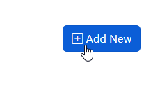
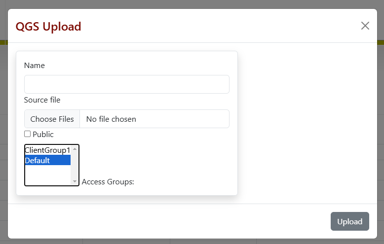
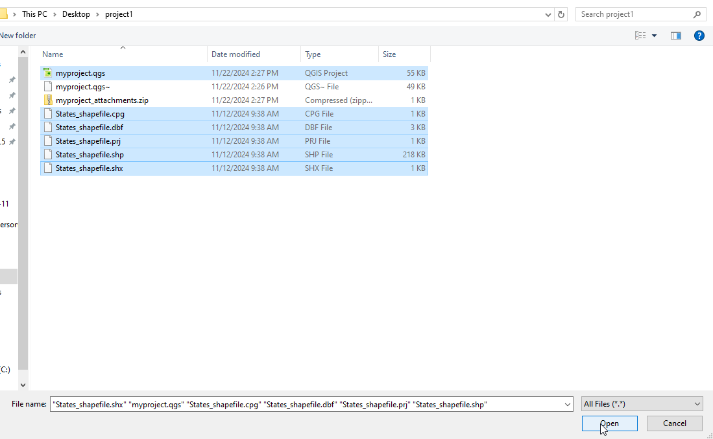
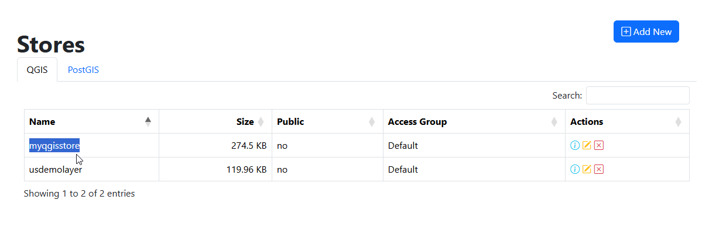
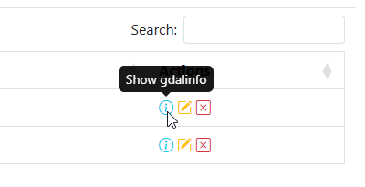
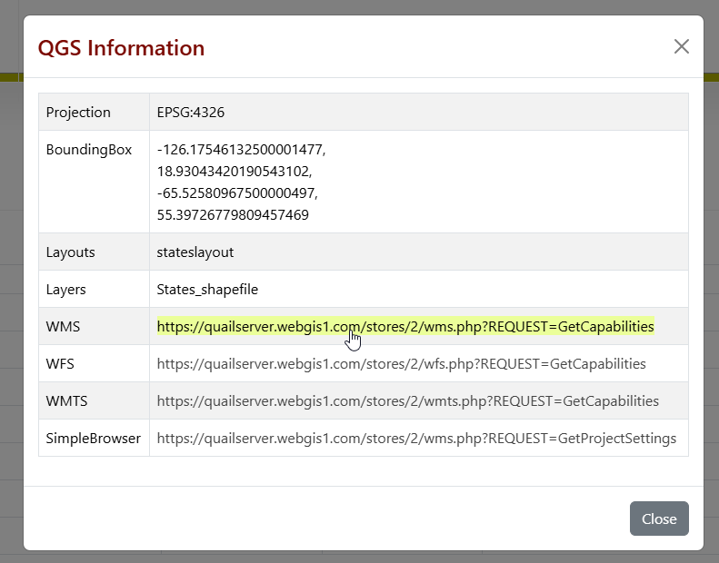
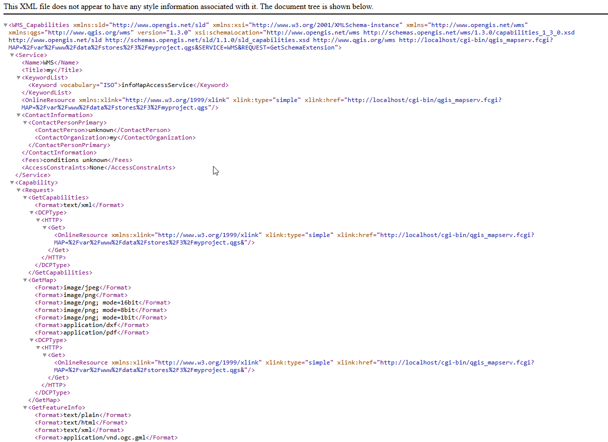

.. This is a comment. Note how any initial comments are moved by
   transforms to after the document title, subtitle, and docinfo.

.. demo.rst from: http://docutils.sourceforge.net/docs/user/rst/demo.txt

.. |EXAMPLE| image:: static/yi_jing_01_chien.jpg
   :width: 1em

**********************
QGIS Stores
**********************

.. contents:: Table of Contents
Overview
==================

A QGIS Store consists of your QGIS Project file, along with any Raster, Vector, and static files.

If your QGIS Project uses a PostGIS data source, you can create a PostGIS Store.

Create a QGIS Store
================

Below, we'll create a QGIS Store that uses ESRI shapefile as the data source.

NOTE: You can import the shapefile into PostGIS via Stores > PostGIS to create a database from your shapefile(s)

On Stores > QGS, click the Add New button:

Give your Store a name.  Below we are using 'myqgisstore'.

Select your QGIS project and any static sources you wish to upload.

With files selected, chose if Store is Public and Access Groups (both can be changed later)

.. image:: qgis-store-modal.png

Your new QGIS Store has now been created:

Show Info
===================

To view your GetCapability urls as well as ESPG and Bounding Box, click on the "info" link at right:

The Store GetCapability urls, ESPG, and Bounding Box are displayed in modal:

Clicking the link will take you to the document(s)

Paths
===================

Be sure the path to your flat files mataches the path used on the server.

If you files are in the same directory as your QGIS Project, you can upload them along with the QGIS Project using multiselect.

If they are stored in a sub directory, zip the directory prior to upload.

Special Cases
===================

**ESRI Geodatabase** When using an ESRI Geodatabase for your project, upload a zipped copy of the *.gdb directory along with your QGIS Project.  On upload, the file will automatically be unzipped.

**ESRI Shapefile** You must upload the support files (.prg, .dbf, etc...) along with the .shp file.

**PostGIS** If you QGIS Project uses layers from a PostGIS data source, you must create a PostGIS Store for it (see next section, PostGIS Stores)

