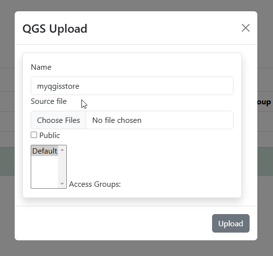
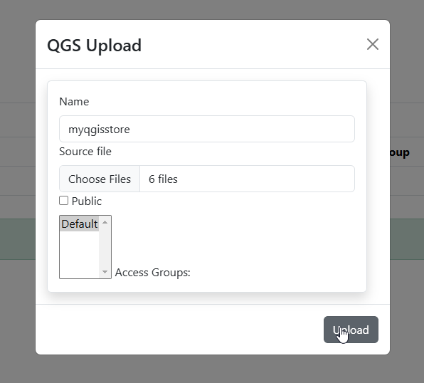

.. This is a comment. Note how any initial comments are moved by
   transforms to after the document title, subtitle, and docinfo.

.. demo.rst from: http://docutils.sourceforge.net/docs/user/rst/demo.txt

.. |EXAMPLE| image:: static/yi_jing_01_chien.jpg
   :width: 1em

**********************
QGIS Stores
**********************

.. contents:: Table of Contents
Overview
==================

A QGIS Store consists of your QGIS Project file, along with any static files if using a static data source.

Create a QGIS Store
================

Examples of static data sources include:

* GeoTiff
* shapefile
* GeoPackage
* GeoJson
* etc....

Below, we'll create a QGIS Store that uses ESRI shapefile as the data source.

NOTE: You can import the shapefile into PostGIS via Stores > PostGIS to create a database from your shapefile(s)

On Stores > QGS, click the Add New button:

.. image:: select-files-0.png

Give your Store a name.  Below we are using 'myqgisstore'.

Select your QGIS project and any static sources you wish to upload.

.. image:: select-files.png

With files selected, chose if Store is Public and Access Groups (both can be changed later)

Delete Report
===================
To delete a report entry, click the Delete icon, as shown below:

.. image:: _static/Edit-Report.png

