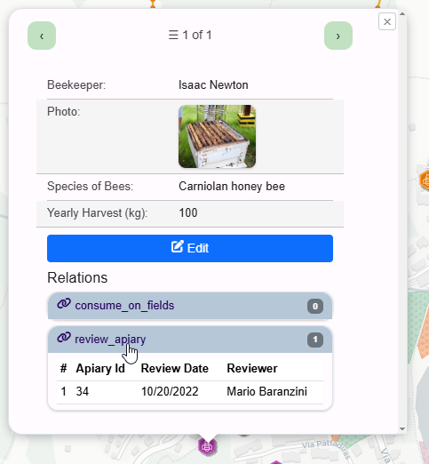

**********************
Relations
**********************

.. contents:: Table of Contents

Overview
==================

QCarta will automatically detect QGIS Reloations.

   .. warning::
      When using MapProxy, do not select Relation layers.  When using QCarta Cache, the Relation layers should be selected.

QGIS Relations
==================

Relations are displayed as accordian at the bottom of the map popup.

By default, accordian is closed.

You can change this behavior via map_index.js

