.. This is a comment. Note how any initial comments are moved by
   transforms to after the document title, subtitle, and docinfo.

.. demo.rst from: http://docutils.sourceforge.net/docs/user/rst/demo.txt

.. |EXAMPLE| image:: static/yi_jing_01_chien.jpg
   :width: 1em

**********************
Demo Data
**********************

.. contents:: Table of Contents
Overview
==================

Quail contains 5 Demo Stores and 5 Demo Layers

Demo Stores
=================

QGIS Stores are QGIS Projects with any required flat files.

The QGIS Demo Stores are below

.. image:: demo-stores-1.png

**BGS-GeoPackage** - This is a geopackage data source obtained from the British Geological Survey.

**Chicago-ESRI** - This is an ESRI Shapefile data source obtained from the Chicago Data Portal

**Gebco-WMS** - This is a WMS source obtained from GEBCO

**NASA-GeoTIFF** - This is a GeoTiff data source from NASA showing percipitation

**USA-PostGIS** - This is a PostGIS data source using the GeoServer USA Population data

.. image:: demo-layers.png

1. UsDemoStore - A QGIS Project with PostGIS Connection

2. USData - PostGIS Data Source

3. ChicagoStore - QGIS Project using ESRI Shapefiles

4. GeoTiff - QGIS Project with GeoTIFF

From these Stores, three Demo Layers are created:

**Layers**

1. UsDemoLayer

2. Neighborhoods

3. GeoTiff

Dashboard
================

The sample reports are available on the Dashboard

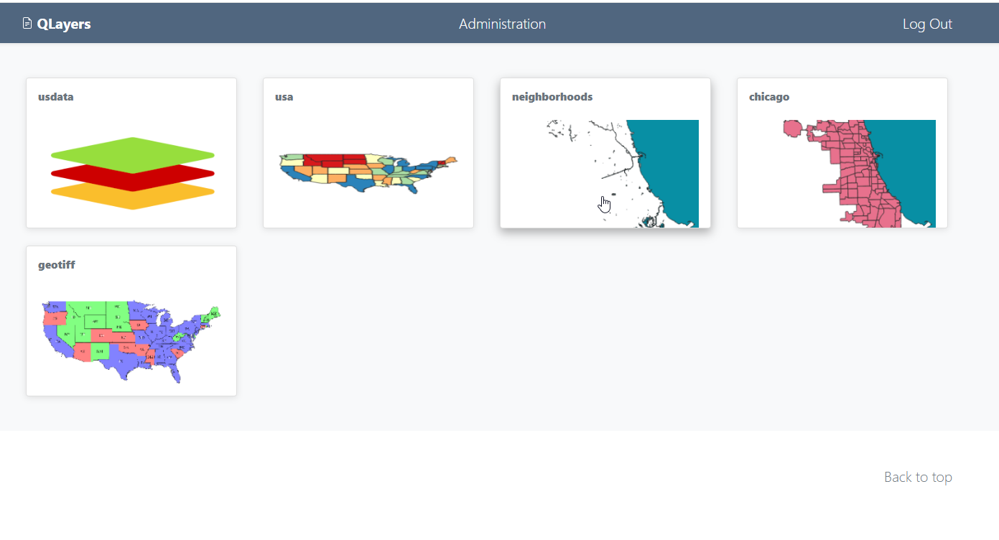

  
Sample Database
================

The sample database, states, contains the data for the PostGIS Store, usdata::

     states=# \dt
               List of relations
     Schema  |      Name       | Type  |  Owner
   ----------+-----------------+-------+----------
    public   | spatial_ref_sys | table | qgapp
    public   | states          | table | qgapp
    topology | layer           | table | qgapp
    topology | topology        | table | qgapp
   (4 rows)

Sample Data Source
================

The included sample Data Source is a JNDI connection to the beedatabase:

layer-sample-chicago.png

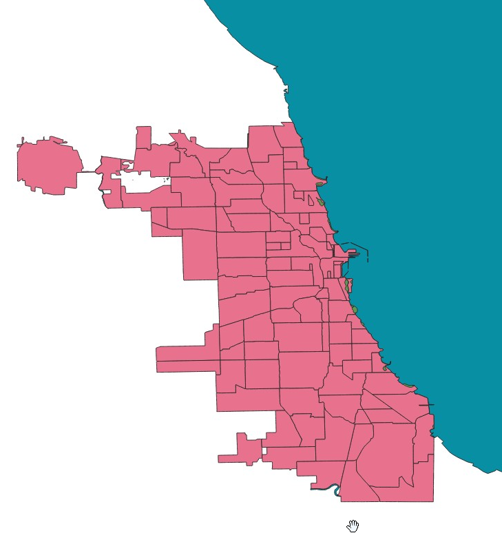

layer-sample-data.png

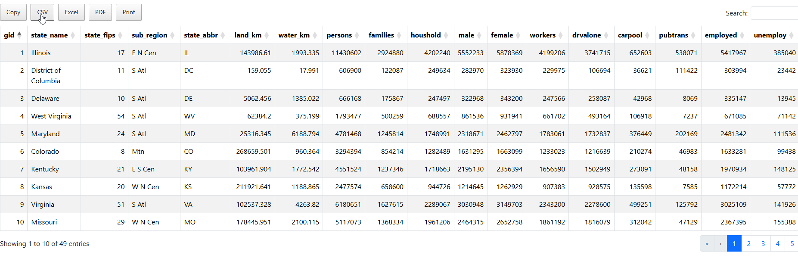

layer-sample-neighborhoods.png

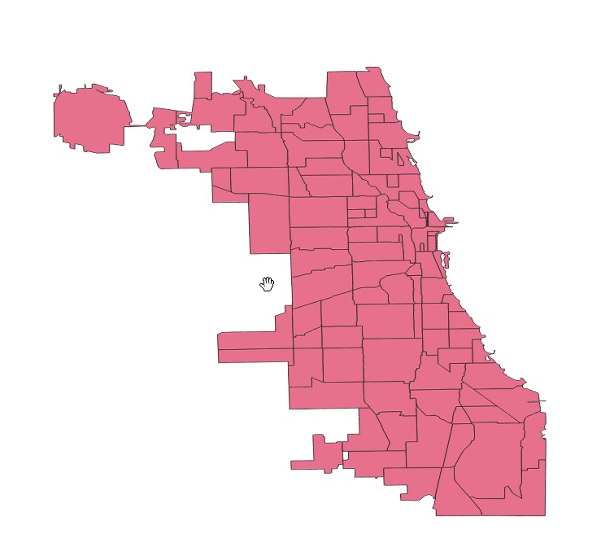

layer-sample-states.png

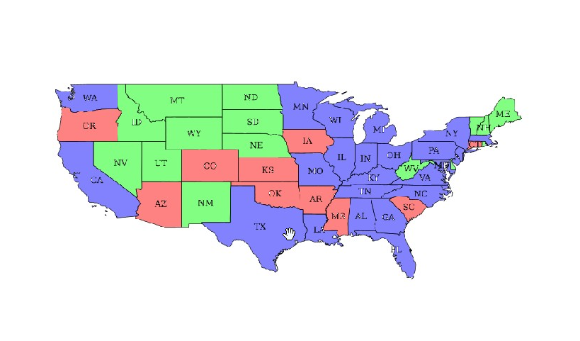

layer-sample-usa.png

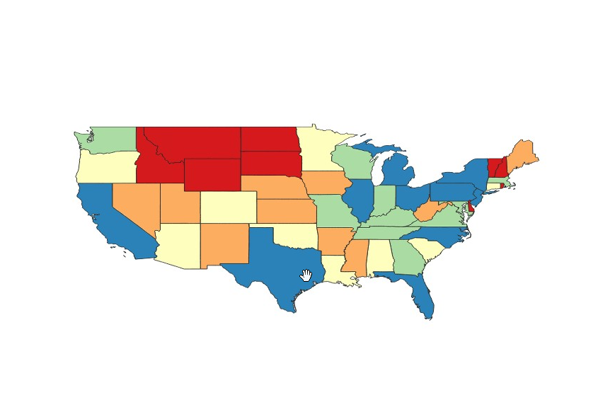

layers-sample-1.png

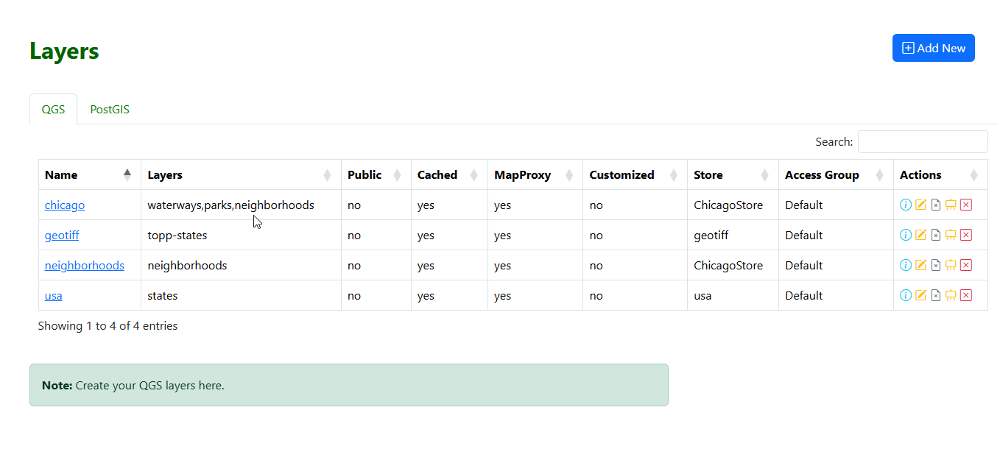

layers-sample-2.png

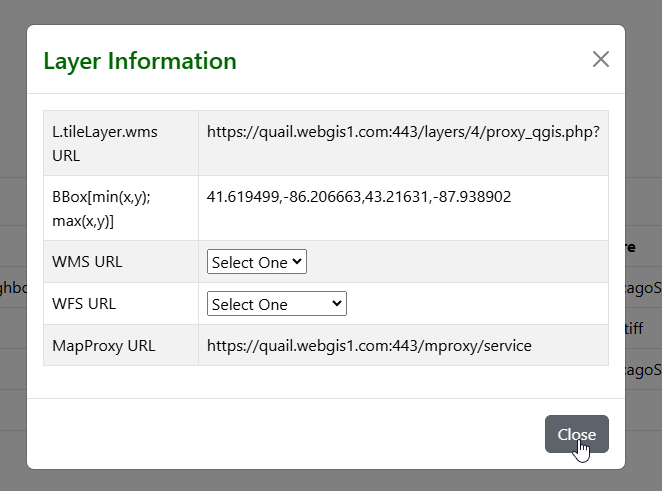

postgis-sample-1.png

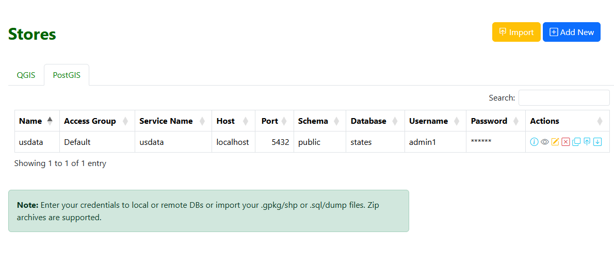

qlayersdashboard.png

stores-sample-1.png

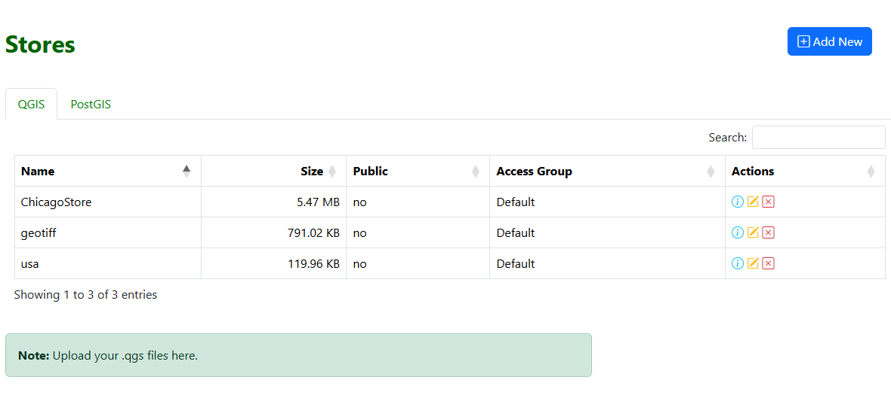

stores-sample-2.png

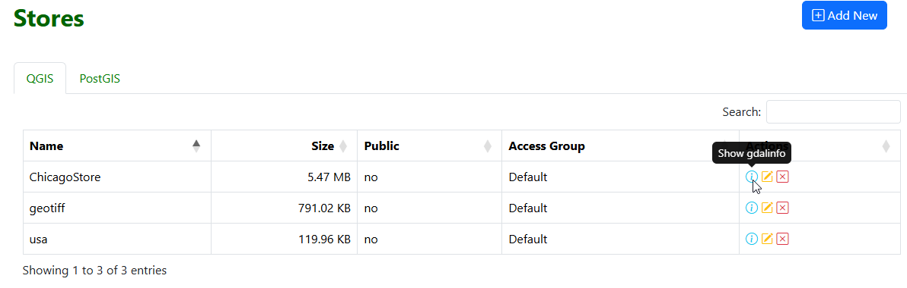

stores-sample-3.png

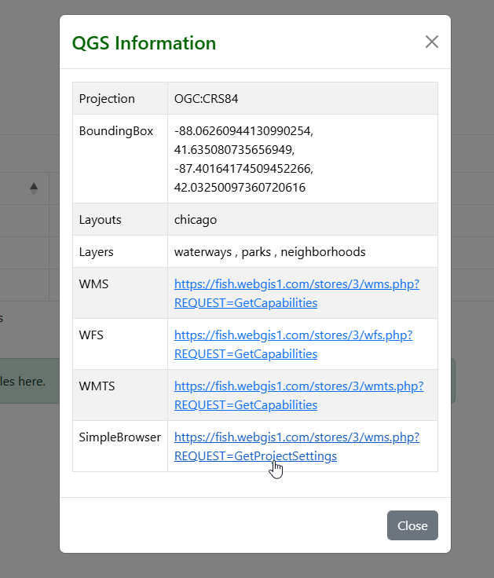

stores-sample-4.png

Sample Reports
================

Three Sample Reports are created

* Simple Bee Report	- this is a basic chart report

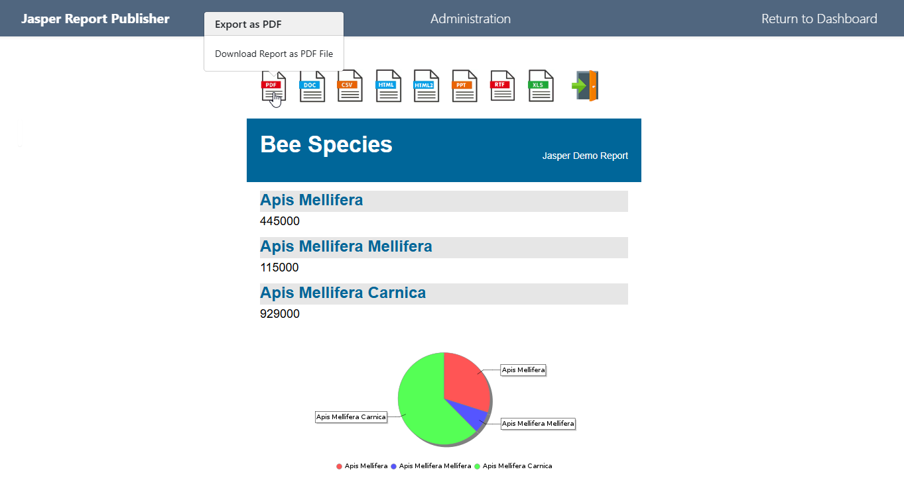

* LOV Parameter - This is a basic report using a single LOV (List of Values) Parameter

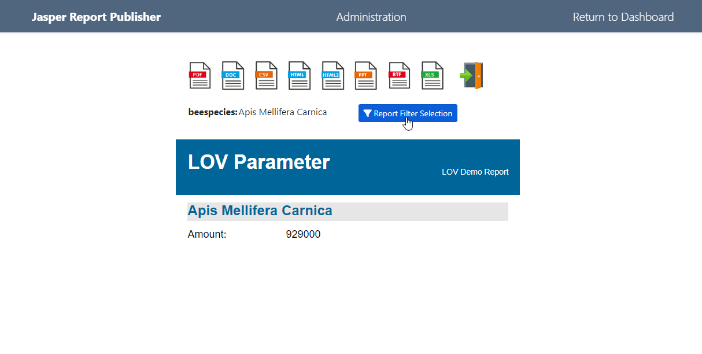

* Query Parameter - This is a basic report using two Query Parameters

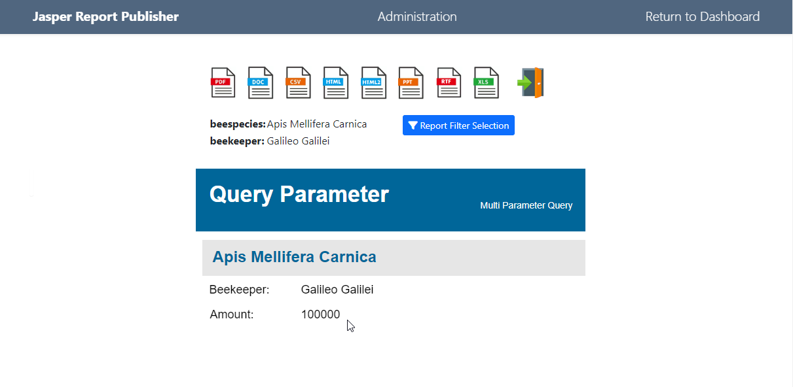

Change From:

      const wmsLayer = L.tileLayer.wms('proxy_qgis.php?', {
		   layers: '<?=implode(',', QGIS_LAYERS)?>'
	   }).addTo(map);

Change to::

      const wmsLayer = L.tileLayer.wms('/mproxy/service', {
       layers: 'neighborhoods'
	   }).addTo(map);

Sample Schedules
================

A sample Schedule is created for each report.

Note: These Schedules, do not have email activated.  You can edit them to include email delivery to test email functionality.

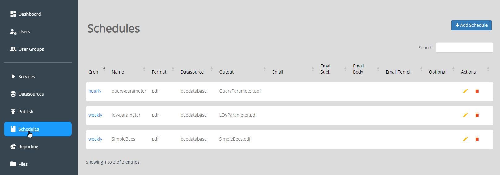

Sample Parameters
=====================

Sample Parameters are include for the LOV Parameter and Query Parameter reports

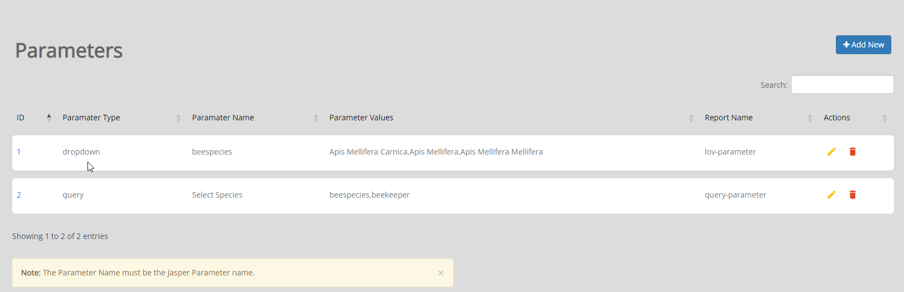

Delete Sample Data
===================

To delete the sample data:

1. Delete Sample Schedules
2. Delete Sample Reports
3. Delete Sample Data Sources
4. Drop beedatabase

