.. This is a comment. Note how any initial comments are moved by
   transforms to after the document title, subtitle, and docinfo.

.. demo.rst from: http://docutils.sourceforge.net/docs/user/rst/demo.txt

.. |EXAMPLE| image:: static/yi_jing_01_chien.jpg
   :width: 1em

**********************
Demo Data
**********************

.. contents:: Table of Contents
Overview
==================

Quail contains 5 Demo Stores and 5 Demo Layers

These Demos show different Store and data source types.

You can safely delete them at any time.

Demo QGIS Stores
=================

QGIS Stores are QGIS Projects with any required flat files.

The QGIS Demo Stores are below

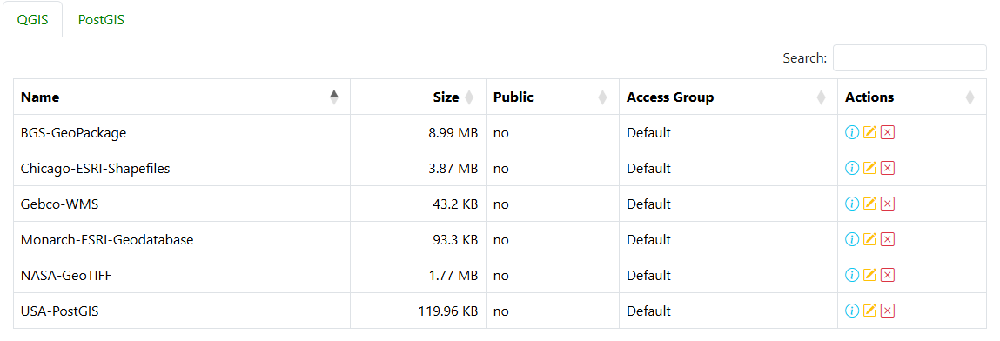

**BGS-GeoPackage.** Geopackage data source obtained from the British Geological Survey.

**Chicago-ESRI-Shapefile.** - ESRI Shapefile data source obtained from the Chicago Data Portal

**Gebco-WMS.** - WMS source obtained from GEBCO

**Monarch-ESRI-Geodatabase.** ESRI Geodatabase data source for Monarch butterfly habitat

**NASA-GeoTIFF.** GeoTiff data source from NASA showing percipitation

**USA-PostGIS.**  PostGIS data source using the GeoServer USA Population data

Demo PostGIS Stores
=================

The installation contains a Demo PostGIS Store

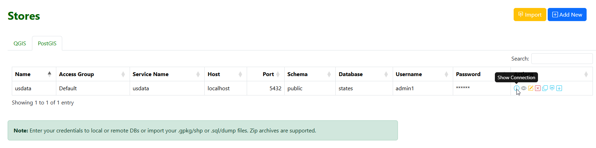

This Store is created from a PostGIS database that is installed with Quail.

It is used in the USA Layer demo.

The sample database, states, contains the data for the PostGIS Store, usdata::

     states=# \dt
               List of relations
     Schema  |      Name       | Type  |  Owner
   ----------+-----------------+-------+----------
    public   | spatial_ref_sys | table | qgapp
    public   | states          | table | qgapp
    topology | layer           | table | qgapp
    topology | topology        | table | qgapp
   (4 rows)

Demo QGIS Layers
================

QGIS Layers are Layers created from QGIS Stores.

The QGIS Demo Layers are below

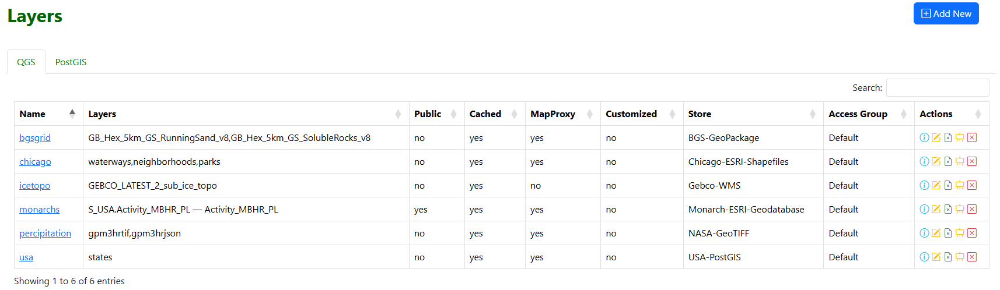

The Layer lists the Store from which it was created.

It also lists which layers from the QGIS Project will be included in the Layer.

Demo Layer Previews
================

USA:

The USA demo layer uses the **USA-PostGIS.**  PostGIS Store. 

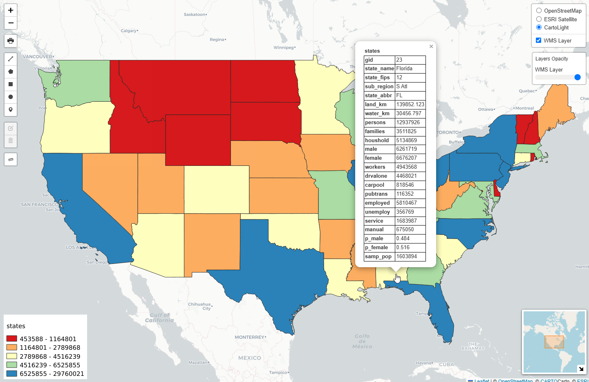

QField:

Simple Bees. This layer uses the QFieldProject Store.

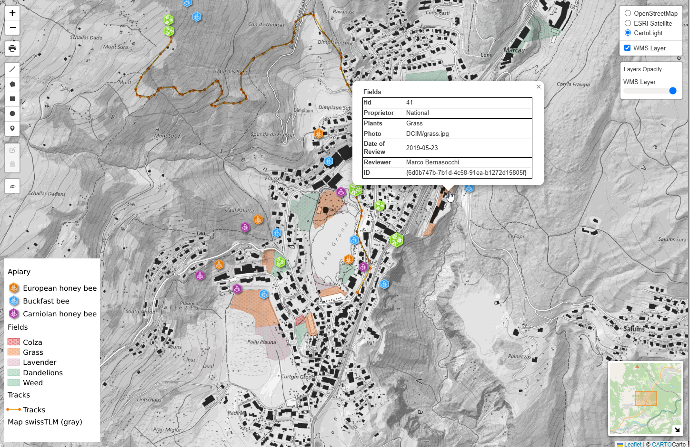

Chicago

**Chicago-ESRI-Shapefile.** - ESRI Shapefile data source obtained from the Chicago Data Portal

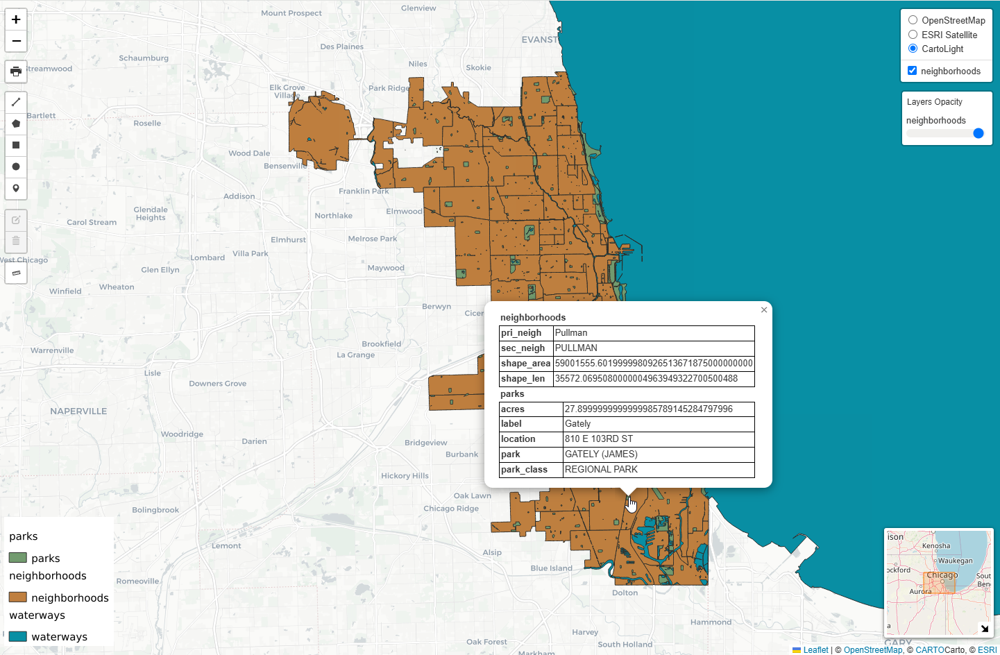

BGS:

The BGS uses the **BGS-GeoPackage** Store

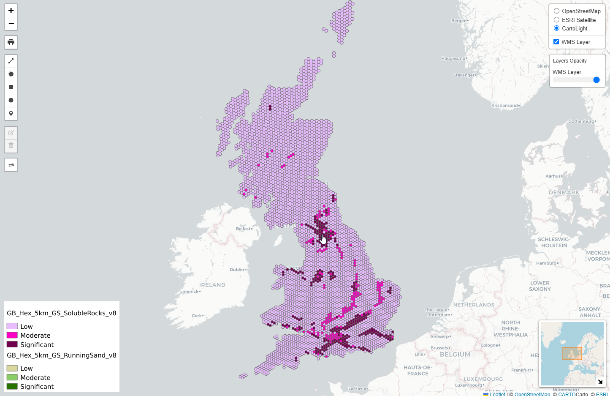

Paris1550

**MapWarper-GeoTIFF.** GeoTiff data source from Map Warper

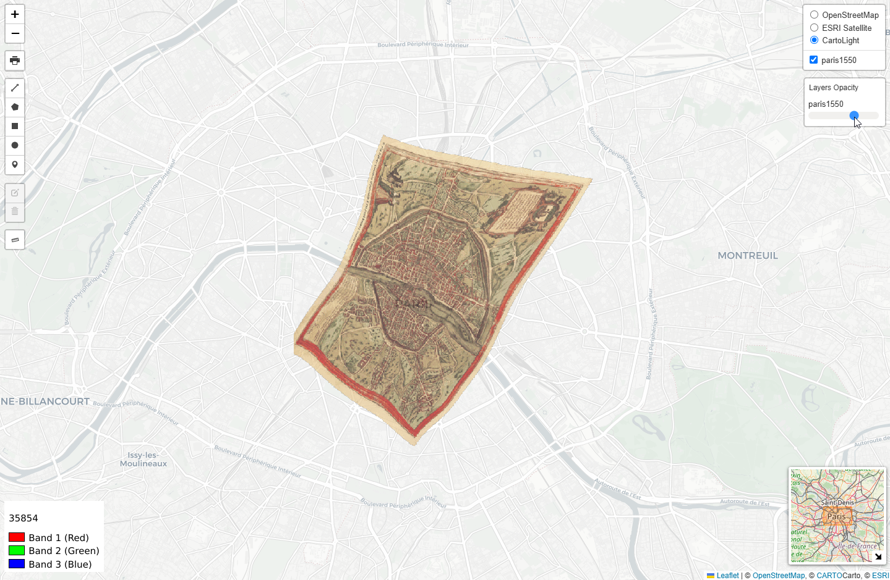

Isotop

**WeatherService-WMS.** - WMS source obtained from the National Weather Service

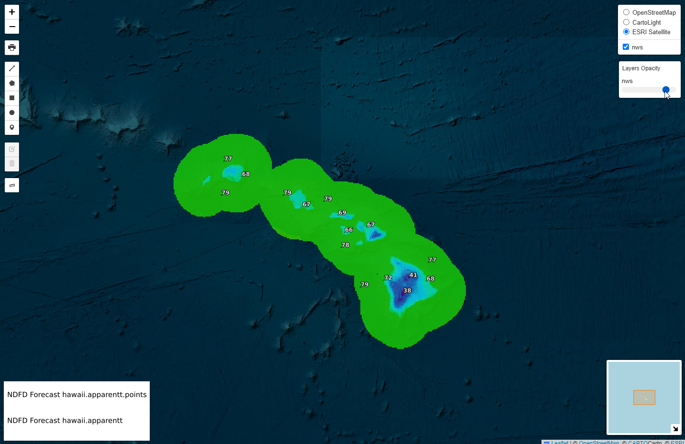

Monarch Butterflies

**Monarch-ESRI-Geodatabase.** ESRI Geodatabase data source for Monarch butterfly habitat

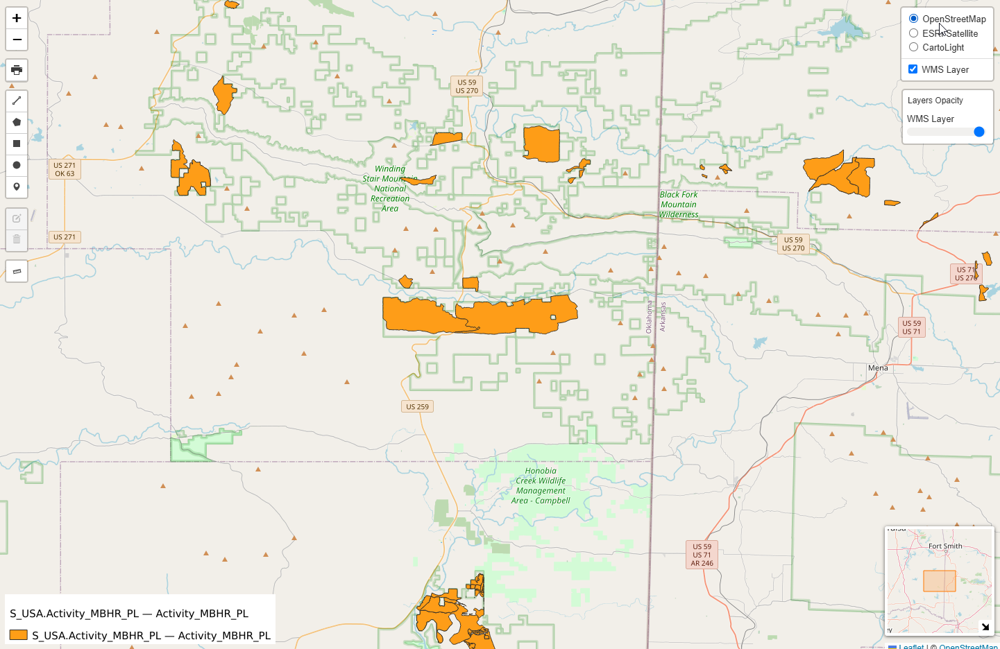

Custom Demo

The USA demo layer uses the **USA-PostGIS.**  PostGIS Store. 

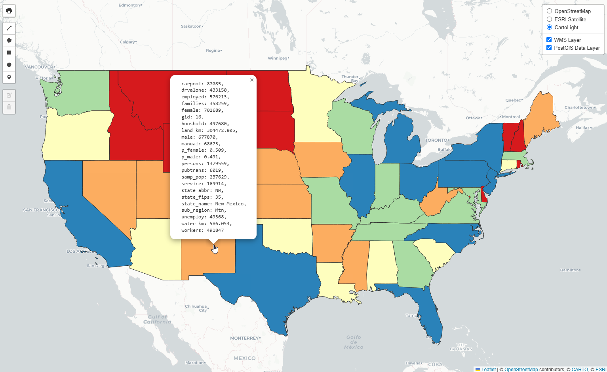

US Data:
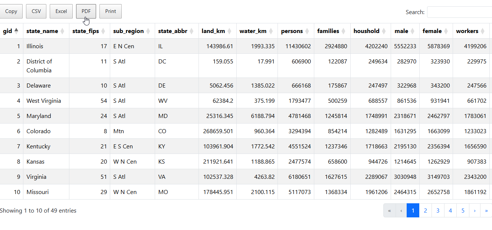

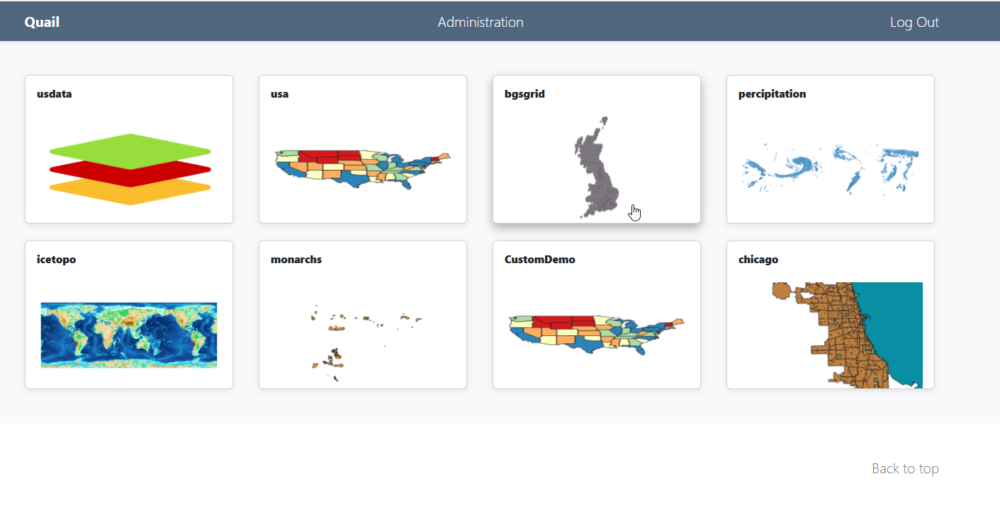

