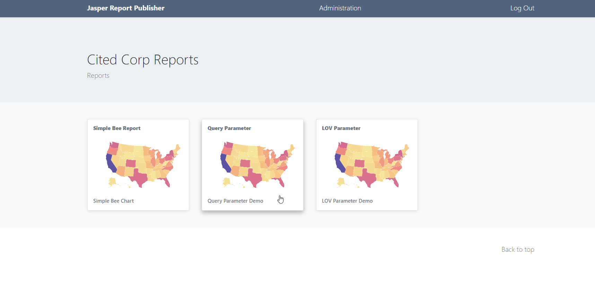
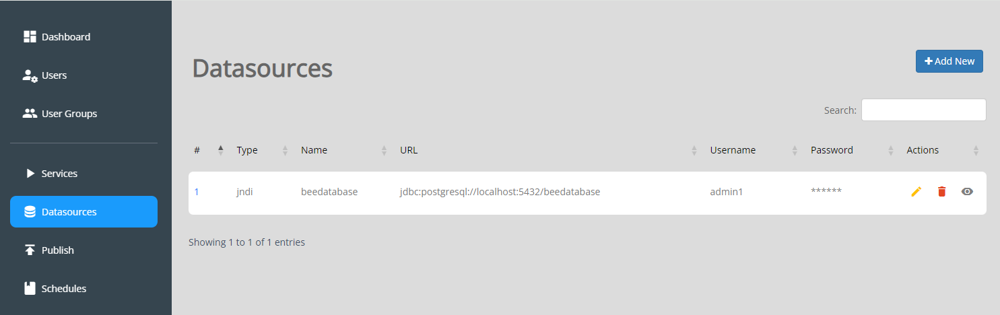

.. This is a comment. Note how any initial comments are moved by
   transforms to after the document title, subtitle, and docinfo.

.. demo.rst from: http://docutils.sourceforge.net/docs/user/rst/demo.txt

.. |EXAMPLE| image:: static/yi_jing_01_chien.jpg
   :width: 1em

**********************
Demo Data
**********************

.. contents:: Table of Contents
Overview
==================

Three Stores and Layers are created on installation.

**Stores**

1. UsDemoStore - A QGIS Project with PostGIS Connection

2. USData - PostGIS Data Source

2. ChicagoStore - QGIS Project using ESRI Shapefiles

3. GeoTiff - QGIS Project with GeoTIFF

From these Stores, three Demo Layers are created:

**Layers**

1. UsDemoLayer

2. Neighborhoods

3. GeoTiff

Dashboard
================

The sample reports are available on the Dashboard

  
Sample Database
================

The sample database, beedatabase, is taken from the QFieldCloud Simple Bee Project::

  beedatabase=# \dt
               List of relations
   Schema |      Name       | Type  | Owner
  --------+-----------------+-------+--------
   public | apiary          | table | admin1
   public | fields          | table | admin1
   public | spatial_ref_sys | table | jrv
  (3 rows)

Sample Data Source
================

The included sample Data Source is a JNDI connection to the beedatabase:

Sample Reports
================

Three Sample Reports are created

* Simple Bee Report	- this is a basic chart report

.. image:: ../../_static/simple-bee-report.png

* LOV Parameter - This is a basic report using a single LOV (List of Values) Parameter

.. image:: ../../_static/lov-report-0.png

* Query Parameter - This is a basic report using two Query Parameters

.. image:: ../../_static/query-report-3.png

Sample Schedules
================

A sample Schedule is created for each report.

Note: These Schedules, do not have email activated.  You can edit them to include email delivery to test email functionality.

.. image:: ../../_static/sample-schedule.png

Sample Parameters
=====================

Sample Parameters are include for the LOV Parameter and Query Parameter reports

.. image:: ../../_static/sample-parameter.png

Delete Sample Data
===================

To delete the sample data:

1. Delete Sample Schedules
2. Delete Sample Reports
3. Delete Sample Data Sources
4. Drop beedatabase

