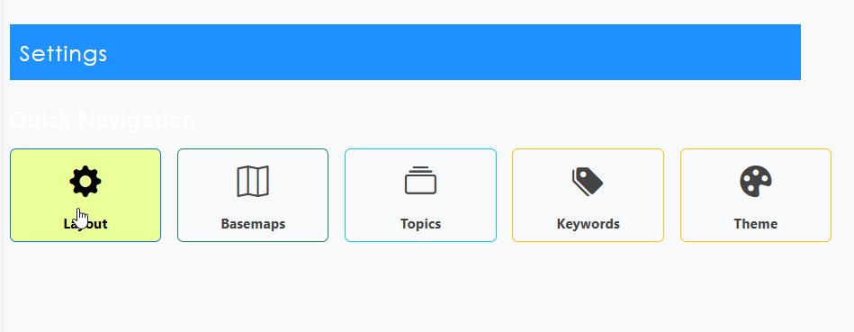
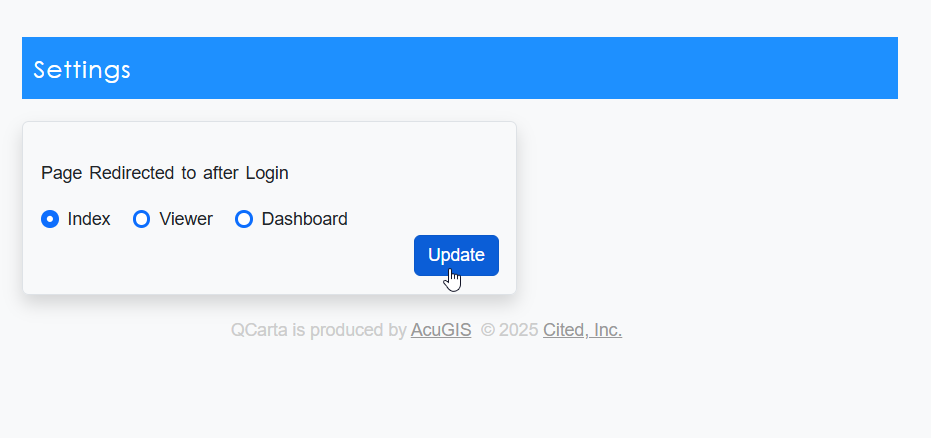
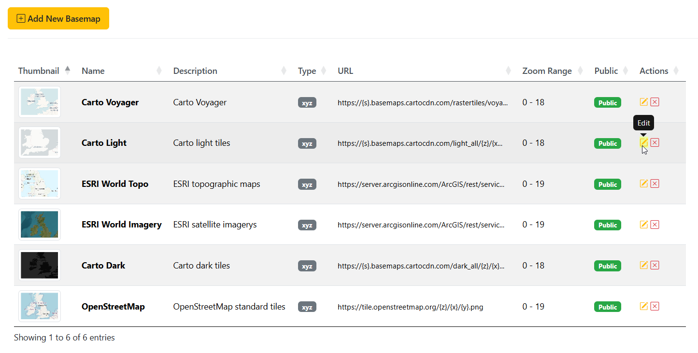
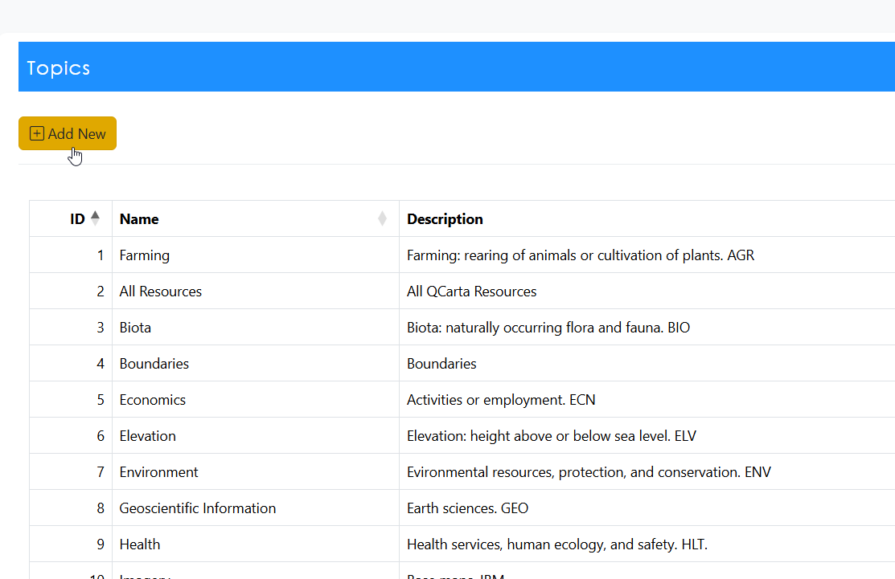
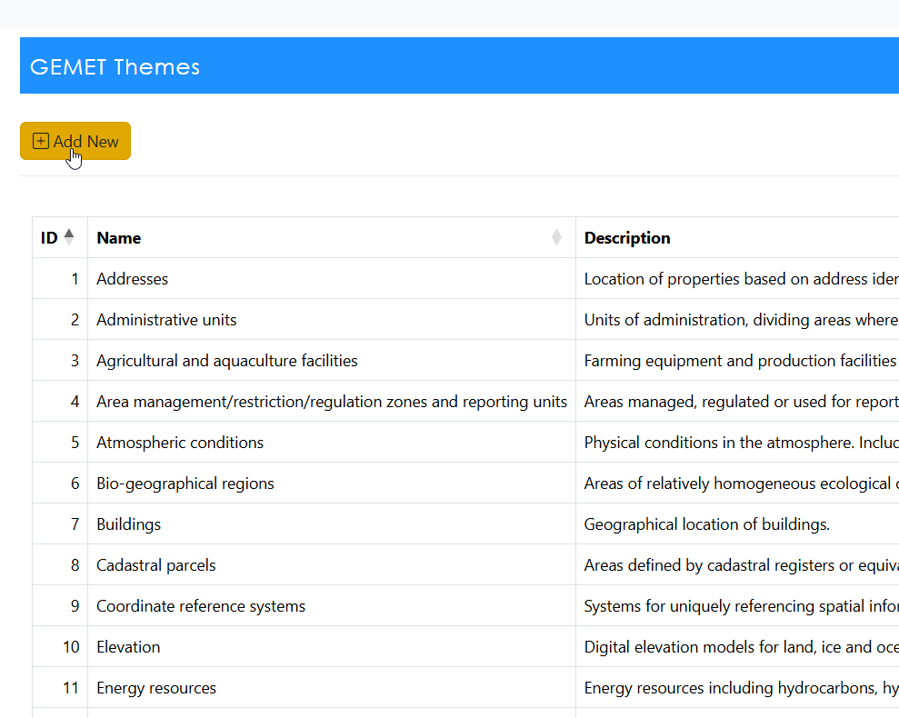
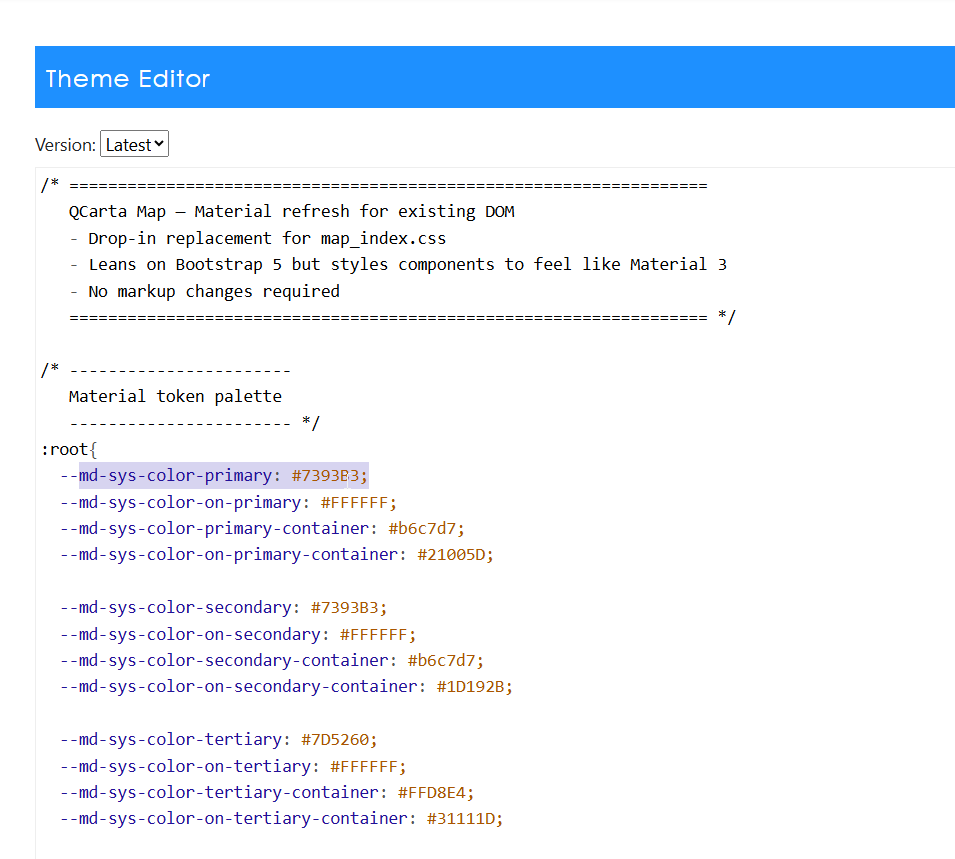

.. This is a comment. Note how any initial comments are moved by
   transforms to after the document title, subtitle, and docinfo.

.. demo.rst from: http://docutils.sourceforge.net/docs/user/rst/demo.txt

.. |EXAMPLE| image:: static/yi_jing_01_chien.jpg
   :width: 1em

**********************
Settings
**********************

.. contents:: Table of Contents

System Settings
=================

Once logged in as an administrator, click on the Settings menu

Layout
=================

The Layout setting controls the instance layout.

By the default, this is 'index'

Basemaps
=================

The Basemap settings allows you to edd, edit, and remove basemaps.

Topics
=================

The Topics settings allows you to edd, edit, and remove Topics.

Keywords (GEMET Themese)
=================

The Topics settings allows you to edd, edit, and remove keywords (GEMET Themes for INSPIRE).

Theme
=================

The Theme settings allows you to edit the main QCarta CSS

Note that on Save, the previous CSS is saved as cc-TIMESTAMP

 

