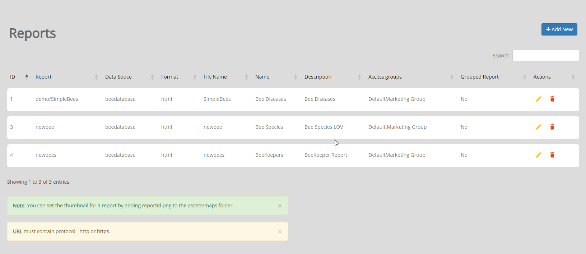
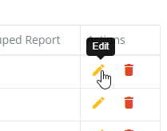

.. This is a comment. Note how any initial comments are moved by
   transforms to after the document title, subtitle, and docinfo.

.. demo.rst from: http://docutils.sourceforge.net/docs/user/rst/demo.txt

.. |EXAMPLE| image:: static/yi_jing_01_chien.jpg
   :width: 1em

**********************
Stores
**********************

.. contents:: Table of Contents
Overview
==================

Quail supports both QGIS and PostGIS Store types.  Additionally, you can create a PostGIS Store via shapefile, geopackage, or PostgreSQL backup.

Add New Store
================

Quail suppports the following Stores

* PostGIS
* QGIS
* shapefile (via PostGIS)
* GeoPackage (via PostGIS)
* PostgreSQL Dump
* PostgreSQL SQL

With all fields populated, click the Add icon at right:

Report Thumbnail
=====================

You can set the thumbnail for a report by adding reportid.png to the assets/maps folder.

Edit Report
===================
To edit a report entry, click the Edit icon, as shown below:

Delete Report
===================
To delete a report entry, click the Delete icon, as shown below:

