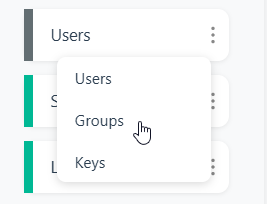
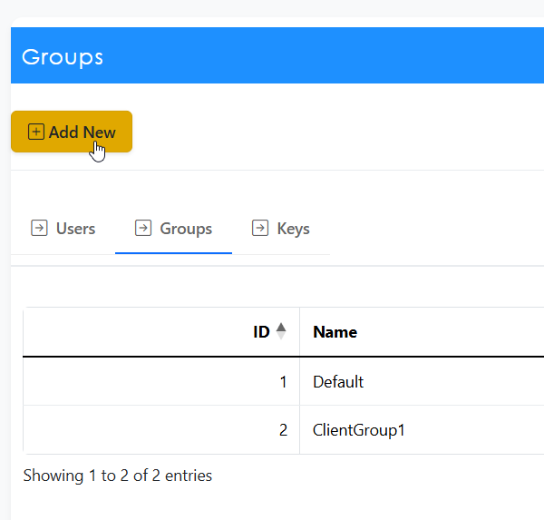
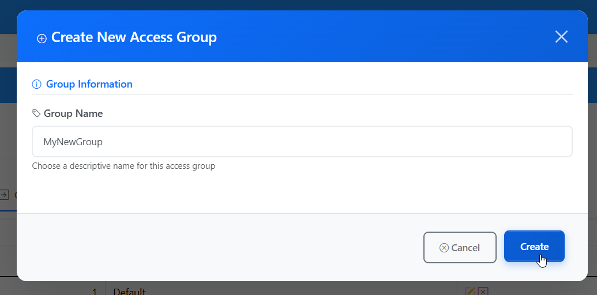

.. This is a comment. Note how any initial comments are moved by
   transforms to after the document title, subtitle, and docinfo.

.. demo.rst from: http://docutils.sourceforge.net/docs/user/rst/demo.txt

.. |EXAMPLE| image:: static/yi_jing_01_chien.jpg
   :width: 1em

**********************
User Groups
**********************
.. contents:: Table of Contents
Overview
==================

Report permissions are granted to User Groups.

Pre-installed Groups
==================

On installation, two Groups are created.

* Default (an Administrator)
   * Members: Quail Admin   
* ClientGroup1
   * Members: Jane Doe
   

Add New Group
================

To add a new Group, click the "Groups" link in Users dropdown menu.

To add a new Group, click the "Add New" button at top.

Give your Group a name and click the Create button:

Delete Group
===================
To delete a report entry, click the Delete icon.

