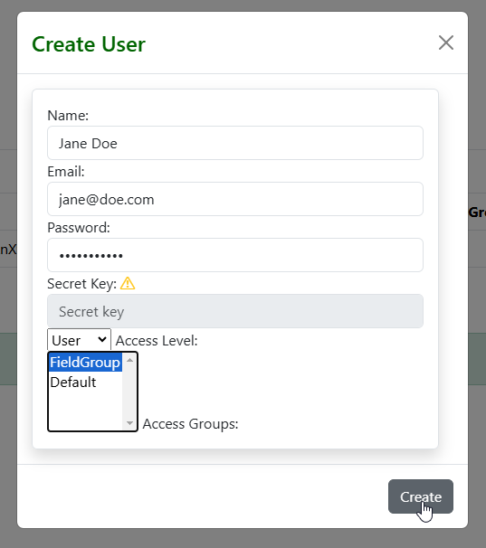
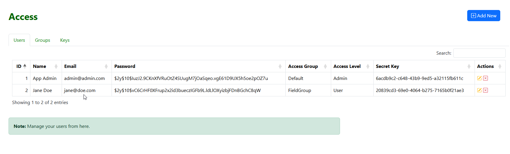
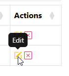
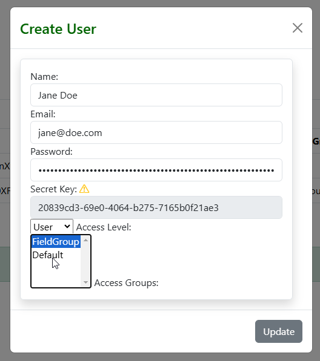
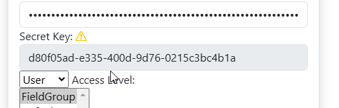

.. This is a comment. Note how any initial comments are moved by
   transforms to after the document title, subtitle, and docinfo.

.. demo.rst from: http://docutils.sourceforge.net/docs/user/rst/demo.txt

.. |EXAMPLE| image:: static/yi_jing_01_chien.jpg
   :width: 1em

**********************
Users
**********************
.. contents:: Table of Contents
Overview
==================

Jasper Report Publisher grants permissions on Reports to User Groups.

You can begin by creatting Users and then Groups, or vice versa.

User Types
==================

Jasper Report Publisher supports the following User types:

1. Admins.  Can create Data Sources, Publish Reports, and create Schedules.
2. Users.   Can consume reports via Dashboard

Add New User
================

To create a new user, click on Users on the left menu.

Click the Add User button

Enter the required information and be sure to set the Access Level (Admin or User)

The user has now been created:

Edit Group Membership
===================

You can always edit Group Membership later as well via both Users and User Groups menu.

To edit Group membership, click the Edit button as below

Make any Group or access Level changes you wish to make, and then click Update

Reset Secret Key
===============

To reset a user's Secret Key, click the Edit button for the user

Click the Reset Secret Key icon

.. image:: 6-edit-key.png

The user's key has now been updated.  Be sure to click the UPdate button.

Delete User
===================
To delete a user, click the Delete icon to the right of the Users name.

