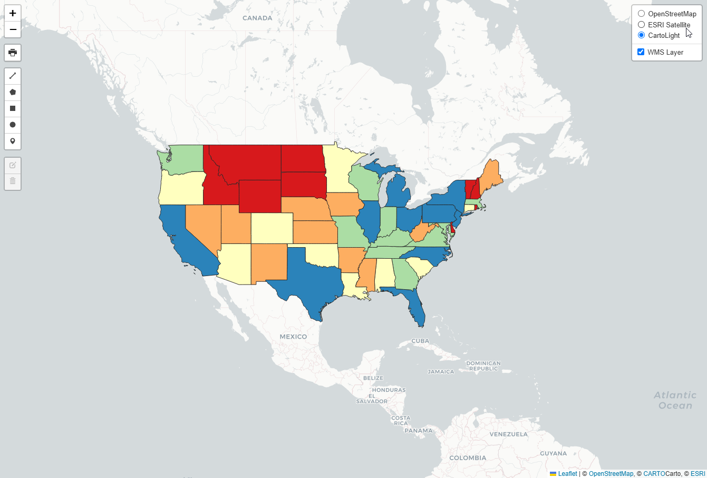
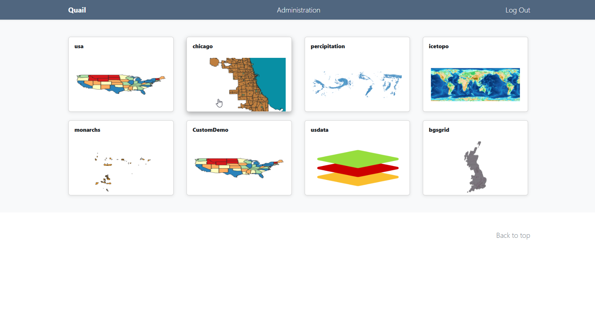
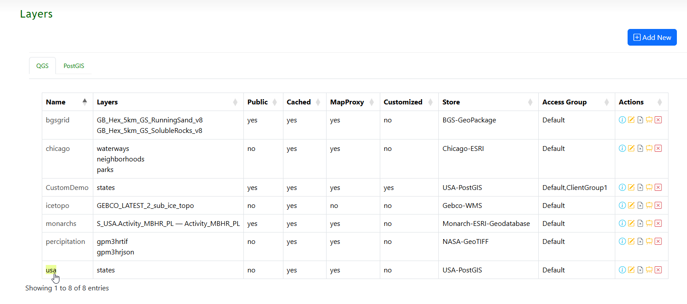
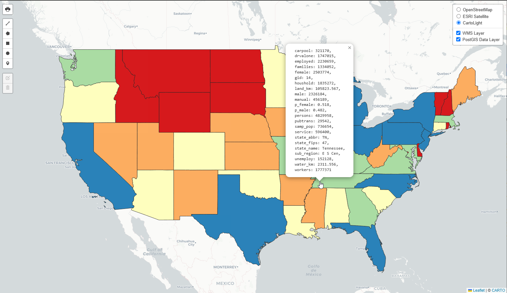

.. This is a comment. Note how any initial comments are moved by
   transforms to after the document title, subtitle, and docinfo.

.. demo.rst from: http://docutils.sourceforge.net/docs/user/rst/demo.txt

.. |EXAMPLE| image:: static/yi_jing_01_chien.jpg
   :width: 1em

**********************
Map Viewer
**********************

.. contents:: Table of Contents
Overview
==================

By default, each Layer you create generates a basic Leafletjs map which can be viewed via the Map Viewer.

The Map Viewer can be reached either via the MapViewer link in the menu or via the Layers page

It can also be viewed via the Layer Preview url directly if the Layer is Public.

Map Viewer Page
====================

The Map Viewr page is what End Users see when they log into Quail.

For example, if you log in as the demo user jane@doe.com with password 'quail', you will see below:

Layer Page
================

The Layer page allows you to view the Map via Map Viewer link as well as edit it.

Custom Maps
================

You can also add Custom Maps to the Map Viewer via the Layers page.

1. Create a new Layer using the Store you wish to use.

2.  Click the Edit Preview button

3.  Update with any additional layers or formatting.

The default Demo layers include a custom Map, CustomDemo

