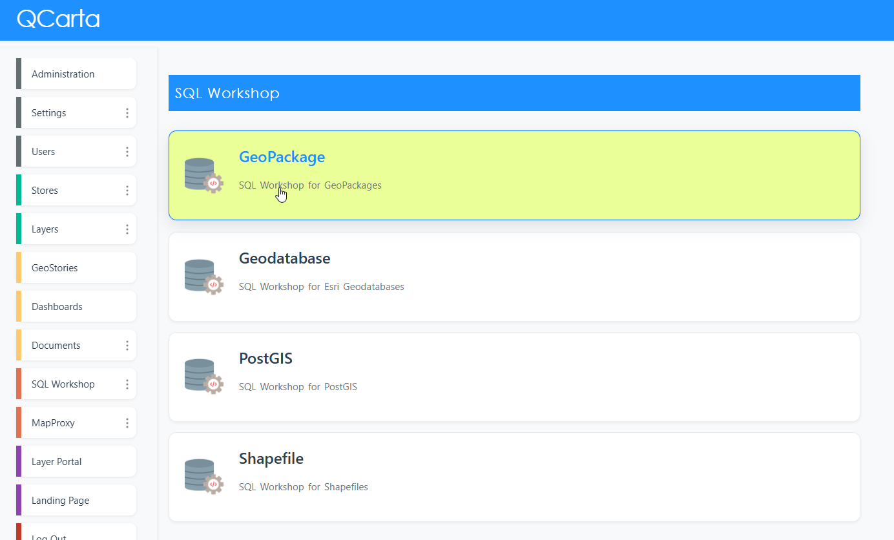
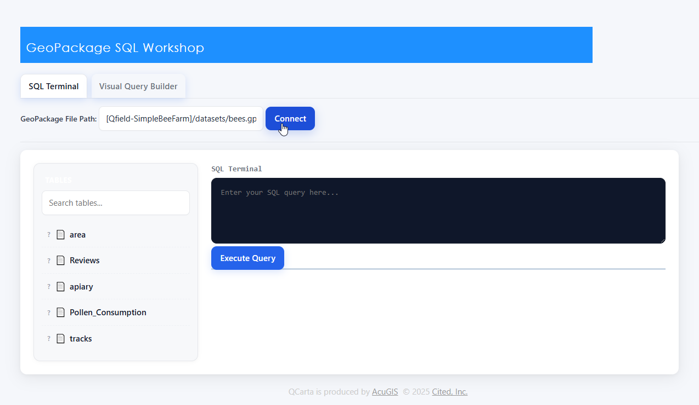
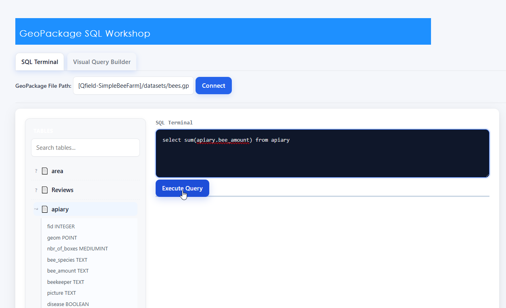
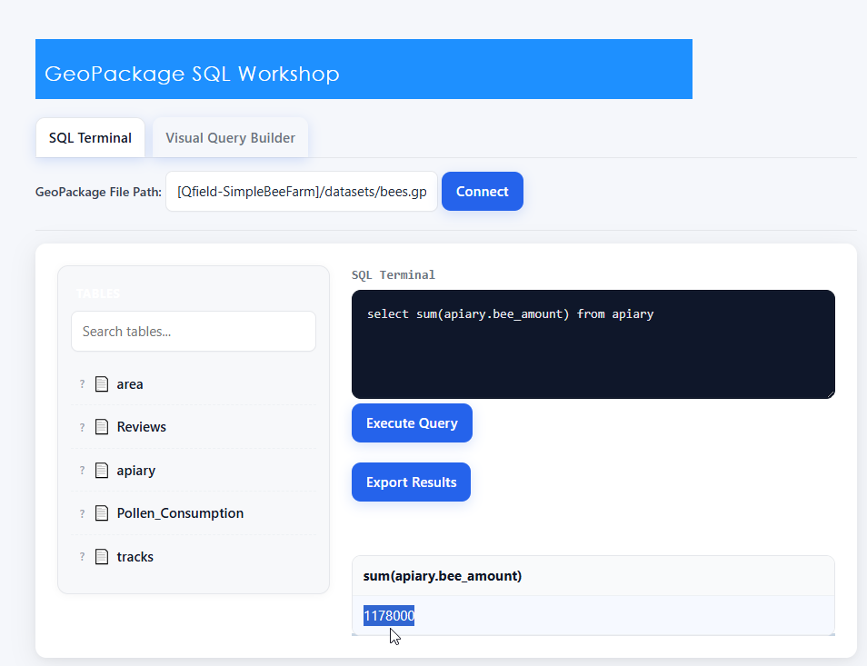
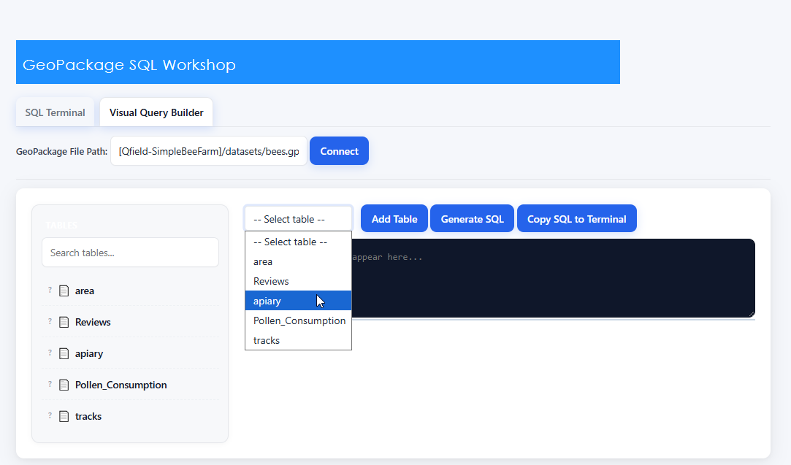
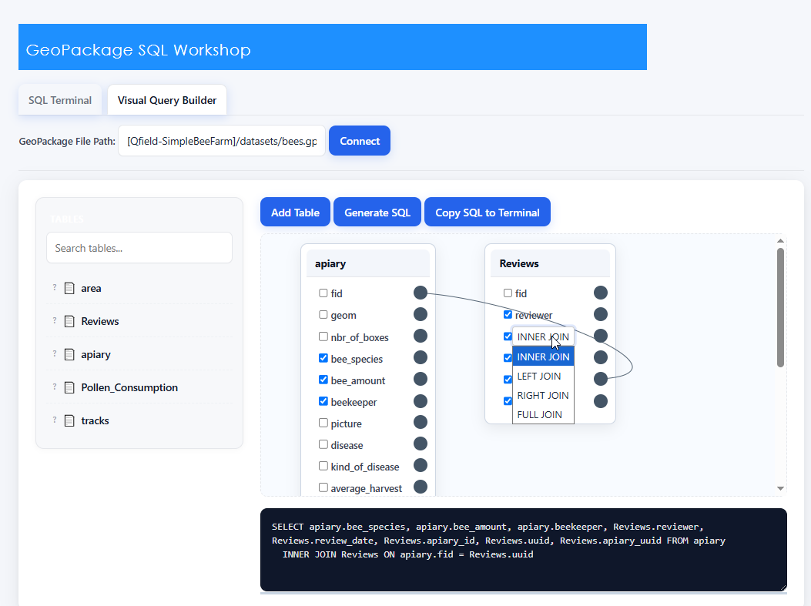
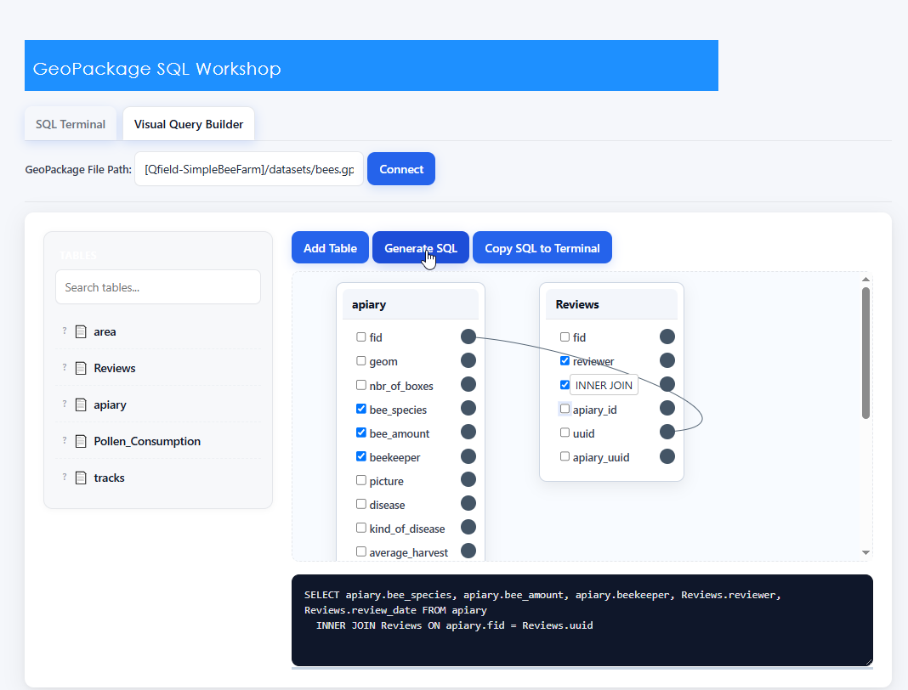
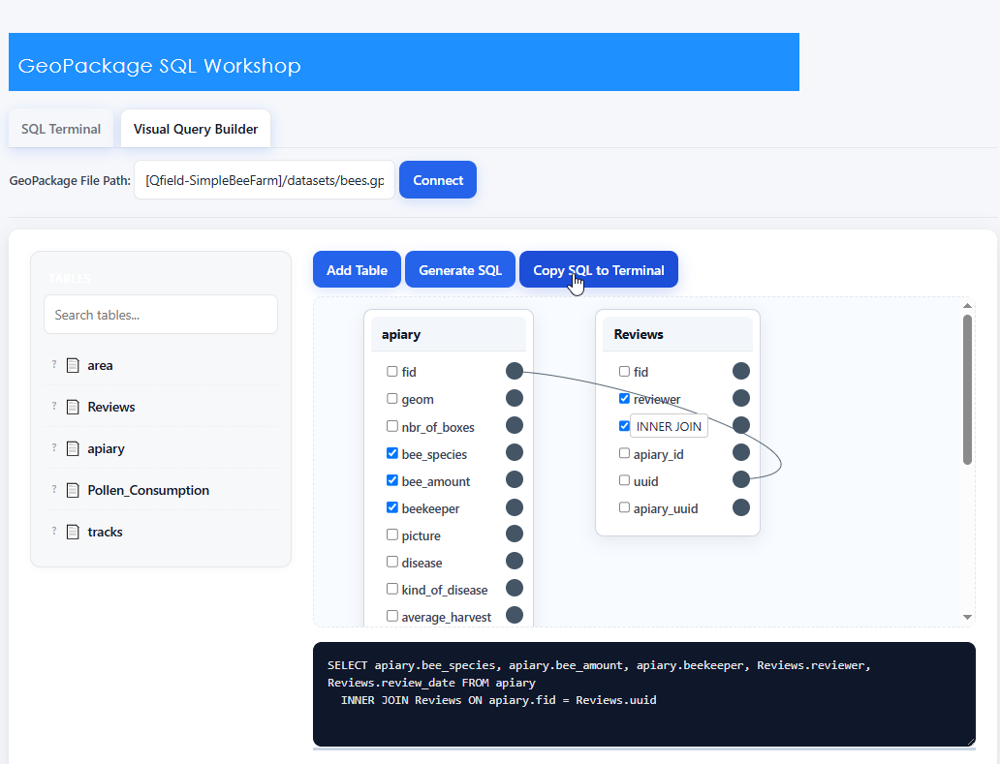
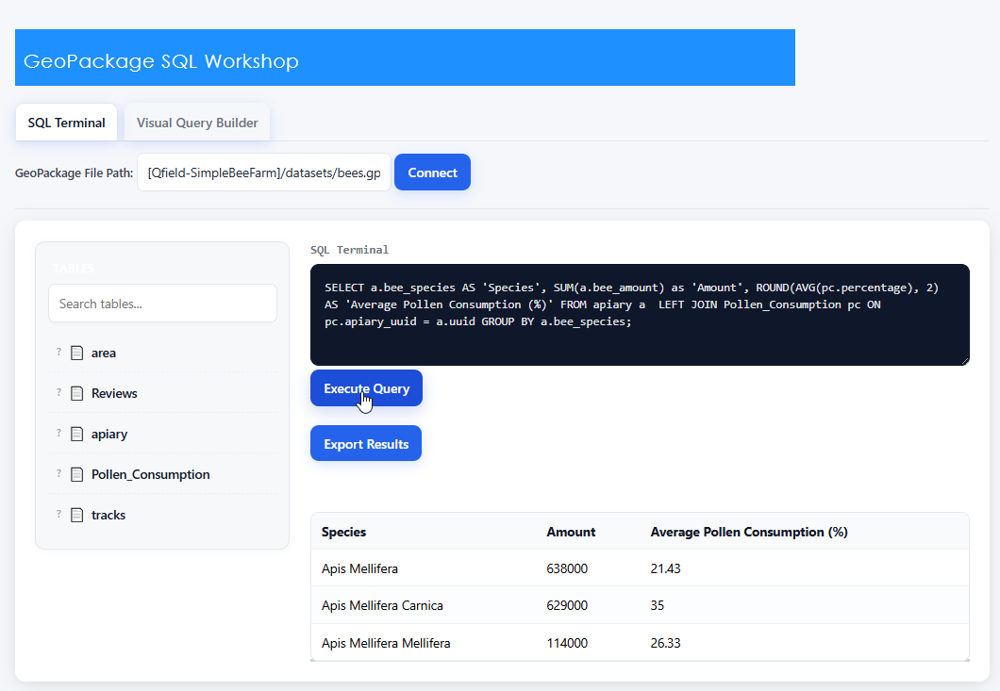

**********************
SQL Workshop
**********************

.. contents:: Table of Contents

Overview
==================

SQL Workshop allows you to run SQL againts your QGIS data sources.

PostGIS, GeoPackage, Shapefile, and ESRI Geodatabase are supported.

SQL Workshop offers a choice of SQL Terminal and a Visual Query Builder.

SQL Terminal
==================

Click on the Workshop you wish to use

Select your target data source from the dropdown.

Enter your SQL

Test your Query

Visual Query Builder
==================

Click the Visual Query Builder tab.

Select the Table(s) you wish to add.

When joining tables, you'll be given Join options.

Click the Generate SQL button

Click the Copy to SQL Terminal button

Execute SQL to view results.

